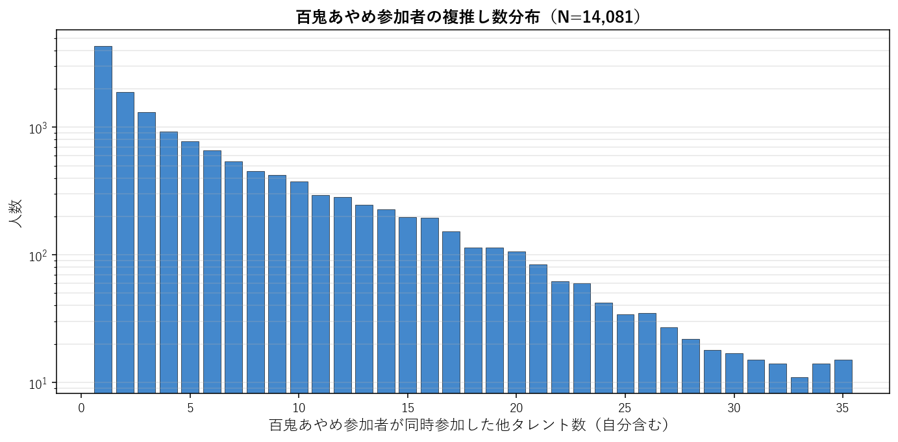
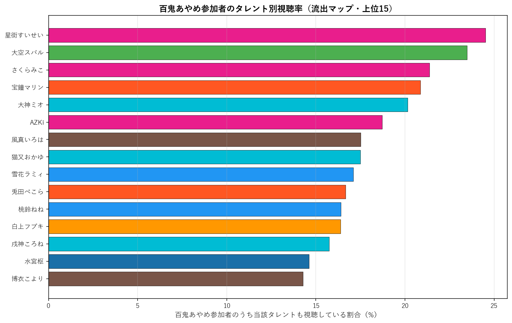
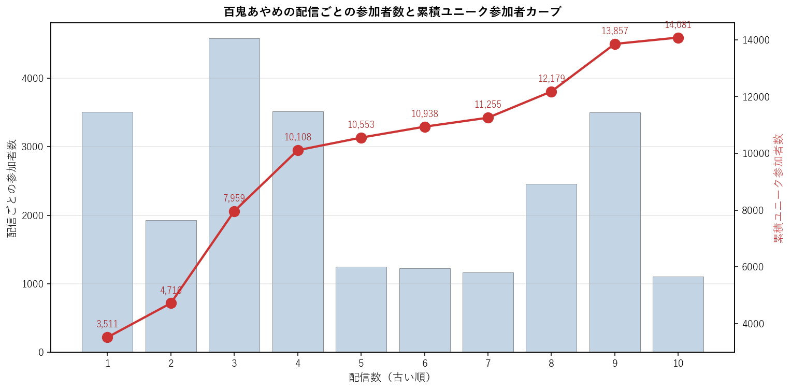

# 百鬼あやめ（2期生）個別深掘り分析

本論文の手法を 百鬼あやめ 一人に絞って詳細展開する個別レポート。集計時点: 2026年5月、10配信固定サンプル。

## 1. 基本プロファイル

| 項目 | 値 |
|---|---:|
| 所属ユニット | 2期生 |
| 活動年数（2026-05-25時点） | 7.72年 |
| 登録者数 | 1,700,000 |
| チャット参加者数（10配信総ユニーク） | 14,081 |
| 参加率（=ユニーク数/登録者数） | 0.83% |
| 専属ファン（百鬼あやめのみ参加） | 4,323（30.7%） |
| 平均複推し数（自分含む） | 5.57 |
| 中央値複推し数 | 3.0 |

### 1.1 複推し数分布

百鬼あやめ参加者を「同時参加した他タレント数」で集計した分布（自分含む、1=単独）。

## 2. 重複ネットワーク

### 2.1 Jaccard 上位10タレント

百鬼あやめと他タレントとのペアJaccard係数。順位は全595ペア中の順位。

| 順位 | タレント | ユニット | Jaccard | 共視聴者数 | 流出率 |
|---:|---|---|---:|---:|---:|
| 25 | 大神ミオ | ゲーマーズ | 12.14% | 2,837 | 20.1% |
| 50 | 白上フブキ | 1期生 | 10.99% | 2,306 | 16.4% |
| 53 | AZKi | 0期生 | 10.94% | 2,636 | 18.7% |
| 66 | 雪花ラミィ | 5期生 | 10.67% | 2,409 | 17.1% |
| 72 | 大空スバル | 2期生 | 10.48% | 3,307 | 23.5% |
| 82 | 風真いろは | 6期生 | 10.30% | 2,467 | 17.5% |
| 98 | 星街すいせい | 0期生 | 10.01% | 3,453 | 24.5% |
| 129 | 猫又おかゆ | ゲーマーズ | 9.43% | 2,464 | 17.5% |
| 135 | 桃鈴ねね | 5期生 | 9.39% | 2,310 | 16.4% |
| 153 | さくらみこ | 0期生 | 9.19% | 3,010 | 21.4% |

### 2.2 流出マップ（参加率上位15）

百鬼あやめ参加者のうち、他タレントの配信にも参加していた割合の上位。絶対人数が多い人気タレントが上位に来る傾向があり、Jaccard上位とは異なる切り口。

| 順位 | タレント | 流出率 | 共視聴者数 | Jaccard |
|---:|---|---:|---:|---:|
| 1 | 星街すいせい | 24.5% | 3,453 | 10.01% |
| 2 | 大空スバル | 23.5% | 3,307 | 10.48% |
| 3 | さくらみこ | 21.4% | 3,010 | 9.19% |
| 4 | 宝鐘マリン | 20.9% | 2,939 | 8.32% |
| 5 | 大神ミオ | 20.1% | 2,837 | 12.14% |
| 6 | AZKi | 18.7% | 2,636 | 10.94% |
| 7 | 風真いろは | 17.5% | 2,467 | 10.30% |
| 8 | 猫又おかゆ | 17.5% | 2,464 | 9.43% |
| 9 | 雪花ラミィ | 17.1% | 2,409 | 10.67% |
| 10 | 兎田ぺこら | 16.7% | 2,348 | 8.26% |
| 11 | 桃鈴ねね | 16.4% | 2,310 | 9.39% |
| 12 | 白上フブキ | 16.4% | 2,306 | 10.99% |
| 13 | 戌神ころね | 15.7% | 2,217 | 8.86% |
| 14 | 水宮枢 | 14.6% | 2,058 | 8.91% |
| 15 | 博衣こより | 14.3% | 2,009 | 8.58% |

### 2.3 3項 lift 上位10（共起の強い3者組）

$\text{lift} = P(百鬼あやめ \cap X \cap Y) / (P(百鬼あやめ \cap X) \cdot P(Y))$。1.0=独立、値が大きいほど3者の同時参加が独立予測値より集中している。$|百鬼あやめ \cap X| \geq 100$ のペアを対象。

| # | X | Y | lift | 3項共視聴 | (target,X) 共視聴 |
|---:|---|---|---:|---:|---:|
| 1 | ときのそら | ロボ子さん | 11.91 | 444 | 1,491 |
| 2 | アキロゼ | 不知火フレア | 10.92 | 320 | 869 |
| 3 | ロボ子さん | 不知火フレア | 9.98 | 382 | 1,135 |
| 4 | ときのそら | 不知火フレア | 9.43 | 474 | 1,491 |
| 5 | アキロゼ | 常闇トワ | 9.29 | 365 | 869 |
| 6 | 一条莉々華 | 響咲リオナ | 9.29 | 356 | 938 |
| 7 | アキロゼ | 獅白ぼたん | 8.90 | 328 | 869 |
| 8 | 不知火フレア | 常闇トワ | 8.80 | 488 | 1,226 |
| 9 | 常闇トワ | 獅白ぼたん | 8.58 | 563 | 1,546 |
| 10 | ロボ子さん | 一条莉々華 | 8.57 | 306 | 1,135 |

**注意**: lift 値が非常に高いペアは小規模かつニッチな同質サブグループを示している。大規模タレント同士のペアでは lift 値は相対的に低くなる（分母が大きいため）。

## 3. ファン構造分解

### 3.1 ユニット別重複

百鬼あやめ参加者の中で各ユニットのタレントいずれかに参加した人の割合と、当該ユニット内タレントとの平均ペアJaccard。

| ユニット | 人数 | 流出率 | 共視聴者数 | 平均ペアJaccard |
|---|---:|---:|---:|---:|
| 0期生 | 5 | 43.3% | 6,096 | 8.89% |
| 1期生 | 3 | 28.1% | 3,959 | 8.25% |
| 2期生 | 1 | 23.5% | 3,307 | 10.48% |
| ゲーマーズ | 3 | 33.8% | 4,754 | 10.15% |
| 3期生 | 4 | 33.1% | 4,661 | 7.67% |
| 4期生 | 3 | 24.7% | 3,476 | 7.81% |
| 5期生 | 4 | 31.7% | 4,461 | 8.21% |
| 6期生 | 3 | 28.7% | 4,043 | 8.45% |
| ReGLOSS | 4 | 21.4% | 3,019 | 5.56% |
| FLOW GLOW | 4 | 28.0% | 3,946 | 7.36% |

### 3.2 活動年数（世代）別重複

百鬼あやめ参加者の各世代タレント群への重複度。

| 世代 | 人数 | 流出率 | 平均ペアJaccard |
|---|---:|---:|---:|
| 2018年以前(7年超) | 12 | 58.3% | 9.18% |
| 2019-2020(5-7年) | 11 | 48.1% | 7.90% |
| 2021-2023(2-5年) | 7 | 37.1% | 6.80% |
| 2024-(2年未満) | 4 | 28.0% | 7.36% |

### 3.3 登録者規模別重複

百鬼あやめ参加者の規模別タレント群への重複度。

| 規模 | 人数 | 流出率 | 平均ペアJaccard |
|---|---:|---:|---:|
| メガ(300万人超) | 1 | 20.9% | 8.32% |
| 大(200-300万) | 8 | 54.7% | 9.33% |
| 中(100-200万) | 19 | 57.0% | 7.88% |
| 小(50-100万) | 5 | 30.3% | 6.96% |
| 極小(50万未満) | 1 | 9.2% | 6.67% |

## 4. 構造的位置

### 4.1 ハブ性指標

- 百鬼あやめ絡みペアの最高順位: **25/595**
- 上位30以内に入る百鬼あやめ絡みペアの数: **1/30**
- 上位100以内に入る百鬼あやめ絡みペアの数: **7/100**

### 4.2 横断接続性

百鬼あやめのJaccard上位10ペアの所属ユニット数: **6/10ユニット**

Jaccard上位10ペアの内訳:
- 大神ミオ（ゲーマーズ）J=12.14%, 順位25
- 白上フブキ（1期生）J=10.99%, 順位50
- AZKi（0期生）J=10.94%, 順位53
- 雪花ラミィ（5期生）J=10.67%, 順位66
- 大空スバル（2期生）J=10.48%, 順位72
- 風真いろは（6期生）J=10.30%, 順位82
- 星街すいせい（0期生）J=10.01%, 順位98
- 猫又おかゆ（ゲーマーズ）J=9.43%, 順位129
- 桃鈴ねね（5期生）J=9.39%, 順位135
- さくらみこ（0期生）J=9.19%, 順位153

### 4.3 外れ値度（平均Jaccard）

- 百鬼あやめの他34名との平均Jaccard: **8.06%**
- 35名中の順位（小さい順、外れ値ほど上位）: **20/35**

**解釈**: 値が小さいほど他タレントとの重なりが薄く外れ値的位置、大きいほどハブ的位置。35名中で見て中央付近にあれば「平均的な接続度」、上位5位以内なら外れ値、下位5位以内ならハブ。

## 5. 配信間多様性

### 5.1 配信ペア間Jaccard

百鬼あやめの10配信間で、ペアごとに参加者集合のJaccard係数を計算した分布。

| 統計 | 値 |
|---|---:|
| 最小 | 9.0% |
| 平均 | 14.9% |
| 中央値 | 14.0% |
| 最大 | 22.3% |

**解釈**: 値が高ければ配信間で「常連層」が中心、値が低ければ配信ごとに「一見さん層」が多い。

### 5.2 各配信の独自参加者率

他9配信に参加していない「その配信だけに来た独自参加者」の割合。値が高い配信は特異な層を呼び込んだ可能性を示す。

| 配信日 | 参加者数 | 独自参加者 | 独自率 | タイトル |
|---|---:|---:|---:|---|
| 20260319 | 3,511 | 1,777 | 50.6% | 【誰かの心霊写真】ちゃんとしゃべって百鬼さん（？）【百鬼あやめ/ホロライブ】 |
| 20260321 | 1,930 | 504 | 26.1% | 【Bits & Bops】リズム感・・・どこ？【百鬼あやめ/ホロライブ】 |
| 20260322 | 4,583 | 2,441 | 53.3% | 【朝活】とり戻せ健康界隈！まぼろしの朝活【百鬼あやめ/ホロライブ】 |
| 20260328 | 3,519 | 1,826 | 51.9% | 【バイオハザード レクイエム】新作のバイオやるぞ・・・！【百鬼あやめ/ホロライブ |
| 20260403 | 1,250 | 339 | 27.1% | 【PUBGモバイル】PUBGモバイルに余が参戦・・・！？【百鬼あやめ/ホロライブ |
| 20260419 | 1,227 | 251 | 20.5% | 【三ツ星ファーム】気になってた三ツ星ファーム実食！！【百鬼あやめ/ホロライブ】 |
| 20260422 | 1,169 | 239 | 20.4% | 【School 666】みんなで協力して生き残れ！？【百鬼あやめ視点/ホロライブ |
| 20260426 | 2,455 | 752 | 30.6% | 【雑談】遂にあれが来たッ・・・！【百鬼あやめ/ホロライブ】 |
| 20260429 | 3,503 | 1,638 | 46.8% | 【歌枠】まぼろしの歌枠・・？【百鬼あやめ/ホロライブ】 |
| 20260503 | 1,106 | 224 | 20.3% | 【Cursed Companions】NGワードで仲間が消滅！？！？【百鬼あやめ |

### 5.3 累積ユニーク参加者カーブ

古い配信から順に1本ずつ追加していった時の累積ユニーク参加者数。カーブが早く頭打ちになるほど常連が多く、長く伸び続けるほど新規流入が多い。

| 本数 | 配信日 | 配信参加者 | 累積ユニーク |
|---:|---|---:|---:|
| 1本目 | 20260319 | 3,511 | 3,511 |
| 2本目 | 20260321 | 1,930 | 4,716 |
| 3本目 | 20260322 | 4,583 | 7,959 |
| 4本目 | 20260328 | 3,519 | 10,108 |
| 5本目 | 20260403 | 1,250 | 10,553 |
| 6本目 | 20260419 | 1,227 | 10,938 |
| 7本目 | 20260422 | 1,169 | 11,255 |
| 8本目 | 20260426 | 2,455 | 12,179 |
| 9本目 | 20260429 | 3,503 | 13,857 |
| 10本目 | 20260503 | 1,106 | 14,081 |

## 6. まとめ

- 百鬼あやめは活動 7.7年・登録者 170.0万人。
  チャット参加コア層は 14,081人で参加率 0.83%。
- 専属ファンは 30.7%、平均複推し数は 5.57人。
- Jaccard 最高ペアは 大神ミオ（12.14%、全595ペア中25位）。
- 流出絶対数では人気古参（星街すいせい 24.5%、大空スバル 23.5%）が上位だが、Jaccard では同世代・同規模タレント（大神ミオ、白上フブキ）が上位。
- ハブ性指標は弱め（上位30以内ペアは 1 組）、
  平均Jaccard 8.06% は35名中 20 位（小さい順）。
- 配信間ユーザー重複は平均 14.9%、累積カーブは10本で 14,081人に到達。

---
*分析時点: 2026年5月25日。本論文 `report_audience_paper_jp.pdf` の方法論を流用。個別タレントへの応用例として作成。*