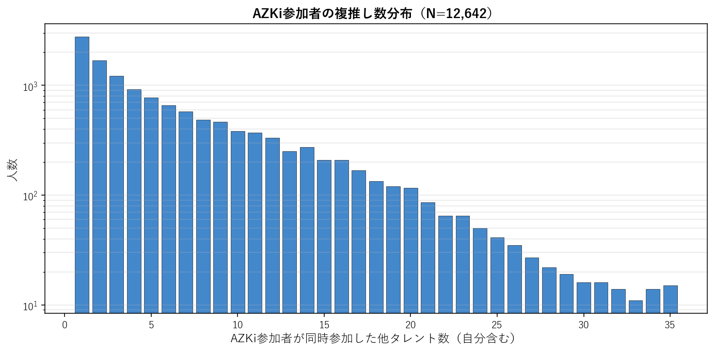
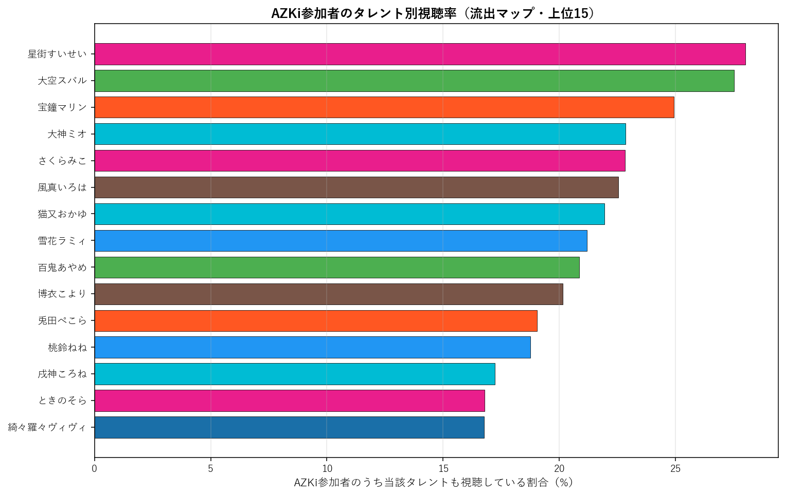
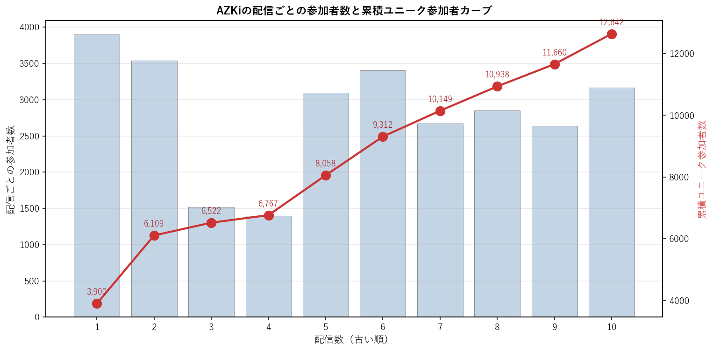

# AZKi（0期生）個別深掘り分析

本論文の手法を AZKi 一人に絞って詳細展開する個別レポート。集計時点: 2026年5月、10配信固定サンプル。

## 1. 基本プロファイル

| 項目 | 値 |
|---|---:|
| 所属ユニット | 0期生 |
| 活動年数（2026-05-25時点） | 7.52年 |
| 登録者数 | 1,310,000 |
| チャット参加者数（10配信総ユニーク） | 12,642 |
| 参加率（=ユニーク数/登録者数） | 0.97% |
| 専属ファン（AZKiのみ参加） | 2,779（22.0%） |
| 平均複推し数（自分含む） | 6.44 |
| 中央値複推し数 | 4.0 |

### 1.1 複推し数分布

AZKi参加者を「同時参加した他タレント数」で集計した分布（自分含む、1=単独）。

## 2. 重複ネットワーク

### 2.1 Jaccard 上位10タレント

AZKiと他タレントとのペアJaccard係数。順位は全595ペア中の順位。

| 順位 | タレント | ユニット | Jaccard | 共視聴者数 | 流出率 |
|---:|---|---|---:|---:|---:|
| 13 | 大神ミオ | ゲーマーズ | 13.21% | 2,888 | 22.8% |
| 17 | 風真いろは | 6期生 | 12.88% | 2,850 | 22.5% |
| 18 | 雪花ラミィ | 5期生 | 12.83% | 2,678 | 21.2% |
| 24 | ときのそら | 0期生 | 12.15% | 2,122 | 16.8% |
| 30 | 博衣こより | 6期生 | 11.87% | 2,547 | 20.1% |
| 36 | 大空スバル | 2期生 | 11.62% | 3,478 | 27.5% |
| 38 | 猫又おかゆ | ゲーマーズ | 11.37% | 2,773 | 21.9% |
| 53 | 百鬼あやめ | 2期生 | 10.94% | 2,636 | 20.9% |
| 60 | 星街すいせい | 0期生 | 10.75% | 3,541 | 28.0% |
| 85 | 桃鈴ねね | 5期生 | 10.27% | 2,371 | 18.8% |

### 2.2 流出マップ（参加率上位15）

AZKi参加者のうち、他タレントの配信にも参加していた割合の上位。絶対人数が多い人気タレントが上位に来る傾向があり、Jaccard上位とは異なる切り口。

| 順位 | タレント | 流出率 | 共視聴者数 | Jaccard |
|---:|---|---:|---:|---:|
| 1 | 星街すいせい | 28.0% | 3,541 | 10.75% |
| 2 | 大空スバル | 27.5% | 3,478 | 11.62% |
| 3 | 宝鐘マリン | 24.9% | 3,150 | 9.36% |
| 4 | 大神ミオ | 22.8% | 2,888 | 13.21% |
| 5 | さくらみこ | 22.8% | 2,886 | 9.18% |
| 6 | 風真いろは | 22.5% | 2,850 | 12.88% |
| 7 | 猫又おかゆ | 21.9% | 2,773 | 11.37% |
| 8 | 雪花ラミィ | 21.2% | 2,678 | 12.83% |
| 9 | 百鬼あやめ | 20.9% | 2,636 | 10.94% |
| 10 | 博衣こより | 20.1% | 2,547 | 11.87% |
| 11 | 兎田ぺこら | 19.0% | 2,406 | 8.94% |
| 12 | 桃鈴ねね | 18.8% | 2,371 | 10.27% |
| 13 | 戌神ころね | 17.2% | 2,178 | 9.22% |
| 14 | ときのそら | 16.8% | 2,122 | 12.15% |
| 15 | 綺々羅々ヴィヴィ | 16.8% | 2,120 | 9.95% |

### 2.3 3項 lift 上位10（共起の強い3者組）

$\text{lift} = P(AZKi \cap X \cap Y) / (P(AZKi \cap X) \cdot P(Y))$。1.0=独立、値が大きいほど3者の同時参加が独立予測値より集中している。$|AZKi \cap X| \geq 100$ のペアを対象。

| # | X | Y | lift | 3項共視聴 | (target,X) 共視聴 |
|---:|---|---|---:|---:|---:|
| 1 | アキロゼ | 不知火フレア | 10.56 | 345 | 969 |
| 2 | ロボ子さん | 不知火フレア | 10.50 | 437 | 1,234 |
| 3 | ときのそら | ロボ子さん | 10.25 | 544 | 2,122 |
| 4 | 白上フブキ | 不知火フレア | 9.72 | 567 | 1,730 |
| 5 | 一条莉々華 | 響咲リオナ | 9.46 | 430 | 1,113 |
| 6 | 尾丸ポルカ | 鷹嶺ルイ | 9.24 | 507 | 1,137 |
| 7 | 音乃瀬奏 | 一条莉々華 | 8.94 | 455 | 1,617 |
| 8 | 夏色まつり | 不知火フレア | 8.92 | 538 | 1,789 |
| 9 | 常闇トワ | 獅白ぼたん | 8.77 | 543 | 1,460 |
| 10 | ロボ子さん | 一条莉々華 | 8.71 | 338 | 1,234 |

**注意**: lift 値が非常に高いペアは小規模かつニッチな同質サブグループを示している。大規模タレント同士のペアでは lift 値は相対的に低くなる（分母が大きいため）。

## 3. ファン構造分解

### 3.1 ユニット別重複

AZKi参加者の中で各ユニットのタレントいずれかに参加した人の割合と、当該ユニット内タレントとの平均ペアJaccard。

| ユニット | 人数 | 流出率 | 共視聴者数 | 平均ペアJaccard |
|---|---:|---:|---:|---:|
| 0期生 | 4 | 45.7% | 5,772 | 10.02% |
| 1期生 | 3 | 26.8% | 3,385 | 7.68% |
| 2期生 | 2 | 37.5% | 4,735 | 11.28% |
| ゲーマーズ | 3 | 38.8% | 4,907 | 11.27% |
| 3期生 | 4 | 39.4% | 4,981 | 9.07% |
| 4期生 | 3 | 28.8% | 3,647 | 8.78% |
| 5期生 | 4 | 37.5% | 4,743 | 9.45% |
| 6期生 | 3 | 38.5% | 4,863 | 11.06% |
| ReGLOSS | 4 | 26.8% | 3,385 | 6.75% |
| FLOW GLOW | 4 | 34.0% | 4,294 | 8.88% |

### 3.2 活動年数（世代）別重複

AZKi参加者の各世代タレント群への重複度。

| 世代 | 人数 | 流出率 | 平均ペアJaccard |
|---|---:|---:|---:|
| 2018年以前(7年超) | 12 | 65.0% | 9.96% |
| 2019-2020(5-7年) | 11 | 56.3% | 9.13% |
| 2021-2023(2-5年) | 7 | 48.0% | 8.60% |
| 2024-(2年未満) | 4 | 34.0% | 8.88% |

### 3.3 登録者規模別重複

AZKi参加者の規模別タレント群への重複度。

| 規模 | 人数 | 流出率 | 平均ペアJaccard |
|---|---:|---:|---:|
| メガ(300万人超) | 1 | 24.9% | 9.36% |
| 大(200-300万) | 8 | 59.5% | 9.90% |
| 中(100-200万) | 19 | 68.2% | 9.29% |
| 小(50-100万) | 5 | 36.8% | 8.45% |
| 極小(50万未満) | 1 | 11.7% | 8.35% |

## 4. 構造的位置

### 4.1 ハブ性指標

- AZKi絡みペアの最高順位: **13/595**
- 上位30以内に入るAZKi絡みペアの数: **5/30**
- 上位100以内に入るAZKi絡みペアの数: **10/100**

### 4.2 横断接続性

AZKiのJaccard上位10ペアの所属ユニット数: **5/10ユニット**

Jaccard上位10ペアの内訳:
- 大神ミオ（ゲーマーズ）J=13.21%, 順位13
- 風真いろは（6期生）J=12.88%, 順位17
- 雪花ラミィ（5期生）J=12.83%, 順位18
- ときのそら（0期生）J=12.15%, 順位24
- 博衣こより（6期生）J=11.87%, 順位30
- 大空スバル（2期生）J=11.62%, 順位36
- 猫又おかゆ（ゲーマーズ）J=11.37%, 順位38
- 百鬼あやめ（2期生）J=10.94%, 順位53
- 星街すいせい（0期生）J=10.75%, 順位60
- 桃鈴ねね（5期生）J=10.27%, 順位85

### 4.3 外れ値度（平均Jaccard）

- AZKiの他34名との平均Jaccard: **9.28%**
- 35名中の順位（小さい順、外れ値ほど上位）: **32/35**

**解釈**: 値が小さいほど他タレントとの重なりが薄く外れ値的位置、大きいほどハブ的位置。35名中で見て中央付近にあれば「平均的な接続度」、上位5位以内なら外れ値、下位5位以内ならハブ。

## 5. 配信間多様性

### 5.1 配信ペア間Jaccard

AZKiの10配信間で、ペアごとに参加者集合のJaccard係数を計算した分布。

| 統計 | 値 |
|---|---:|
| 最小 | 19.5% |
| 平均 | 22.8% |
| 中央値 | 22.1% |
| 最大 | 30.8% |

**解釈**: 値が高ければ配信間で「常連層」が中心、値が低ければ配信ごとに「一見さん層」が多い。

### 5.2 各配信の独自参加者率

他9配信に参加していない「その配信だけに来た独自参加者」の割合。値が高い配信は特異な層を呼び込んだ可能性を示す。

| 配信日 | 参加者数 | 独自参加者 | 独自率 | タイトル |
|---|---:|---:|---:|---|
| 20260310 | 3,900 | 1,364 | 35.0% | 【クロックタワー・リワインド】完全初見！名作ホラー「クロックタワー」に挑戦【ホロ |
| 20260316 | 3,536 | 1,013 | 28.6% | 【歌枠】春に聴きたい曲！歌う～～～！！！J-POP・アニソン・ボカロ Singi |
| 20260318 | 1,521 | 185 | 12.2% | 【三ツ星ファーム】実食！ミシュラン級の味がレンジ5分で食べられる！？【ホロライブ |
| 20260319 | 1,396 | 126 | 9.0% | 【Green Light】やなぎなぎさんの音楽と物語が紡ぐ短編ADV【ホロライブ |
| 20260325 | 3,097 | 834 | 26.9% | 【重大報告】一日小豆警察署長 ＆ 香川県警察 交通規制アンバサダー に就任しまし |
| 20260329 | 3,406 | 984 | 28.9% | 【Euro Truck Simulator 2】日本MAP Project Ja |
| 20260403 | 2,670 | 727 | 27.2% | 【GeoGuessr】沖縄県MAPでシーサー出たら即終了【ホロライブ / AZK |
| 20260413 | 2,850 | 648 | 22.7% | 【歌枠】月曜の夜にしっとり歌います🌙ピアノ歌枠 Piano Singing St |
| 20260424 | 2,636 | 681 | 25.8% | 【BIOHAZARD RE:3】完全初見！バイオハザード RE:3 #1【ホロラ |
| 20260509 | 3,164 | 982 | 31.0% | 【歌枠】うたう！！！！！！！！！！！Singing Stream【ホロライブ / |

### 5.3 累積ユニーク参加者カーブ

古い配信から順に1本ずつ追加していった時の累積ユニーク参加者数。カーブが早く頭打ちになるほど常連が多く、長く伸び続けるほど新規流入が多い。

| 本数 | 配信日 | 配信参加者 | 累積ユニーク |
|---:|---|---:|---:|
| 1本目 | 20260310 | 3,900 | 3,900 |
| 2本目 | 20260316 | 3,536 | 6,109 |
| 3本目 | 20260318 | 1,521 | 6,522 |
| 4本目 | 20260319 | 1,396 | 6,767 |
| 5本目 | 20260325 | 3,097 | 8,058 |
| 6本目 | 20260329 | 3,406 | 9,312 |
| 7本目 | 20260403 | 2,670 | 10,149 |
| 8本目 | 20260413 | 2,850 | 10,938 |
| 9本目 | 20260424 | 2,636 | 11,660 |
| 10本目 | 20260509 | 3,164 | 12,642 |

## 6. まとめ

- AZKiは活動 7.5年・登録者 131.0万人。
  チャット参加コア層は 12,642人で参加率 0.97%。
- 専属ファンは 22.0%、平均複推し数は 6.44人。
- Jaccard 最高ペアは 大神ミオ（13.21%、全595ペア中13位）。
- 流出絶対数では人気古参（星街すいせい 28.0%、大空スバル 27.5%）が上位だが、Jaccard では同世代・同規模タレント（大神ミオ、風真いろは）が上位。
- ハブ性指標は弱め（上位30以内ペアは 5 組）、
  平均Jaccard 9.28% は35名中 32 位（小さい順）。
- 配信間ユーザー重複は平均 22.8%、累積カーブは10本で 12,642人に到達。

---
*分析時点: 2026年5月25日。本論文 `report_audience_paper_jp.pdf` の方法論を流用。個別タレントへの応用例として作成。*