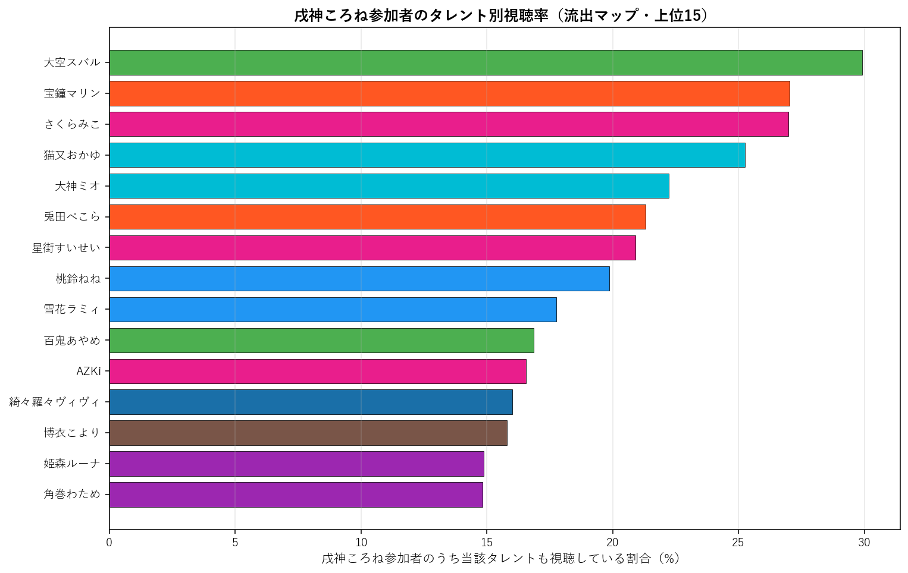

# 戌神ころね（ゲーマーズ）個別深掘り分析

本論文の手法を 戌神ころね 一人に絞って詳細展開する個別レポート。集計時点: 2026年5月、10配信固定サンプル。

## 1. 基本プロファイル

| 項目 | 値 |
|---|---:|
| 所属ユニット | ゲーマーズ |
| 活動年数（2026-05-25時点） | 7.12年 |
| 登録者数 | 2,270,000 |
| チャット参加者数（10配信総ユニーク） | 13,150 |
| 参加率（=ユニーク数/登録者数） | 0.58% |
| 専属ファン（戌神ころねのみ参加） | 3,341（25.4%） |
| 平均複推し数（自分含む） | 5.97 |
| 中央値複推し数 | 4.0 |

### 1.1 複推し数分布

戌神ころね参加者を「同時参加した他タレント数」で集計した分布（自分含む、1=単独）。

## 2. 重複ネットワーク

### 2.1 Jaccard 上位10タレント

戌神ころねと他タレントとのペアJaccard係数。順位は全595ペア中の順位。

| 順位 | タレント | ユニット | Jaccard | 共視聴者数 | 流出率 |
|---:|---|---|---:|---:|---:|
| 10 | 猫又おかゆ | ゲーマーズ | 13.65% | 3,323 | 25.3% |
| 15 | 大空スバル | 2期生 | 13.12% | 3,935 | 29.9% |
| 16 | 大神ミオ | ゲーマーズ | 13.09% | 2,925 | 22.2% |
| 40 | さくらみこ | 0期生 | 11.34% | 3,548 | 27.0% |
| 42 | 桃鈴ねね | 5期生 | 11.19% | 2,614 | 19.9% |
| 59 | 雪花ラミィ | 5期生 | 10.76% | 2,336 | 17.8% |
| 71 | 宝鐘マリン | 3期生 | 10.53% | 3,554 | 27.0% |
| 78 | 兎田ぺこら | 3期生 | 10.37% | 2,803 | 21.3% |
| 84 | 姫森ルーナ | 4期生 | 10.27% | 1,957 | 14.9% |
| 112 | 綺々羅々ヴィヴィ | FLOW GLOW | 9.66% | 2,107 | 16.0% |

### 2.2 流出マップ（参加率上位15）

戌神ころね参加者のうち、他タレントの配信にも参加していた割合の上位。絶対人数が多い人気タレントが上位に来る傾向があり、Jaccard上位とは異なる切り口。

| 順位 | タレント | 流出率 | 共視聴者数 | Jaccard |
|---:|---|---:|---:|---:|
| 1 | 大空スバル | 29.9% | 3,935 | 13.12% |
| 2 | 宝鐘マリン | 27.0% | 3,554 | 10.53% |
| 3 | さくらみこ | 27.0% | 3,548 | 11.34% |
| 4 | 猫又おかゆ | 25.3% | 3,323 | 13.65% |
| 5 | 大神ミオ | 22.2% | 2,925 | 13.09% |
| 6 | 兎田ぺこら | 21.3% | 2,803 | 10.37% |
| 7 | 星街すいせい | 20.9% | 2,751 | 8.03% |
| 8 | 桃鈴ねね | 19.9% | 2,614 | 11.19% |
| 9 | 雪花ラミィ | 17.8% | 2,336 | 10.76% |
| 10 | 百鬼あやめ | 16.9% | 2,217 | 8.86% |
| 11 | AZKi | 16.6% | 2,178 | 9.22% |
| 12 | 綺々羅々ヴィヴィ | 16.0% | 2,107 | 9.66% |
| 13 | 博衣こより | 15.8% | 2,079 | 9.27% |
| 14 | 姫森ルーナ | 14.9% | 1,957 | 10.27% |
| 15 | 角巻わため | 14.8% | 1,951 | 9.46% |

### 2.3 3項 lift 上位10（共起の強い3者組）

$\text{lift} = P(戌神ころね \cap X \cap Y) / (P(戌神ころね \cap X) \cdot P(Y))$。1.0=独立、値が大きいほど3者の同時参加が独立予測値より集中している。$|戌神ころね \cap X| \geq 100$ のペアを対象。

| # | X | Y | lift | 3項共視聴 | (target,X) 共視聴 |
|---:|---|---|---:|---:|---:|
| 1 | ときのそら | ロボ子さん | 11.60 | 407 | 1,403 |
| 2 | ロボ子さん | 不知火フレア | 9.90 | 343 | 1,028 |
| 3 | アキロゼ | 不知火フレア | 9.69 | 251 | 768 |
| 4 | ロボ子さん | 姫森ルーナ | 9.21 | 464 | 1,028 |
| 5 | ときのそら | 不知火フレア | 8.98 | 425 | 1,403 |
| 6 | 常闇トワ | 獅白ぼたん | 8.83 | 455 | 1,215 |
| 7 | ロボ子さん | 白銀ノエル | 8.77 | 436 | 1,028 |
| 8 | 尾丸ポルカ | 鷹嶺ルイ | 8.54 | 432 | 1,049 |
| 9 | アキロゼ | 獅白ぼたん | 8.53 | 278 | 768 |
| 10 | アキロゼ | 常闇トワ | 8.52 | 296 | 768 |

**注意**: lift 値が非常に高いペアは小規模かつニッチな同質サブグループを示している。大規模タレント同士のペアでは lift 値は相対的に低くなる（分母が大きいため）。

## 3. ファン構造分解

### 3.1 ユニット別重複

戌神ころね参加者の中で各ユニットのタレントいずれかに参加した人の割合と、当該ユニット内タレントとの平均ペアJaccard。

| ユニット | 人数 | 流出率 | 共視聴者数 | 平均ペアJaccard |
|---|---:|---:|---:|---:|
| 0期生 | 5 | 44.8% | 5,893 | 8.50% |
| 1期生 | 3 | 24.4% | 3,212 | 6.92% |
| 2期生 | 2 | 37.1% | 4,874 | 10.99% |
| ゲーマーズ | 2 | 35.3% | 4,636 | 13.37% |
| 3期生 | 4 | 41.2% | 5,413 | 9.23% |
| 4期生 | 3 | 28.3% | 3,719 | 8.69% |
| 5期生 | 4 | 35.6% | 4,679 | 8.70% |
| 6期生 | 3 | 29.4% | 3,862 | 8.40% |
| ReGLOSS | 4 | 22.8% | 2,996 | 5.76% |
| FLOW GLOW | 4 | 29.7% | 3,907 | 7.47% |

### 3.2 活動年数（世代）別重複

戌神ころね参加者の各世代タレント群への重複度。

| 世代 | 人数 | 流出率 | 平均ペアJaccard |
|---|---:|---:|---:|
| 2018年以前(7年超) | 12 | 62.4% | 9.33% |
| 2019-2020(5-7年) | 11 | 56.6% | 8.89% |
| 2021-2023(2-5年) | 7 | 38.4% | 6.89% |
| 2024-(2年未満) | 4 | 29.7% | 7.47% |

### 3.3 登録者規模別重複

戌神ころね参加者の規模別タレント群への重複度。

| 規模 | 人数 | 流出率 | 平均ペアJaccard |
|---|---:|---:|---:|
| メガ(300万人超) | 1 | 27.0% | 10.53% |
| 大(200-300万) | 7 | 59.0% | 10.68% |
| 中(100-200万) | 20 | 62.8% | 8.01% |
| 小(50-100万) | 5 | 32.3% | 7.16% |
| 極小(50万未満) | 1 | 9.3% | 6.61% |

## 4. 構造的位置

### 4.1 ハブ性指標

- 戌神ころね絡みペアの最高順位: **10/595**
- 上位30以内に入る戌神ころね絡みペアの数: **3/30**
- 上位100以内に入る戌神ころね絡みペアの数: **9/100**

### 4.2 横断接続性

戌神ころねのJaccard上位10ペアの所属ユニット数: **7/10ユニット**

Jaccard上位10ペアの内訳:
- 猫又おかゆ（ゲーマーズ）J=13.65%, 順位10
- 大空スバル（2期生）J=13.12%, 順位15
- 大神ミオ（ゲーマーズ）J=13.09%, 順位16
- さくらみこ（0期生）J=11.34%, 順位40
- 桃鈴ねね（5期生）J=11.19%, 順位42
- 雪花ラミィ（5期生）J=10.76%, 順位59
- 宝鐘マリン（3期生）J=10.53%, 順位71
- 兎田ぺこら（3期生）J=10.37%, 順位78
- 姫森ルーナ（4期生）J=10.27%, 順位84
- 綺々羅々ヴィヴィ（FLOW GLOW）J=9.66%, 順位112

### 4.3 外れ値度（平均Jaccard）

- 戌神ころねの他34名との平均Jaccard: **8.47%**
- 35名中の順位（小さい順、外れ値ほど上位）: **25/35**

**解釈**: 値が小さいほど他タレントとの重なりが薄く外れ値的位置、大きいほどハブ的位置。35名中で見て中央付近にあれば「平均的な接続度」、上位5位以内なら外れ値、下位5位以内ならハブ。

## 5. 配信間多様性

### 5.1 配信ペア間Jaccard

戌神ころねの10配信間で、ペアごとに参加者集合のJaccard係数を計算した分布。

| 統計 | 値 |
|---|---:|
| 最小 | 17.2% |
| 平均 | 20.5% |
| 中央値 | 20.7% |
| 最大 | 24.9% |

**解釈**: 値が高ければ配信間で「常連層」が中心、値が低ければ配信ごとに「一見さん層」が多い。

### 5.2 各配信の独自参加者率

他9配信に参加していない「その配信だけに来た独自参加者」の割合。値が高い配信は特異な層を呼び込んだ可能性を示す。

| 配信日 | 参加者数 | 独自参加者 | 独自率 | タイトル |
|---|---:|---:|---:|---|
| 20260325 | 1,883 | 473 | 25.1% | 【#突発ホロライブ】ころね支店【R.E.P.O. 】 |
| 20260326 | 2,896 | 862 | 29.8% | 超話題作ゲーム『ゼットンの1兆度ホームラン競争』、遊ぶぞ！ |
| 20260401 | 2,484 | 671 | 27.0% | チル枠～鮨ではなく弁当～ |
| 20260402 | 2,485 | 614 | 24.7% | 【ウルトラマン】超話題ゲーム『宇宙恐竜-ゼットン-に恋して』やるぞ！ |
| 20260407 | 3,848 | 1,342 | 34.9% | 【お知らせもある】急な雑談 |
| 20260408 | 3,000 | 804 | 26.8% | 【釣りゲーと聞いて】ウミガリするヨ |
| 20260411 | 2,935 | 989 | 33.7% | 【ド★初見】スーパーマリオギャラクシー２遊ぶ！ |
| 20260414 | 3,220 | 1,034 | 32.1% | 高野菜 |
| 20260416 | 3,075 | 937 | 30.5% | きかんしゃトーマス！！！！！！！！ |
| 20260417 | 1,783 | 342 | 19.2% | ぽこあ |

### 5.3 累積ユニーク参加者カーブ

古い配信から順に1本ずつ追加していった時の累積ユニーク参加者数。カーブが早く頭打ちになるほど常連が多く、長く伸び続けるほど新規流入が多い。

| 本数 | 配信日 | 配信参加者 | 累積ユニーク |
|---:|---|---:|---:|
| 1本目 | 20260325 | 1,883 | 1,883 |
| 2本目 | 20260326 | 2,896 | 3,975 |
| 3本目 | 20260401 | 2,484 | 5,308 |
| 4本目 | 20260402 | 2,485 | 6,385 |
| 5本目 | 20260407 | 3,848 | 8,382 |
| 6本目 | 20260408 | 3,000 | 9,516 |
| 7本目 | 20260411 | 2,935 | 10,689 |
| 8本目 | 20260414 | 3,220 | 11,840 |
| 9本目 | 20260416 | 3,075 | 12,808 |
| 10本目 | 20260417 | 1,783 | 13,150 |

## 6. まとめ

- 戌神ころねは活動 7.1年・登録者 227.0万人。
  チャット参加コア層は 13,150人で参加率 0.58%。
- 専属ファンは 25.4%、平均複推し数は 5.97人。
- Jaccard 最高ペアは 猫又おかゆ（13.65%、全595ペア中10位）。
- 流出絶対数では人気古参（大空スバル 29.9%、宝鐘マリン 27.0%）が上位だが、Jaccard では同世代・同規模タレント（猫又おかゆ、大空スバル）が上位。
- ハブ性指標は弱め（上位30以内ペアは 3 組）、
  平均Jaccard 8.47% は35名中 25 位（小さい順）。
- 配信間ユーザー重複は平均 20.5%、累積カーブは10本で 13,150人に到達。

---
*分析時点: 2026年5月25日。本論文 `report_audience_paper_jp.pdf` の方法論を流用。個別タレントへの応用例として作成。*