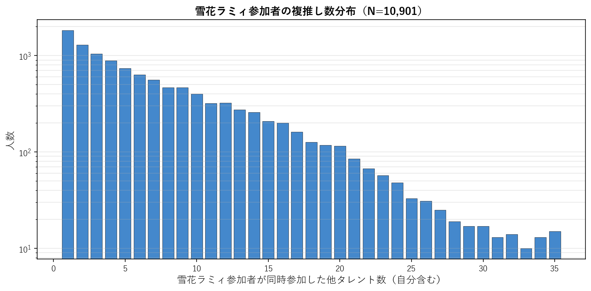
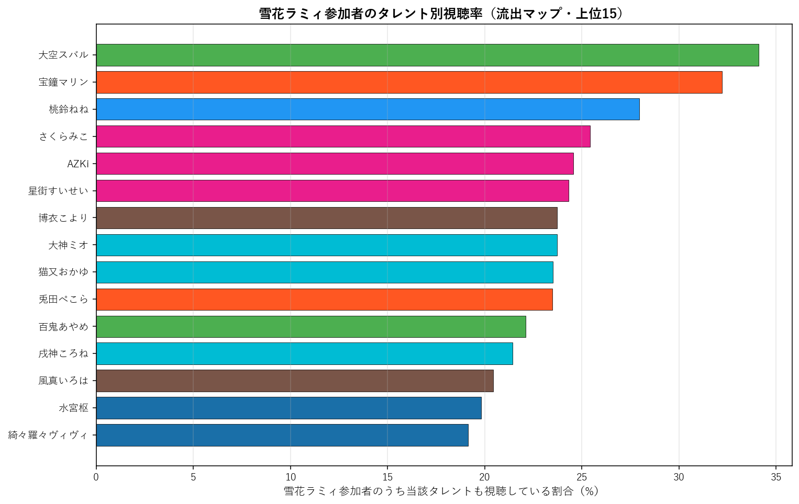
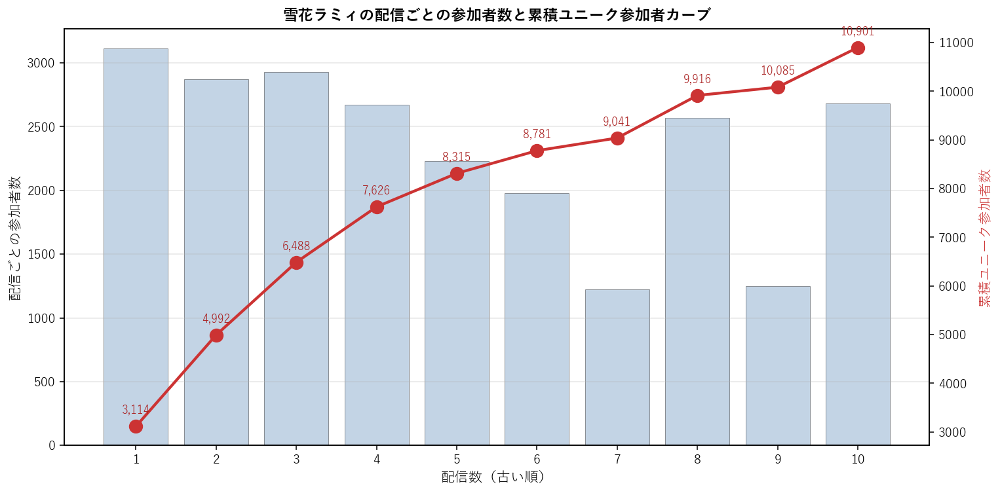

# 雪花ラミィ（5期生）個別深掘り分析

本論文の手法を 雪花ラミィ 一人に絞って詳細展開する個別レポート。集計時点: 2026年5月、10配信固定サンプル。

## 1. 基本プロファイル

| 項目 | 値 |
|---|---:|
| 所属ユニット | 5期生 |
| 活動年数（2026-05-25時点） | 5.78年 |
| 登録者数 | 1,370,000 |
| チャット参加者数（10配信総ユニーク） | 10,901 |
| 参加率（=ユニーク数/登録者数） | 0.80% |
| 専属ファン（雪花ラミィのみ参加） | 1,829（16.8%） |
| 平均複推し数（自分含む） | 7.04 |
| 中央値複推し数 | 5.0 |

### 1.1 複推し数分布

雪花ラミィ参加者を「同時参加した他タレント数」で集計した分布（自分含む、1=単独）。

## 2. 重複ネットワーク

### 2.1 Jaccard 上位10タレント

雪花ラミィと他タレントとのペアJaccard係数。順位は全595ペア中の順位。

| 順位 | タレント | ユニット | Jaccard | 共視聴者数 | 流出率 |
|---:|---|---|---:|---:|---:|
| 7 | 桃鈴ねね | 5期生 | 14.73% | 3,047 | 28.0% |
| 12 | 大空スバル | 2期生 | 13.30% | 3,718 | 34.1% |
| 14 | 博衣こより | 6期生 | 13.15% | 2,587 | 23.7% |
| 18 | AZKi | 0期生 | 12.83% | 2,678 | 24.6% |
| 20 | 大神ミオ | ゲーマーズ | 12.65% | 2,585 | 23.7% |
| 27 | 白銀ノエル | 3期生 | 12.03% | 2,004 | 18.4% |
| 41 | 猫又おかゆ | ゲーマーズ | 11.21% | 2,562 | 23.5% |
| 44 | 宝鐘マリン | 3期生 | 11.13% | 3,512 | 32.2% |
| 54 | 水宮枢 | FLOW GLOW | 10.90% | 2,159 | 19.8% |
| 59 | 戌神ころね | ゲーマーズ | 10.76% | 2,336 | 21.4% |

### 2.2 流出マップ（参加率上位15）

雪花ラミィ参加者のうち、他タレントの配信にも参加していた割合の上位。絶対人数が多い人気タレントが上位に来る傾向があり、Jaccard上位とは異なる切り口。

| 順位 | タレント | 流出率 | 共視聴者数 | Jaccard |
|---:|---|---:|---:|---:|
| 1 | 大空スバル | 34.1% | 3,718 | 13.30% |
| 2 | 宝鐘マリン | 32.2% | 3,512 | 11.13% |
| 3 | 桃鈴ねね | 28.0% | 3,047 | 14.73% |
| 4 | さくらみこ | 25.4% | 2,771 | 9.30% |
| 5 | AZKi | 24.6% | 2,678 | 12.83% |
| 6 | 星街すいせい | 24.3% | 2,650 | 8.25% |
| 7 | 博衣こより | 23.7% | 2,587 | 13.15% |
| 8 | 大神ミオ | 23.7% | 2,585 | 12.65% |
| 9 | 猫又おかゆ | 23.5% | 2,562 | 11.21% |
| 10 | 兎田ぺこら | 23.5% | 2,559 | 10.22% |
| 11 | 百鬼あやめ | 22.1% | 2,409 | 10.67% |
| 12 | 戌神ころね | 21.4% | 2,336 | 10.76% |
| 13 | 風真いろは | 20.4% | 2,228 | 10.60% |
| 14 | 水宮枢 | 19.8% | 2,159 | 10.90% |
| 15 | 綺々羅々ヴィヴィ | 19.2% | 2,088 | 10.66% |

### 2.3 3項 lift 上位10（共起の強い3者組）

$\text{lift} = P(雪花ラミィ \cap X \cap Y) / (P(雪花ラミィ \cap X) \cdot P(Y))$。1.0=独立、値が大きいほど3者の同時参加が独立予測値より集中している。$|雪花ラミィ \cap X| \geq 100$ のペアを対象。

| # | X | Y | lift | 3項共視聴 | (target,X) 共視聴 |
|---:|---|---|---:|---:|---:|
| 1 | ときのそら | ロボ子さん | 11.29 | 417 | 1,477 |
| 2 | アキロゼ | 不知火フレア | 10.48 | 302 | 855 |
| 3 | ロボ子さん | 不知火フレア | 10.29 | 365 | 1,052 |
| 4 | 白上フブキ | 不知火フレア | 9.66 | 491 | 1,508 |
| 5 | ロボ子さん | 一条莉々華 | 9.55 | 316 | 1,052 |
| 6 | ときのそら | 不知火フレア | 9.52 | 474 | 1,477 |
| 7 | ロボ子さん | 白銀ノエル | 9.41 | 479 | 1,052 |
| 8 | 音乃瀬奏 | 一条莉々華 | 9.37 | 455 | 1,544 |
| 9 | 不知火フレア | 白銀ノエル | 9.07 | 537 | 1,224 |
| 10 | 鷹嶺ルイ | 響咲リオナ | 9.02 | 530 | 1,438 |

**注意**: lift 値が非常に高いペアは小規模かつニッチな同質サブグループを示している。大規模タレント同士のペアでは lift 値は相対的に低くなる（分母が大きいため）。

## 3. ファン構造分解

### 3.1 ユニット別重複

雪花ラミィ参加者の中で各ユニットのタレントいずれかに参加した人の割合と、当該ユニット内タレントとの平均ペアJaccard。

| ユニット | 人数 | 流出率 | 共視聴者数 | 平均ペアJaccard |
|---|---:|---:|---:|---:|
| 0期生 | 5 | 50.3% | 5,481 | 9.40% |
| 1期生 | 3 | 28.1% | 3,062 | 7.52% |
| 2期生 | 2 | 44.0% | 4,800 | 11.98% |
| ゲーマーズ | 3 | 42.8% | 4,667 | 11.54% |
| 3期生 | 4 | 47.8% | 5,216 | 10.37% |
| 4期生 | 3 | 31.4% | 3,420 | 8.97% |
| 5期生 | 3 | 37.7% | 4,106 | 10.14% |
| 6期生 | 3 | 39.6% | 4,320 | 10.71% |
| ReGLOSS | 4 | 28.9% | 3,146 | 7.05% |
| FLOW GLOW | 4 | 38.4% | 4,190 | 9.45% |

### 3.2 活動年数（世代）別重複

雪花ラミィ参加者の各世代タレント群への重複度。

| 世代 | 人数 | 流出率 | 平均ペアJaccard |
|---|---:|---:|---:|
| 2018年以前(7年超) | 13 | 70.7% | 9.86% |
| 2019-2020(5-7年) | 10 | 64.1% | 9.88% |
| 2021-2023(2-5年) | 7 | 49.4% | 8.62% |
| 2024-(2年未満) | 4 | 38.4% | 9.45% |

### 3.3 登録者規模別重複

雪花ラミィ参加者の規模別タレント群への重複度。

| 規模 | 人数 | 流出率 | 平均ペアJaccard |
|---|---:|---:|---:|
| メガ(300万人超) | 1 | 32.2% | 11.13% |
| 大(200-300万) | 8 | 65.3% | 10.40% |
| 中(100-200万) | 19 | 72.5% | 9.28% |
| 小(50-100万) | 5 | 41.6% | 9.10% |
| 極小(50万未満) | 1 | 13.1% | 8.92% |

## 4. 構造的位置

### 4.1 ハブ性指標

- 雪花ラミィ絡みペアの最高順位: **7/595**
- 上位30以内に入る雪花ラミィ絡みペアの数: **6/30**
- 上位100以内に入る雪花ラミィ絡みペアの数: **14/100**

### 4.2 横断接続性

雪花ラミィのJaccard上位10ペアの所属ユニット数: **7/10ユニット**

Jaccard上位10ペアの内訳:
- 桃鈴ねね（5期生）J=14.73%, 順位7
- 大空スバル（2期生）J=13.30%, 順位12
- 博衣こより（6期生）J=13.15%, 順位14
- AZKi（0期生）J=12.83%, 順位18
- 大神ミオ（ゲーマーズ）J=12.65%, 順位20
- 白銀ノエル（3期生）J=12.03%, 順位27
- 猫又おかゆ（ゲーマーズ）J=11.21%, 順位41
- 宝鐘マリン（3期生）J=11.13%, 順位44
- 水宮枢（FLOW GLOW）J=10.90%, 順位54
- 戌神ころね（ゲーマーズ）J=10.76%, 順位59

### 4.3 外れ値度（平均Jaccard）

- 雪花ラミィの他34名との平均Jaccard: **9.56%**
- 35名中の順位（小さい順、外れ値ほど上位）: **33/35**

**解釈**: 値が小さいほど他タレントとの重なりが薄く外れ値的位置、大きいほどハブ的位置。35名中で見て中央付近にあれば「平均的な接続度」、上位5位以内なら外れ値、下位5位以内ならハブ。

## 5. 配信間多様性

### 5.1 配信ペア間Jaccard

雪花ラミィの10配信間で、ペアごとに参加者集合のJaccard係数を計算した分布。

| 統計 | 値 |
|---|---:|
| 最小 | 16.9% |
| 平均 | 21.9% |
| 中央値 | 22.0% |
| 最大 | 27.9% |

**解釈**: 値が高ければ配信間で「常連層」が中心、値が低ければ配信ごとに「一見さん層」が多い。

### 5.2 各配信の独自参加者率

他9配信に参加していない「その配信だけに来た独自参加者」の割合。値が高い配信は特異な層を呼び込んだ可能性を示す。

| 配信日 | 参加者数 | 独自参加者 | 独自率 | タイトル |
|---|---:|---:|---:|---|
| 20260311 | 3,114 | 1,148 | 36.9% | 【テストプレイをサボりすぎたＲＰＧ】クリア時間100時間の超大作ゲームをプレイす |
| 20260317 | 2,871 | 1,079 | 37.6% | 【ぽこ あ ポケモン】ゆるゆるなぽこあ生活スタート【雪花ラミィ/ホロライブ】 |
| 20260402 | 2,930 | 865 | 29.5% | 【Bits & Bops】リズムゲーね！！！任せろ！！！【雪花ラミィ/ホロライブ |
| 20260404 | 2,672 | 745 | 27.9% | 【雑談】え、1か月ぶりの雑談ですってぇ！？【雪花ラミィ /ホロライブ】 |
| 20260417 | 2,232 | 500 | 22.4% | 【いえのあじ | A taste of home】最恐ホラーってマジ？よし、行く |
| 20260419 | 1,981 | 354 | 17.9% | 【鬼サザエトリ】海鮮が食べたい気分【雪花ラミィ /ホロライブ】 |
| 20260422 | 1,222 | 216 | 17.7% | 【モンギル：STAR DIVE】話題の新作『モンギル』！プレイするよ～！！【雪花 |
| 20260502 | 2,571 | 785 | 30.5% | 【夜雑談】配信内容変更！！雑談してもいい？【雪花ラミィ /ホロライブ】 |
| 20260507 | 1,247 | 149 | 11.9% | 【Cursed Companions】協力型ホラーゲーム！「禁句」に気をつけろ！ |
| 20260508 | 2,681 | 816 | 30.4% | 【ワンワンバトル】デカイ声なら任せろ！！！【雪花ラミィ /ホロライブ】 |

### 5.3 累積ユニーク参加者カーブ

古い配信から順に1本ずつ追加していった時の累積ユニーク参加者数。カーブが早く頭打ちになるほど常連が多く、長く伸び続けるほど新規流入が多い。

| 本数 | 配信日 | 配信参加者 | 累積ユニーク |
|---:|---|---:|---:|
| 1本目 | 20260311 | 3,114 | 3,114 |
| 2本目 | 20260317 | 2,871 | 4,992 |
| 3本目 | 20260402 | 2,930 | 6,488 |
| 4本目 | 20260404 | 2,672 | 7,626 |
| 5本目 | 20260417 | 2,232 | 8,315 |
| 6本目 | 20260419 | 1,981 | 8,781 |
| 7本目 | 20260422 | 1,222 | 9,041 |
| 8本目 | 20260502 | 2,571 | 9,916 |
| 9本目 | 20260507 | 1,247 | 10,085 |
| 10本目 | 20260508 | 2,681 | 10,901 |

## 6. まとめ

- 雪花ラミィは活動 5.8年・登録者 137.0万人。
  チャット参加コア層は 10,901人で参加率 0.80%。
- 専属ファンは 16.8%、平均複推し数は 7.04人。
- Jaccard 最高ペアは 桃鈴ねね（14.73%、全595ペア中7位）。
- 流出絶対数では人気古参（大空スバル 34.1%、宝鐘マリン 32.2%）が上位だが、Jaccard では同世代・同規模タレント（桃鈴ねね、大空スバル）が上位。
- ハブ性指標は弱め（上位30以内ペアは 6 組）、
  平均Jaccard 9.56% は35名中 33 位（小さい順）。
- 配信間ユーザー重複は平均 21.9%、累積カーブは10本で 10,901人に到達。

---
*分析時点: 2026年5月25日。本論文 `report_audience_paper_jp.pdf` の方法論を流用。個別タレントへの応用例として作成。*