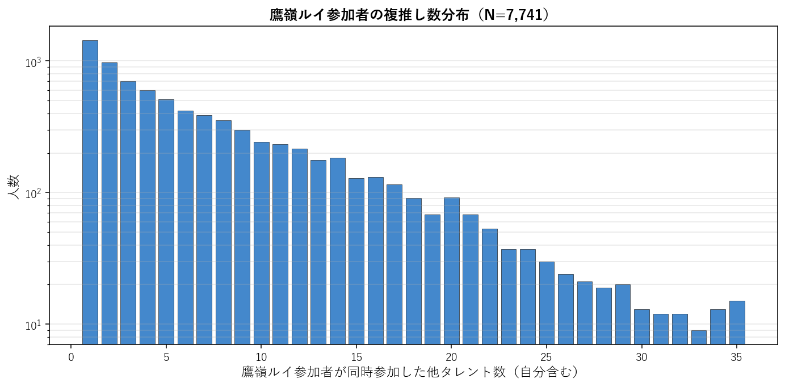
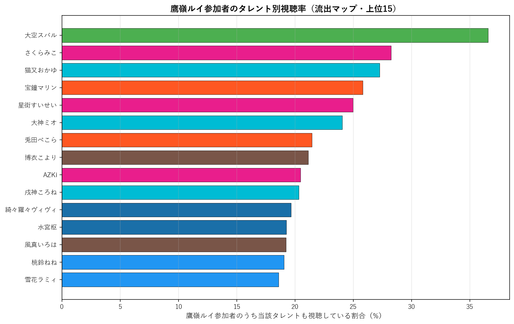
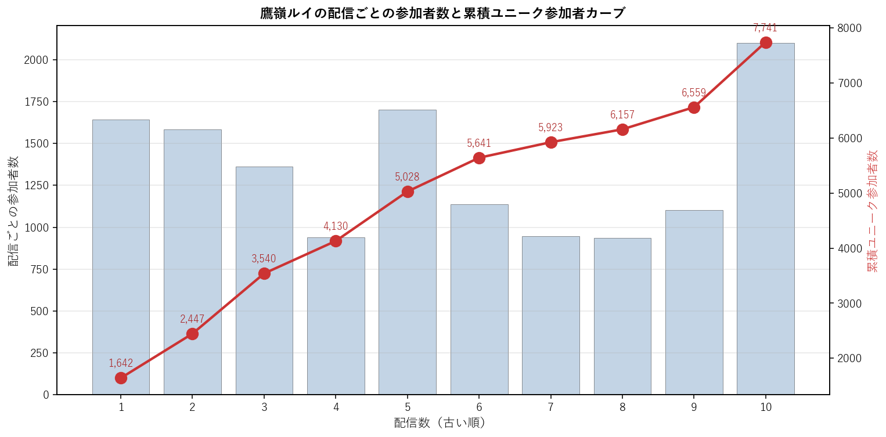

# 鷹嶺ルイ（6期生）個別深掘り分析

本論文の手法を 鷹嶺ルイ 一人に絞って詳細展開する個別レポート。集計時点: 2026年5月、10配信固定サンプル。

## 1. 基本プロファイル

| 項目 | 値 |
|---|---:|
| 所属ユニット | 6期生 |
| 活動年数（2026-05-25時点） | 4.49年 |
| 登録者数 | 1,110,000 |
| チャット参加者数（10配信総ユニーク） | 7,741 |
| 参加率（=ユニーク数/登録者数） | 0.70% |
| 専属ファン（鷹嶺ルイのみ参加） | 1,435（18.5%） |
| 平均複推し数（自分含む） | 7.00 |
| 中央値複推し数 | 5.0 |

### 1.1 複推し数分布

鷹嶺ルイ参加者を「同時参加した他タレント数」で集計した分布（自分含む、1=単独）。

## 2. 重複ネットワーク

### 2.1 Jaccard 上位10タレント

鷹嶺ルイと他タレントとのペアJaccard係数。順位は全595ペア中の順位。

| 順位 | タレント | ユニット | Jaccard | 共視聴者数 | 流出率 |
|---:|---|---|---:|---:|---:|
| 37 | 尾丸ポルカ | 5期生 | 11.48% | 1,386 | 17.9% |
| 48 | 大空スバル | 2期生 | 11.02% | 2,831 | 36.6% |
| 73 | 猫又おかゆ | ゲーマーズ | 10.48% | 2,111 | 27.3% |
| 80 | 大神ミオ | ゲーマーズ | 10.35% | 1,862 | 24.1% |
| 106 | 響咲リオナ | FLOW GLOW | 9.79% | 1,275 | 16.5% |
| 137 | 博衣こより | 6期生 | 9.37% | 1,636 | 21.1% |
| 148 | 輪堂千速 | FLOW GLOW | 9.23% | 1,271 | 16.4% |
| 166 | 綺々羅々ヴィヴィ | FLOW GLOW | 8.95% | 1,522 | 19.7% |
| 187 | 水宮枢 | FLOW GLOW | 8.61% | 1,491 | 19.3% |
| 199 | 白銀ノエル | 3期生 | 8.46% | 1,209 | 15.6% |

### 2.2 流出マップ（参加率上位15）

鷹嶺ルイ参加者のうち、他タレントの配信にも参加していた割合の上位。絶対人数が多い人気タレントが上位に来る傾向があり、Jaccard上位とは異なる切り口。

| 順位 | タレント | 流出率 | 共視聴者数 | Jaccard |
|---:|---|---:|---:|---:|
| 1 | 大空スバル | 36.6% | 2,831 | 11.02% |
| 2 | さくらみこ | 28.3% | 2,187 | 8.03% |
| 3 | 猫又おかゆ | 27.3% | 2,111 | 10.48% |
| 4 | 宝鐘マリン | 25.8% | 1,998 | 6.68% |
| 5 | 星街すいせい | 25.0% | 1,934 | 6.52% |
| 6 | 大神ミオ | 24.1% | 1,862 | 10.35% |
| 7 | 兎田ぺこら | 21.5% | 1,661 | 7.30% |
| 8 | 博衣こより | 21.1% | 1,636 | 9.37% |
| 9 | AZKi | 20.5% | 1,584 | 8.43% |
| 10 | 戌神ころね | 20.3% | 1,573 | 8.14% |
| 11 | 綺々羅々ヴィヴィ | 19.7% | 1,522 | 8.95% |
| 12 | 水宮枢 | 19.3% | 1,491 | 8.61% |
| 13 | 風真いろは | 19.2% | 1,488 | 8.00% |
| 14 | 桃鈴ねね | 19.1% | 1,475 | 7.73% |
| 15 | 雪花ラミィ | 18.6% | 1,438 | 8.36% |

### 2.3 3項 lift 上位10（共起の強い3者組）

$\text{lift} = P(鷹嶺ルイ \cap X \cap Y) / (P(鷹嶺ルイ \cap X) \cdot P(Y))$。1.0=独立、値が大きいほど3者の同時参加が独立予測値より集中している。$|鷹嶺ルイ \cap X| \geq 100$ のペアを対象。

| # | X | Y | lift | 3項共視聴 | (target,X) 共視聴 |
|---:|---|---|---:|---:|---:|
| 1 | ときのそら | ロボ子さん | 12.97 | 314 | 968 |
| 2 | ロボ子さん | 尾丸ポルカ | 10.91 | 267 | 686 |
| 3 | アキロゼ | 尾丸ポルカ | 10.82 | 232 | 601 |
| 4 | ロボ子さん | 一条莉々華 | 10.66 | 230 | 686 |
| 5 | 不知火フレア | 尾丸ポルカ | 10.52 | 293 | 781 |
| 6 | アキロゼ | 不知火フレア | 10.46 | 212 | 601 |
| 7 | 一条莉々華 | 響咲リオナ | 10.46 | 338 | 791 |
| 8 | ロボ子さん | 不知火フレア | 10.42 | 241 | 686 |
| 9 | ロボ子さん | 響咲リオナ | 10.31 | 289 | 686 |
| 10 | 音乃瀬奏 | 一条莉々華 | 10.22 | 316 | 983 |

**注意**: lift 値が非常に高いペアは小規模かつニッチな同質サブグループを示している。大規模タレント同士のペアでは lift 値は相対的に低くなる（分母が大きいため）。

## 3. ファン構造分解

### 3.1 ユニット別重複

鷹嶺ルイ参加者の中で各ユニットのタレントいずれかに参加した人の割合と、当該ユニット内タレントとの平均ペアJaccard。

| ユニット | 人数 | 流出率 | 共視聴者数 | 平均ペアJaccard |
|---|---:|---:|---:|---:|
| 0期生 | 5 | 48.7% | 3,767 | 7.25% |
| 1期生 | 3 | 28.1% | 2,174 | 6.49% |
| 2期生 | 2 | 42.4% | 3,283 | 8.75% |
| ゲーマーズ | 3 | 44.0% | 3,407 | 9.66% |
| 3期生 | 4 | 42.4% | 3,279 | 7.19% |
| 4期生 | 3 | 30.7% | 2,373 | 7.50% |
| 5期生 | 4 | 42.8% | 3,312 | 8.81% |
| 6期生 | 2 | 31.1% | 2,405 | 8.69% |
| ReGLOSS | 4 | 28.7% | 2,221 | 6.06% |
| FLOW GLOW | 4 | 42.1% | 3,258 | 9.15% |

### 3.2 活動年数（世代）別重複

鷹嶺ルイ参加者の各世代タレント群への重複度。

| 世代 | 人数 | 流出率 | 平均ペアJaccard |
|---|---:|---:|---:|
| 2018年以前(7年超) | 13 | 67.9% | 7.86% |
| 2019-2020(5-7年) | 11 | 62.1% | 7.86% |
| 2021-2023(2-5年) | 6 | 43.7% | 6.93% |
| 2024-(2年未満) | 4 | 42.1% | 9.15% |

### 3.3 登録者規模別重複

鷹嶺ルイ参加者の規模別タレント群への重複度。

| 規模 | 人数 | 流出率 | 平均ペアJaccard |
|---|---:|---:|---:|
| メガ(300万人超) | 1 | 25.8% | 6.68% |
| 大(200-300万) | 8 | 65.8% | 8.43% |
| 中(100-200万) | 19 | 68.1% | 7.53% |
| 小(50-100万) | 5 | 42.8% | 7.98% |
| 極小(50万未満) | 1 | 16.5% | 9.79% |

## 4. 構造的位置

### 4.1 ハブ性指標

- 鷹嶺ルイ絡みペアの最高順位: **37/595**
- 上位30以内に入る鷹嶺ルイ絡みペアの数: **0/30**
- 上位100以内に入る鷹嶺ルイ絡みペアの数: **4/100**

### 4.2 横断接続性

鷹嶺ルイのJaccard上位10ペアの所属ユニット数: **6/10ユニット**

Jaccard上位10ペアの内訳:
- 尾丸ポルカ（5期生）J=11.48%, 順位37
- 大空スバル（2期生）J=11.02%, 順位48
- 猫又おかゆ（ゲーマーズ）J=10.48%, 順位73
- 大神ミオ（ゲーマーズ）J=10.35%, 順位80
- 響咲リオナ（FLOW GLOW）J=9.79%, 順位106
- 博衣こより（6期生）J=9.37%, 順位137
- 輪堂千速（FLOW GLOW）J=9.23%, 順位148
- 綺々羅々ヴィヴィ（FLOW GLOW）J=8.95%, 順位166
- 水宮枢（FLOW GLOW）J=8.61%, 順位187
- 白銀ノエル（3期生）J=8.46%, 順位199

### 4.3 外れ値度（平均Jaccard）

- 鷹嶺ルイの他34名との平均Jaccard: **7.85%**
- 35名中の順位（小さい順、外れ値ほど上位）: **17/35**

**解釈**: 値が小さいほど他タレントとの重なりが薄く外れ値的位置、大きいほどハブ的位置。35名中で見て中央付近にあれば「平均的な接続度」、上位5位以内なら外れ値、下位5位以内ならハブ。

## 5. 配信間多様性

### 5.1 配信ペア間Jaccard

鷹嶺ルイの10配信間で、ペアごとに参加者集合のJaccard係数を計算した分布。

| 統計 | 値 |
|---|---:|
| 最小 | 6.7% |
| 平均 | 12.1% |
| 中央値 | 9.3% |
| 最大 | 31.9% |

**解釈**: 値が高ければ配信間で「常連層」が中心、値が低ければ配信ごとに「一見さん層」が多い。

### 5.2 各配信の独自参加者率

他9配信に参加していない「その配信だけに来た独自参加者」の割合。値が高い配信は特異な層を呼び込んだ可能性を示す。

| 配信日 | 参加者数 | 独自参加者 | 独自率 | タイトル |
|---|---:|---:|---:|---|
| 20260411 | 1,642 | 560 | 34.1% | 【 ドラゴンボールZ KAKAROT 】完全初見！クリア後のサブクエとDLC『T |
| 20260412 | 1,585 | 470 | 29.7% | 【 ドラゴンボールZ KAKAROT 】完全初見！トランクスの続きとサブクエ…そ |
| 20260412 | 1,362 | 431 | 31.6% | 【 桜花賞 】18頭の桜咲きほこる桜花賞。誰が満開の花を咲かれるのか⁉【鷹嶺ルイ |
| 20260414 | 941 | 441 | 46.9% | 【 ウマ娘 プリティーダービー 】アーモンドアイを初めて育成するぜ！！！【鷹嶺ル |
| 20260419 | 1,700 | 644 | 37.9% | 【 皐月賞 】G1の的中率がわるいのでここで挽回したい・・・！！！【鷹嶺ルイ/ホ |
| 20260421 | 1,136 | 485 | 42.7% | 【 いえのあじ 】最近肩こりがヤバいのでホラーで荒治療。※荒療治が正しいらしい【 |
| 20260426 | 946 | 211 | 22.3% | 【 フローラステークス＆マイラーズカップ 】今回も的中したい…‼【鷹嶺ルイ/ホロ |
| 20260426 | 935 | 222 | 23.7% | 【 香港チャンピオンズデー 】ジョバンニ応援します！！！！！！！！【鷹嶺ルイ/ホ |
| 20260501 | 1,103 | 337 | 30.6% | 【 ドラゴンボールZ KAKAROT 】完全初見！GWだ～！！！DAIMA編だ～ |
| 20260509 | 2,100 | 1,182 | 56.3% | 【 Detroit: Become Human 】完全初見！運命を選択し、自分の |

### 5.3 累積ユニーク参加者カーブ

古い配信から順に1本ずつ追加していった時の累積ユニーク参加者数。カーブが早く頭打ちになるほど常連が多く、長く伸び続けるほど新規流入が多い。

| 本数 | 配信日 | 配信参加者 | 累積ユニーク |
|---:|---|---:|---:|
| 1本目 | 20260411 | 1,642 | 1,642 |
| 2本目 | 20260412 | 1,585 | 2,447 |
| 3本目 | 20260412 | 1,362 | 3,540 |
| 4本目 | 20260414 | 941 | 4,130 |
| 5本目 | 20260419 | 1,700 | 5,028 |
| 6本目 | 20260421 | 1,136 | 5,641 |
| 7本目 | 20260426 | 946 | 5,923 |
| 8本目 | 20260426 | 935 | 6,157 |
| 9本目 | 20260501 | 1,103 | 6,559 |
| 10本目 | 20260509 | 2,100 | 7,741 |

## 6. まとめ

- 鷹嶺ルイは活動 4.5年・登録者 111.0万人。
  チャット参加コア層は 7,741人で参加率 0.70%。
- 専属ファンは 18.5%、平均複推し数は 7.00人。
- Jaccard 最高ペアは 尾丸ポルカ（11.48%、全595ペア中37位）。
- 流出絶対数では人気古参（大空スバル 36.6%、さくらみこ 28.3%）が上位だが、Jaccard では同世代・同規模タレント（尾丸ポルカ、大空スバル）が上位。
- ハブ性指標は弱め（上位30以内ペアは 0 組）、
  平均Jaccard 7.85% は35名中 17 位（小さい順）。
- 配信間ユーザー重複は平均 12.1%、累積カーブは10本で 7,741人に到達。

---
*分析時点: 2026年5月25日。本論文 `report_audience_paper_jp.pdf` の方法論を流用。個別タレントへの応用例として作成。*