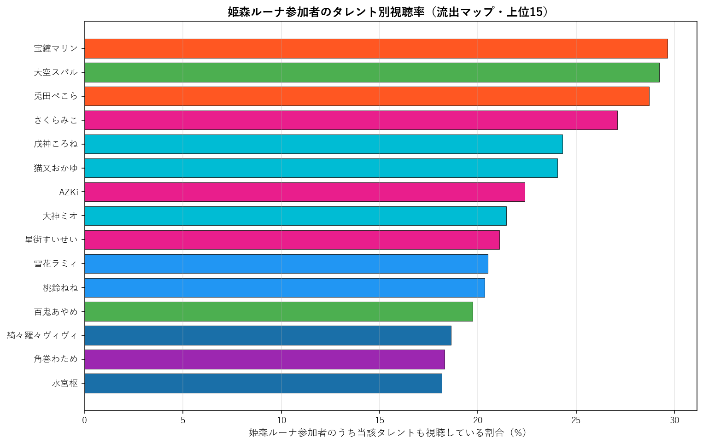

# 姫森ルーナ（4期生）個別深掘り分析

本論文の手法を 姫森ルーナ 一人に絞って詳細展開する個別レポート。集計時点: 2026年5月、10配信固定サンプル。

## 1. 基本プロファイル

| 項目 | 値 |
|---|---:|
| 所属ユニット | 4期生 |
| 活動年数（2026-05-25時点） | 6.39年 |
| 登録者数 | 1,150,000 |
| チャット参加者数（10配信総ユニーク） | 7,859 |
| 参加率（=ユニーク数/登録者数） | 0.68% |
| 専属ファン（姫森ルーナのみ参加） | 1,687（21.5%） |
| 平均複推し数（自分含む） | 6.82 |
| 中央値複推し数 | 5.0 |

### 1.1 複推し数分布

姫森ルーナ参加者を「同時参加した他タレント数」で集計した分布（自分含む、1=単独）。

## 2. 重複ネットワーク

### 2.1 Jaccard 上位10タレント

姫森ルーナと他タレントとのペアJaccard係数。順位は全595ペア中の順位。

| 順位 | タレント | ユニット | Jaccard | 共視聴者数 | 流出率 |
|---:|---|---|---:|---:|---:|
| 54 | 戌神ころね | ゲーマーズ | 10.32% | 1,910 | 24.3% |
| 81 | 綺々羅々ヴィヴィ | FLOW GLOW | 9.77% | 1,465 | 18.6% |
| 83 | 兎田ぺこら | 3期生 | 9.69% | 2,256 | 28.7% |
| 86 | 桃鈴ねね | 5期生 | 9.58% | 1,599 | 20.3% |
| 92 | 白銀ノエル | 3期生 | 9.50% | 1,355 | 17.2% |
| 99 | 雪花ラミィ | 5期生 | 9.39% | 1,611 | 20.5% |
| 104 | 大空スバル | 2期生 | 9.30% | 2,296 | 29.2% |
| 111 | 猫又おかゆ | ゲーマーズ | 9.22% | 1,889 | 24.0% |
| 113 | 大神ミオ | ゲーマーズ | 9.21% | 1,685 | 21.4% |
| 118 | AZKi | 0期生 | 9.16% | 1,758 | 22.4% |

### 2.2 流出マップ（参加率上位15）

姫森ルーナ参加者のうち、他タレントの配信にも参加していた割合の上位。絶対人数が多い人気タレントが上位に来る傾向があり、Jaccard上位とは異なる切り口。

| 順位 | タレント | 流出率 | 共視聴者数 | Jaccard |
|---:|---|---:|---:|---:|
| 1 | 宝鐘マリン | 29.6% | 2,330 | 7.85% |
| 2 | 大空スバル | 29.2% | 2,296 | 9.30% |
| 3 | 兎田ぺこら | 28.7% | 2,256 | 9.69% |
| 4 | さくらみこ | 27.1% | 2,129 | 7.74% |
| 5 | 戌神ころね | 24.3% | 1,910 | 10.32% |
| 6 | 猫又おかゆ | 24.0% | 1,889 | 9.22% |
| 7 | AZKi | 22.4% | 1,758 | 9.16% |
| 8 | 大神ミオ | 21.4% | 1,685 | 9.21% |
| 9 | 星街すいせい | 21.1% | 1,657 | 5.49% |
| 10 | 雪花ラミィ | 20.5% | 1,611 | 9.39% |
| 11 | 桃鈴ねね | 20.3% | 1,599 | 9.58% |
| 12 | 百鬼あやめ | 19.7% | 1,551 | 7.61% |
| 13 | 綺々羅々ヴィヴィ | 18.6% | 1,465 | 9.77% |
| 14 | 角巻わため | 18.3% | 1,439 | 9.08% |
| 15 | 水宮枢 | 18.2% | 1,427 | 8.15% |

### 2.3 3項 lift 上位10（共起の強い3者組）

$\text{lift} = P(姫森ルーナ \cap X \cap Y) / (P(姫森ルーナ \cap X) \cdot P(Y))$。1.0=独立、値が大きいほど3者の同時参加が独立予測値より集中している。$|姫森ルーナ \cap X| \geq 100$ のペアを対象。

| # | X | Y | lift | 3項共視聴 | (target,X) 共視聴 |
|---:|---|---|---:|---:|---:|
| 1 | ときのそら | ロボ子さん | 13.69 | 324 | 911 |
| 2 | アキロゼ | 不知火フレア | 12.08 | 200 | 595 |
| 3 | ときのそら | 不知火フレア | 10.81 | 274 | 911 |
| 4 | ロボ子さん | 不知火フレア | 10.72 | 272 | 912 |
| 5 | 白上フブキ | 不知火フレア | 10.07 | 302 | 1,078 |
| 6 | 音乃瀬奏 | 一条莉々華 | 9.85 | 328 | 1,028 |
| 7 | 一条莉々華 | 響咲リオナ | 9.70 | 317 | 797 |
| 8 | アキロゼ | 尾丸ポルカ | 9.57 | 173 | 595 |
| 9 | 不知火フレア | 獅白ぼたん | 9.22 | 326 | 735 |
| 10 | 不知火フレア | 尾丸ポルカ | 9.22 | 206 | 735 |

**注意**: lift 値が非常に高いペアは小規模かつニッチな同質サブグループを示している。大規模タレント同士のペアでは lift 値は相対的に低くなる（分母が大きいため）。

## 3. ファン構造分解

### 3.1 ユニット別重複

姫森ルーナ参加者の中で各ユニットのタレントいずれかに参加した人の割合と、当該ユニット内タレントとの平均ペアJaccard。

| ユニット | 人数 | 流出率 | 共視聴者数 | 平均ペアJaccard |
|---|---:|---:|---:|---:|
| 0期生 | 5 | 48.6% | 3,823 | 7.57% |
| 1期生 | 3 | 27.0% | 2,119 | 6.28% |
| 2期生 | 2 | 37.9% | 2,982 | 8.45% |
| ゲーマーズ | 3 | 42.5% | 3,344 | 9.58% |
| 3期生 | 4 | 47.5% | 3,732 | 8.35% |
| 4期生 | 2 | 25.3% | 1,986 | 8.09% |
| 5期生 | 4 | 39.9% | 3,135 | 8.33% |
| 6期生 | 3 | 31.8% | 2,500 | 7.49% |
| ReGLOSS | 4 | 28.9% | 2,275 | 6.27% |
| FLOW GLOW | 4 | 37.5% | 2,946 | 8.07% |

### 3.2 活動年数（世代）別重複

姫森ルーナ参加者の各世代タレント群への重複度。

| 世代 | 人数 | 流出率 | 平均ペアJaccard |
|---|---:|---:|---:|
| 2018年以前(7年超) | 13 | 65.8% | 7.87% |
| 2019-2020(5-7年) | 10 | 62.0% | 8.29% |
| 2021-2023(2-5年) | 7 | 44.0% | 6.79% |
| 2024-(2年未満) | 4 | 37.5% | 8.07% |

### 3.3 登録者規模別重複

姫森ルーナ参加者の規模別タレント群への重複度。

| 規模 | 人数 | 流出率 | 平均ペアJaccard |
|---|---:|---:|---:|
| メガ(300万人超) | 1 | 29.6% | 7.85% |
| 大(200-300万) | 8 | 63.5% | 8.50% |
| 中(100-200万) | 19 | 65.8% | 7.55% |
| 小(50-100万) | 5 | 39.5% | 7.55% |
| 極小(50万未満) | 1 | 13.5% | 7.97% |

## 4. 構造的位置

### 4.1 ハブ性指標

- 姫森ルーナ絡みペアの最高順位: **54/595**
- 上位30以内に入る姫森ルーナ絡みペアの数: **0/30**
- 上位100以内に入る姫森ルーナ絡みペアの数: **6/100**

### 4.2 横断接続性

姫森ルーナのJaccard上位10ペアの所属ユニット数: **6/10ユニット**

Jaccard上位10ペアの内訳:
- 戌神ころね（ゲーマーズ）J=10.32%, 順位54
- 綺々羅々ヴィヴィ（FLOW GLOW）J=9.77%, 順位81
- 兎田ぺこら（3期生）J=9.69%, 順位83
- 桃鈴ねね（5期生）J=9.58%, 順位86
- 白銀ノエル（3期生）J=9.50%, 順位92
- 雪花ラミィ（5期生）J=9.39%, 順位99
- 大空スバル（2期生）J=9.30%, 順位104
- 猫又おかゆ（ゲーマーズ）J=9.22%, 順位111
- 大神ミオ（ゲーマーズ）J=9.21%, 順位113
- AZKi（0期生）J=9.16%, 順位118

### 4.3 外れ値度（平均Jaccard）

- 姫森ルーナの他34名との平均Jaccard: **7.80%**
- 35名中の順位（小さい順、外れ値ほど上位）: **23/35**

**解釈**: 値が小さいほど他タレントとの重なりが薄く外れ値的位置、大きいほどハブ的位置。35名中で見て中央付近にあれば「平均的な接続度」、上位5位以内なら外れ値、下位5位以内ならハブ。

## 5. 配信間多様性

### 5.1 配信ペア間Jaccard

姫森ルーナの10配信間で、ペアごとに参加者集合のJaccard係数を計算した分布。

| 統計 | 値 |
|---|---:|
| 最小 | 16.5% |
| 平均 | 21.8% |
| 中央値 | 22.0% |
| 最大 | 27.1% |

**解釈**: 値が高ければ配信間で「常連層」が中心、値が低ければ配信ごとに「一見さん層」が多い。

### 5.2 各配信の独自参加者率

他9配信に参加していない「その配信だけに来た独自参加者」の割合。値が高い配信は特異な層を呼び込んだ可能性を示す。

| 配信日 | 参加者数 | 独自参加者 | 独自率 | タイトル |
|---|---:|---:|---:|---|
| 20260329 | 1,921 | 618 | 32.2% | 【 アソビ大全 】さぁ、ルーナイト達……久々のバトルの時間なのら！！！【姫森ルー |
| 20260405 | 970 | 165 | 17.0% | んなたん奮闘記①なのらね✌(・o・🍬)【姫森ルーナ/ホロライブ】 |
| 20260412 | 1,887 | 804 | 42.6% | 【 アソビ大全 】ミリしら将棋やるのら…ぞっ！！！(・o・🍬)【姫森ルーナ/ホロ |
| 20260419 | 1,837 | 683 | 37.2% | 【 悪魔城ドラキュラXセレクション 月下の夜想曲＆血の輪廻 】＃１ 初めての「月 |
| 20260426 | 749 | 115 | 15.4% | 【 モンスターハンターストーリーズ3 】初めてのモンハンストーリーズで遊んでみる |
| 20260428 | 1,462 | 407 | 27.8% | 【 背徳飯 】咀嚼音あり♪大好きな「蒙古タンメン中本」バター入りを食べるのら！！ |
| 20260429 | 1,940 | 555 | 28.6% | 【 ぷちホロの村 】どんなゲームか遊んでみるのら！！！🪓(・o・🍬)【姫森ルーナ |
| 20260504 | 1,822 | 497 | 27.3% | 【 LEGO 】レゴのゲームボーイを組み立てるのら！！！Build with L |
| 20260506 | 1,516 | 350 | 23.1% | 【 Windrose / ウィンドローズ 】帆を上げろ！荒れ狂うカリブ海を生き残 |
| 20260509 | 2,278 | 871 | 38.2% | 【 バイオハザードRE:4 】初見！ぺこちゃんに貰ったゲームで遊ぶのら！！！BI |

### 5.3 累積ユニーク参加者カーブ

古い配信から順に1本ずつ追加していった時の累積ユニーク参加者数。カーブが早く頭打ちになるほど常連が多く、長く伸び続けるほど新規流入が多い。

| 本数 | 配信日 | 配信参加者 | 累積ユニーク |
|---:|---|---:|---:|
| 1本目 | 20260329 | 1,921 | 1,921 |
| 2本目 | 20260405 | 970 | 2,356 |
| 3本目 | 20260412 | 1,887 | 3,470 |
| 4本目 | 20260419 | 1,837 | 4,465 |
| 5本目 | 20260426 | 749 | 4,647 |
| 6本目 | 20260428 | 1,462 | 5,211 |
| 7本目 | 20260429 | 1,940 | 5,978 |
| 8本目 | 20260504 | 1,822 | 6,578 |
| 9本目 | 20260506 | 1,516 | 6,988 |
| 10本目 | 20260509 | 2,278 | 7,859 |

## 6. まとめ

- 姫森ルーナは活動 6.4年・登録者 115.0万人。
  チャット参加コア層は 7,859人で参加率 0.68%。
- 専属ファンは 21.5%、平均複推し数は 6.82人。
- Jaccard 最高ペアは 戌神ころね（10.32%、全595ペア中54位）。
- 流出絶対数では人気古参（宝鐘マリン 29.6%、大空スバル 29.2%）が上位だが、Jaccard では同世代・同規模タレント（戌神ころね、綺々羅々ヴィヴィ）が上位。
- ハブ性指標は弱め（上位30以内ペアは 0 組）、
  平均Jaccard 7.80% は35名中 23 位（小さい順）。
- 配信間ユーザー重複は平均 21.8%、累積カーブは10本で 7,859人に到達。

---
*分析時点: 2026年5月25日。本論文 `report_audience_paper_jp.pdf` の方法論を流用。個別タレントへの応用例として作成。*