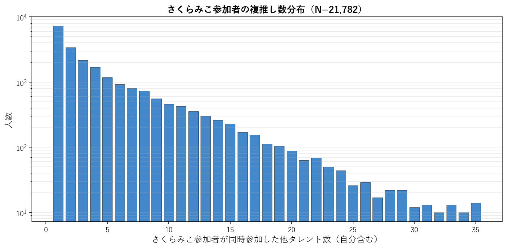
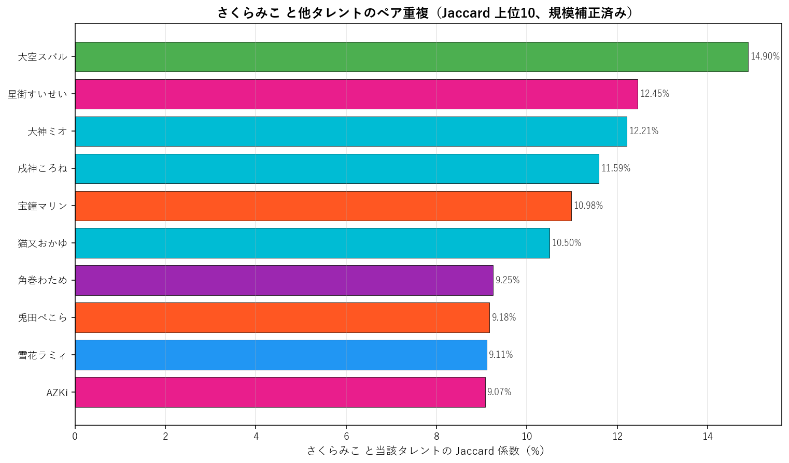
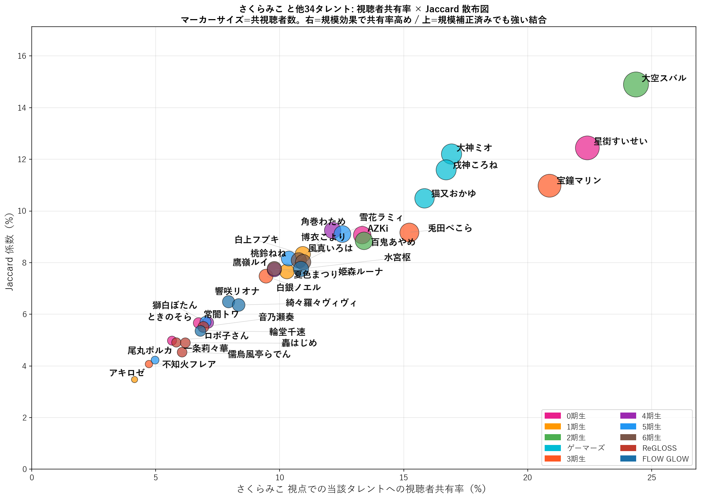
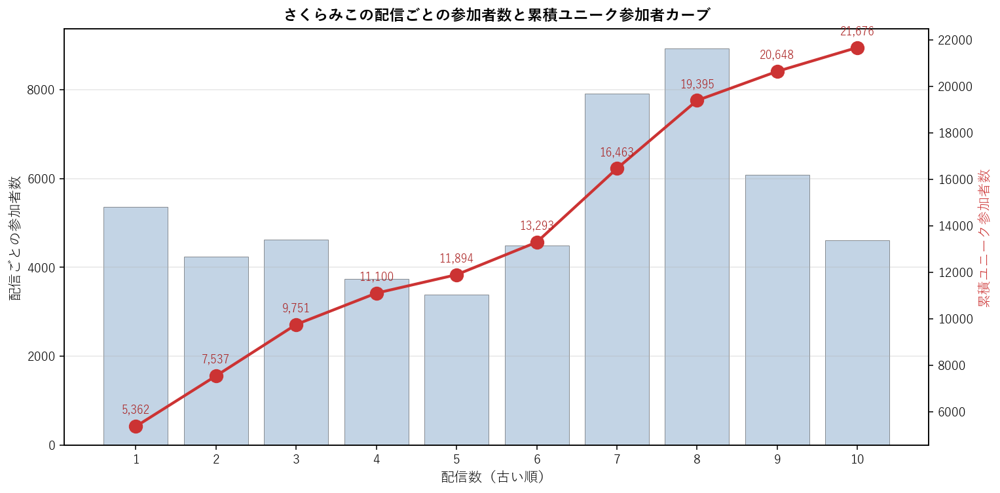

# さくらみこ（0期生）個別深掘り分析

本論文の手法を さくらみこ 一人に絞って詳細展開する個別レポート。集計時点: 2026年5月、10配信固定サンプル。

## 1. 基本プロファイル

| 項目 | 値 |
|---|---:|
| 所属ユニット | 0期生 |
| 活動年数（2026-05-25時点） | 7.81年 |
| 登録者数 | 2,430,000 |
| チャット参加者数（10配信総ユニーク） | 21,782 |
| 参加率（=ユニーク数/登録者数） | 0.90% |
| 専属ファン（さくらみこのみ参加） | 7,260（33.3%） |
| 平均複推し数（自分含む） | 4.65 |
| 中央値複推し数 | 3.0 |

### 1.1 複推し数分布

さくらみこ参加者を「同時参加した他タレント数」で集計した分布（自分含む、1=単独）。

## 2. 重複ネットワーク

### 2.1 Jaccard 上位10タレント

さくらみこと他タレントとのペアJaccard係数（規模補正済み）。$|A \cap B|/|A \cup B|$ で計算し、両タレントの規模差に依存しない結合強度を示す。順位は全595ペア中の順位。

| 順位 | タレント | ユニット | Jaccard | 共視聴者数 |
|---:|---|---|---:|---:|
| 5 | 大空スバル | 2期生 | 14.90% | 5,305 |
| 16 | 星街すいせい | 0期生 | 12.45% | 4,879 |
| 18 | 大神ミオ | ゲーマーズ | 12.21% | 3,687 |
| 23 | 戌神ころね | ゲーマーズ | 11.59% | 3,639 |
| 33 | 宝鐘マリン | 3期生 | 10.98% | 4,548 |
| 46 | 猫又おかゆ | ゲーマーズ | 10.50% | 3,449 |
| 110 | 角巻わため | 4期生 | 9.25% | 2,643 |
| 117 | 兎田ぺこら | 3期生 | 9.18% | 3,316 |
| 119 | 雪花ラミィ | 5期生 | 9.11% | 2,729 |
| 121 | AZKi | 0期生 | 9.07% | 2,902 |

### 2.2 視聴者共有率上位と 視聴者共有率 × Jaccard 散布図

**さくらみこ視点での他タレントへの視聴者共有率** = $|A \cap B|/|A|$、すなわち「さくらみこの参加者のうち、当該タレント B にも参加した割合」。**視聴者共有率は B の規模に比例するため、絶対値は B が大規模であるほど自然に高くなる**。以下の散布図では、視聴者共有率（X軸）と Jaccard（Y軸）を同時にプロットする。**右方向に位置 = 規模効果で視聴者共有率が押し上げられている**、**上方向に位置 = 規模補正済みでも強い結合** と読める。

**視聴者共有率上位15**: 巨大タレント（マリン・スバル・すいせい等）が上位を占めるのは規模効果。その中に非巨大タレントが食い込む場合は、Jaccard でも上位にあるか確認すると規模補正済みの結合強度が判断できる。

| 順位 | タレント | 視聴者共有率 | 共視聴者数 | Jaccard |
|---:|---|---:|---:|---:|
| 1 | 大空スバル | 24.4% | 5,305 | 14.90% |
| 2 | 星街すいせい | 22.4% | 4,879 | 12.45% |
| 3 | 宝鐘マリン | 20.9% | 4,548 | 10.98% |
| 4 | 大神ミオ | 16.9% | 3,687 | 12.21% |
| 5 | 戌神ころね | 16.7% | 3,639 | 11.59% |
| 6 | 猫又おかゆ | 15.8% | 3,449 | 10.50% |
| 7 | 兎田ぺこら | 15.2% | 3,316 | 9.18% |
| 8 | 百鬼あやめ | 13.4% | 2,917 | 8.85% |
| 9 | AZKi | 13.3% | 2,902 | 9.07% |
| 10 | 雪花ラミィ | 12.5% | 2,729 | 9.11% |
| 11 | 角巻わため | 12.1% | 2,643 | 9.25% |
| 12 | 風真いろは | 10.9% | 2,384 | 8.02% |
| 13 | 白上フブキ | 10.9% | 2,380 | 8.33% |
| 14 | 水宮枢 | 10.9% | 2,365 | 7.76% |
| 15 | 博衣こより | 10.8% | 2,346 | 8.09% |

## 3. ファン構造分解

### 3.1 ユニット別重複

さくらみこ参加者の中で各ユニットのタレントいずれかに参加した人の割合と、当該ユニット内タレントとの平均ペアJaccard。

| ユニット | 人数 | 視聴者共有率 | 共視聴者数 | 平均ペアJaccard |
|---|---:|---:|---:|---:|
| 0期生 | 4 | 32.6% | 7,097 | 8.04% |
| 1期生 | 3 | 20.1% | 4,379 | 6.49% |
| 2期生 | 2 | 30.7% | 6,686 | 11.88% |
| ゲーマーズ | 3 | 31.9% | 6,946 | 11.43% |
| 3期生 | 4 | 31.3% | 6,811 | 7.93% |
| 4期生 | 3 | 21.8% | 4,743 | 7.56% |
| 5期生 | 4 | 23.4% | 5,094 | 6.81% |
| 6期生 | 3 | 23.3% | 5,069 | 7.96% |
| ReGLOSS | 4 | 17.4% | 3,781 | 4.97% |
| FLOW GLOW | 4 | 22.5% | 4,898 | 6.50% |

### 3.2 活動年数（世代）別重複

さくらみこ参加者の各世代タレント群への重複度。

| 世代 | 人数 | 視聴者共有率 | 平均ペアJaccard |
|---|---:|---:|---:|
| 2018年以前(7年超) | 12 | 55.5% | 9.14% |
| 2019-2020(5-7年) | 11 | 44.1% | 7.42% |
| 2021-2023(2-5年) | 7 | 31.2% | 6.25% |
| 2024-(2年未満) | 4 | 22.5% | 6.50% |

### 3.3 登録者規模別重複

さくらみこ参加者の規模別タレント群への重複度。

| 規模 | 人数 | 視聴者共有率 | 平均ペアJaccard |
|---|---:|---:|---:|
| メガ(300万人超) | 1 | 20.9% | 10.98% |
| 大(200-300万) | 7 | 51.5% | 10.63% |
| 中(100-200万) | 20 | 51.5% | 6.96% |
| 小(50-100万) | 5 | 24.0% | 5.99% |
| 極小(50万未満) | 1 | 7.9% | 6.49% |

## 4. 構造的位置

### 4.1 ハブ性指標

- さくらみこ絡みペアの最高順位: **5/595**
- 上位30以内に入るさくらみこ絡みペアの数: **4/30**
- 上位100以内に入るさくらみこ絡みペアの数: **6/100**

### 4.2 横断接続性

さくらみこのJaccard上位10ペアの所属ユニット数: **6/10ユニット**

Jaccard上位10ペアの内訳:
- 大空スバル（2期生）J=14.90%, 順位5
- 星街すいせい（0期生）J=12.45%, 順位16
- 大神ミオ（ゲーマーズ）J=12.21%, 順位18
- 戌神ころね（ゲーマーズ）J=11.59%, 順位23
- 宝鐘マリン（3期生）J=10.98%, 順位33
- 猫又おかゆ（ゲーマーズ）J=10.50%, 順位46
- 角巻わため（4期生）J=9.25%, 順位110
- 兎田ぺこら（3期生）J=9.18%, 順位117
- 雪花ラミィ（5期生）J=9.11%, 順位119
- AZKi（0期生）J=9.07%, 順位121

### 4.3 外れ値度（平均Jaccard）

- さくらみこの他34名との平均Jaccard: **7.68%**
- 35名中の順位（小さい順、外れ値ほど上位）: **19/35**

**解釈**: 値が小さいほど他タレントとの重なりが薄く外れ値的位置、大きいほどハブ的位置。35名中で見て中央付近にあれば「平均的な接続度」、上位5位以内なら外れ値、下位5位以内ならハブ。

## 5. 配信間多様性

### 5.1 配信ペア間Jaccard

さくらみこの10配信間で、ペアごとに参加者集合のJaccard係数を計算した分布。

| 統計 | 値 |
|---|---:|
| 最小 | 20.6% |
| 平均 | 25.9% |
| 中央値 | 25.4% |
| 最大 | 35.7% |

**解釈**: 値が高ければ配信間で「常連層」が中心、値が低ければ配信ごとに「一見さん層」が多い。

### 5.2 各配信の独自参加者率

他9配信に参加していない「その配信だけに来た独自参加者」の割合。値が高い配信は特異な層を呼び込んだ可能性を示す。

| 配信日 | 参加者数 | 独自参加者 | 独自率 | タイトル |
|---|---:|---:|---:|---|
| 20260205 | 3,986 | 475 | 11.9% | 【ホロタイプ】新作ホロゲーきちゃあああ！ホロタイプ お宝ゾンビの島やるにええええ |
| 20260208 | 5,164 | 1,187 | 23.0% | 【 勉強 】３教科のみこ専用ドリルを解く！！！みこち学力向上計画だにぇ・・・・・ |
| 20260224 | 5,550 | 1,043 | 18.8% | 【firefightIng simulator】真面目に消防隊になり訓練をするに |
| 20260225 | 5,362 | 1,456 | 27.2% | 【 Poppy Playtime５】奴が帰ってくる――⁉ いつになったら工場から |
| 20260226 | 4,241 | 730 | 17.2% | 【ソウルキャリバーⅥ】ひさびさに‼ソウルキャリバーでカオスな戦いするにぇぇえええ |
| 20260314 | 3,740 | 672 | 18.0% | 【ぽこあポケモン】深夜のみこ あ ポケモン生活３日目【ホロライブ/さくらみこ】 |
| 20260317 | 3,382 | 401 | 11.9% | 【ぽこあポケモン】夕方のみこ あ ポケモン生活４日目【ホロライブ/さくらみこ】 |
| 20260426 | 7,912 | 2,213 | 28.0% | 【 配信復帰 】ただいま！！！！！！！！！！！！！！！！！！【ホロライブ/さくら |
| 20260427 | 8,924 | 2,250 | 25.2% | 【トモコレ】ついに地獄ワクワク島の物語が動き出すにぇえええええええ！！！！！！【 |
| 20260429 | 6,088 | 1,143 | 18.8% | 【トモコレ】３日目🔥地獄ワクワク島の物語が動き出すにぇえええええええ！！！！！！ |

### 5.3 累積ユニーク参加者カーブ

古い配信から順に1本ずつ追加していった時の累積ユニーク参加者数。カーブが早く頭打ちになるほど常連が多く、長く伸び続けるほど新規流入が多い。

| 本数 | 配信日 | 配信参加者 | 累積ユニーク |
|---:|---|---:|---:|
| 1本目 | 20260205 | 3,986 | 3,986 |
| 2本目 | 20260208 | 5,164 | 7,048 |
| 3本目 | 20260224 | 5,550 | 9,605 |
| 4本目 | 20260225 | 5,362 | 11,803 |
| 5本目 | 20260226 | 4,241 | 12,966 |
| 6本目 | 20260314 | 3,740 | 14,078 |
| 7本目 | 20260317 | 3,382 | 14,692 |
| 8本目 | 20260426 | 7,912 | 17,850 |
| 9本目 | 20260427 | 8,924 | 20,639 |
| 10本目 | 20260429 | 6,088 | 21,782 |

## 6. まとめ

- さくらみこは活動 7.8年・登録者 243.0万人。
  チャット参加コア層は 21,782人で参加率 0.90%。
- 専属ファンは 33.3%、平均複推し数は 4.65人。
- Jaccard 最高ペアは 大空スバル（14.90%、全595ペア中5位）。
- 視聴者共有率絶対数では人気古参（大空スバル 24.4%、星街すいせい 22.4%）が上位だが、Jaccard では同世代・同規模タレント（大空スバル、星街すいせい）が上位。
- ハブ性指標は弱め（上位30以内ペアは 4 組）、
  平均Jaccard 7.68% は35名中 19 位（小さい順）。
- 配信間ユーザー重複は平均 25.9%、累積カーブは10本で 21,782人に到達。

---
*分析時点: 2026年5月25日。本論文 `report_audience_paper_jp.pdf` の方法論を流用。個別タレントへの応用例として作成。*