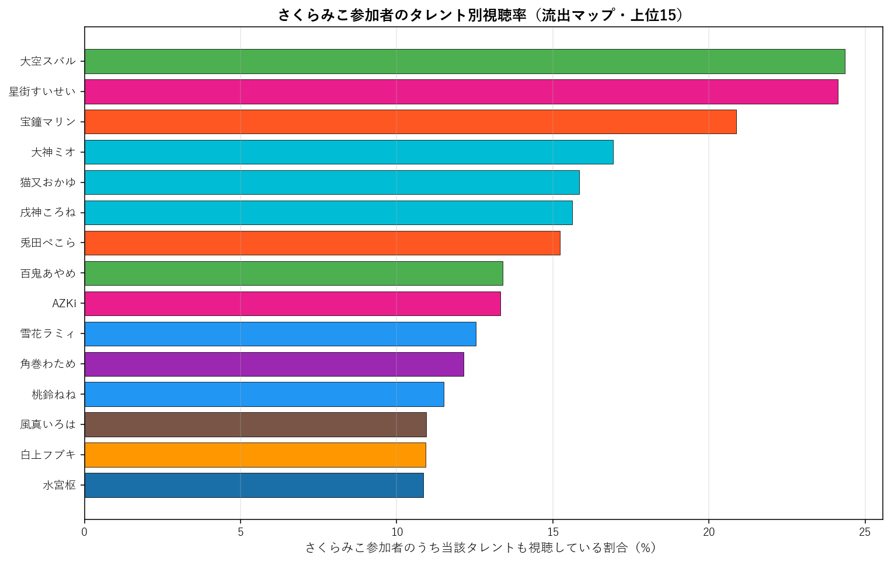

# さくらみこ（0期生）個別深掘り分析

本論文の手法を さくらみこ 一人に絞って詳細展開する個別レポート。集計時点: 2026年5月、10配信固定サンプル。

## 1. 基本プロファイル

| 項目 | 値 |
|---|---:|
| 所属ユニット | 0期生 |
| 活動年数（2026-05-25時点） | 7.81年 |
| 登録者数 | 2,430,000 |
| チャット参加者数（10配信総ユニーク） | 21,782 |
| 参加率（=ユニーク数/登録者数） | 0.90% |
| 専属ファン（さくらみこのみ参加） | 7,246（33.3%） |
| 平均複推し数（自分含む） | 4.69 |
| 中央値複推し数 | 3.0 |

### 1.1 複推し数分布

さくらみこ参加者を「同時参加した他タレント数」で集計した分布（自分含む、1=単独）。

## 2. 重複ネットワーク

### 2.1 Jaccard 上位10タレント

さくらみこと他タレントとのペアJaccard係数。順位は全595ペア中の順位。

| 順位 | タレント | ユニット | Jaccard | 共視聴者数 | 流出率 |
|---:|---|---|---:|---:|---:|
| 5 | 大空スバル | 2期生 | 14.90% | 5,305 | 24.4% |
| 10 | 星街すいせい | 0期生 | 12.98% | 5,256 | 24.1% |
| 18 | 大神ミオ | ゲーマーズ | 12.21% | 3,687 | 16.9% |
| 33 | 戌神ころね | ゲーマーズ | 10.99% | 3,401 | 15.6% |
| 34 | 宝鐘マリン | 3期生 | 10.98% | 4,548 | 20.9% |
| 47 | 猫又おかゆ | ゲーマーズ | 10.50% | 3,449 | 15.8% |
| 109 | 角巻わため | 4期生 | 9.25% | 2,643 | 12.1% |
| 117 | 兎田ぺこら | 3期生 | 9.18% | 3,316 | 15.2% |
| 121 | 雪花ラミィ | 5期生 | 9.11% | 2,729 | 12.5% |
| 123 | AZKi | 0期生 | 9.07% | 2,902 | 13.3% |

### 2.2 流出マップ（参加率上位15）

さくらみこ参加者のうち、他タレントの配信にも参加していた割合の上位。絶対人数が多い人気タレントが上位に来る傾向があり、Jaccard上位とは異なる切り口。

| 順位 | タレント | 流出率 | 共視聴者数 | Jaccard |
|---:|---|---:|---:|---:|
| 1 | 大空スバル | 24.4% | 5,305 | 14.90% |
| 2 | 星街すいせい | 24.1% | 5,256 | 12.98% |
| 3 | 宝鐘マリン | 20.9% | 4,548 | 10.98% |
| 4 | 大神ミオ | 16.9% | 3,687 | 12.21% |
| 5 | 猫又おかゆ | 15.8% | 3,449 | 10.50% |
| 6 | 戌神ころね | 15.6% | 3,401 | 10.99% |
| 7 | 兎田ぺこら | 15.2% | 3,316 | 9.18% |
| 8 | 百鬼あやめ | 13.4% | 2,917 | 8.85% |
| 9 | AZKi | 13.3% | 2,902 | 9.07% |
| 10 | 雪花ラミィ | 12.5% | 2,729 | 9.11% |
| 11 | 角巻わため | 12.1% | 2,643 | 9.25% |
| 12 | 桃鈴ねね | 11.5% | 2,506 | 8.44% |
| 13 | 風真いろは | 10.9% | 2,384 | 8.02% |
| 14 | 白上フブキ | 10.9% | 2,380 | 8.33% |
| 15 | 水宮枢 | 10.9% | 2,365 | 7.76% |

### 2.3 3項 lift 上位10（共起の強い3者組）

$\text{lift} = P(さくらみこ \cap X \cap Y) / (P(さくらみこ \cap X) \cdot P(Y))$。1.0=独立、値が大きいほど3者の同時参加が独立予測値より集中している。$|さくらみこ \cap X| \geq 100$ のペアを対象。

| # | X | Y | lift | 3項共視聴 | (target,X) 共視聴 |
|---:|---|---|---:|---:|---:|
| 1 | ときのそら | ロボ子さん | 11.41 | 435 | 1,467 |
| 2 | アキロゼ | 不知火フレア | 9.82 | 247 | 904 |
| 3 | 尾丸ポルカ | 鷹嶺ルイ | 9.58 | 502 | 1,082 |
| 4 | ロボ子さん | 不知火フレア | 8.61 | 295 | 1,231 |
| 5 | ときのそら | 不知火フレア | 8.33 | 340 | 1,467 |
| 6 | 不知火フレア | 獅白ぼたん | 8.29 | 410 | 1,029 |
| 7 | 不知火フレア | 白銀ノエル | 8.28 | 414 | 1,029 |
| 8 | ロボ子さん | 常闇トワ | 8.23 | 444 | 1,231 |
| 9 | ロボ子さん | 姫森ルーナ | 8.15 | 493 | 1,231 |
| 10 | 一条莉々華 | 響咲リオナ | 8.13 | 416 | 1,247 |

**注意**: lift 値が非常に高いペアは小規模かつニッチな同質サブグループを示している。大規模タレント同士のペアでは lift 値は相対的に低くなる（分母が大きいため）。

## 3. ファン構造分解

### 3.1 ユニット別重複

さくらみこ参加者の中で各ユニットのタレントいずれかに参加した人の割合と、当該ユニット内タレントとの平均ペアJaccard。

| ユニット | 人数 | 流出率 | 共視聴者数 | 平均ペアJaccard |
|---|---:|---:|---:|---:|
| 0期生 | 4 | 33.4% | 7,283 | 8.17% |
| 1期生 | 3 | 20.1% | 4,379 | 6.49% |
| 2期生 | 2 | 30.7% | 6,686 | 11.88% |
| ゲーマーズ | 3 | 31.4% | 6,833 | 11.23% |
| 3期生 | 4 | 31.3% | 6,811 | 7.93% |
| 4期生 | 3 | 21.8% | 4,743 | 7.56% |
| 5期生 | 4 | 24.6% | 5,366 | 7.07% |
| 6期生 | 3 | 23.3% | 5,069 | 7.96% |
| ReGLOSS | 4 | 18.1% | 3,944 | 5.15% |
| FLOW GLOW | 4 | 22.5% | 4,898 | 6.50% |

### 3.2 活動年数（世代）別重複

さくらみこ参加者の各世代タレント群への重複度。

| 世代 | 人数 | 流出率 | 平均ペアJaccard |
|---|---:|---:|---:|
| 2018年以前(7年超) | 12 | 55.4% | 9.14% |
| 2019-2020(5-7年) | 11 | 44.6% | 7.52% |
| 2021-2023(2-5年) | 7 | 31.6% | 6.35% |
| 2024-(2年未満) | 4 | 22.5% | 6.50% |

### 3.3 登録者規模別重複

さくらみこ参加者の規模別タレント群への重複度。

| 規模 | 人数 | 流出率 | 平均ペアJaccard |
|---|---:|---:|---:|
| メガ(300万人超) | 1 | 20.9% | 10.98% |
| 大(200-300万) | 7 | 51.5% | 10.62% |
| 中(100-200万) | 20 | 51.8% | 7.01% |
| 小(50-100万) | 5 | 24.6% | 6.13% |
| 極小(50万未満) | 1 | 7.9% | 6.49% |

## 4. 構造的位置

### 4.1 ハブ性指標

- さくらみこ絡みペアの最高順位: **5/595**
- 上位30以内に入るさくらみこ絡みペアの数: **3/30**
- 上位100以内に入るさくらみこ絡みペアの数: **6/100**

### 4.2 横断接続性

さくらみこのJaccard上位10ペアの所属ユニット数: **6/10ユニット**

Jaccard上位10ペアの内訳:
- 大空スバル（2期生）J=14.90%, 順位5
- 星街すいせい（0期生）J=12.98%, 順位10
- 大神ミオ（ゲーマーズ）J=12.21%, 順位18
- 戌神ころね（ゲーマーズ）J=10.99%, 順位33
- 宝鐘マリン（3期生）J=10.98%, 順位34
- 猫又おかゆ（ゲーマーズ）J=10.50%, 順位47
- 角巻わため（4期生）J=9.25%, 順位109
- 兎田ぺこら（3期生）J=9.18%, 順位117
- 雪花ラミィ（5期生）J=9.11%, 順位121
- AZKi（0期生）J=9.07%, 順位123

### 4.3 外れ値度（平均Jaccard）

- さくらみこの他34名との平均Jaccard: **7.73%**
- 35名中の順位（小さい順、外れ値ほど上位）: **21/35**

**解釈**: 値が小さいほど他タレントとの重なりが薄く外れ値的位置、大きいほどハブ的位置。35名中で見て中央付近にあれば「平均的な接続度」、上位5位以内なら外れ値、下位5位以内ならハブ。

## 5. 配信間多様性

### 5.1 配信ペア間Jaccard

さくらみこの10配信間で、ペアごとに参加者集合のJaccard係数を計算した分布。

| 統計 | 値 |
|---|---:|
| 最小 | 20.6% |
| 平均 | 25.9% |
| 中央値 | 25.4% |
| 最大 | 35.7% |

**解釈**: 値が高ければ配信間で「常連層」が中心、値が低ければ配信ごとに「一見さん層」が多い。

### 5.2 各配信の独自参加者率

他9配信に参加していない「その配信だけに来た独自参加者」の割合。値が高い配信は特異な層を呼び込んだ可能性を示す。

| 配信日 | 参加者数 | 独自参加者 | 独自率 | タイトル |
|---|---:|---:|---:|---|
| 20260205 | 3,986 | 475 | 11.9% | 【ホロタイプ】新作ホロゲーきちゃあああ！ホロタイプ お宝ゾンビの島やるにええええ |
| 20260208 | 5,164 | 1,187 | 23.0% | 【 勉強 】３教科のみこ専用ドリルを解く！！！みこち学力向上計画だにぇ・・・・・ |
| 20260224 | 5,550 | 1,043 | 18.8% | 【firefightIng simulator】真面目に消防隊になり訓練をするに |
| 20260225 | 5,362 | 1,456 | 27.2% | 【 Poppy Playtime５】奴が帰ってくる――⁉ いつになったら工場から |
| 20260226 | 4,241 | 730 | 17.2% | 【ソウルキャリバーⅥ】ひさびさに‼ソウルキャリバーでカオスな戦いするにぇぇえええ |
| 20260314 | 3,740 | 672 | 18.0% | 【ぽこあポケモン】深夜のみこ あ ポケモン生活３日目【ホロライブ/さくらみこ】 |
| 20260317 | 3,382 | 401 | 11.9% | 【ぽこあポケモン】夕方のみこ あ ポケモン生活４日目【ホロライブ/さくらみこ】 |
| 20260426 | 7,912 | 2,213 | 28.0% | 【 配信復帰 】ただいま！！！！！！！！！！！！！！！！！！【ホロライブ/さくら |
| 20260427 | 8,924 | 2,250 | 25.2% | 【トモコレ】ついに地獄ワクワク島の物語が動き出すにぇえええええええ！！！！！！【 |
| 20260429 | 6,088 | 1,143 | 18.8% | 【トモコレ】３日目🔥地獄ワクワク島の物語が動き出すにぇえええええええ！！！！！！ |

### 5.3 累積ユニーク参加者カーブ

古い配信から順に1本ずつ追加していった時の累積ユニーク参加者数。カーブが早く頭打ちになるほど常連が多く、長く伸び続けるほど新規流入が多い。

| 本数 | 配信日 | 配信参加者 | 累積ユニーク |
|---:|---|---:|---:|
| 1本目 | 20260205 | 3,986 | 3,986 |
| 2本目 | 20260208 | 5,164 | 7,048 |
| 3本目 | 20260224 | 5,550 | 9,605 |
| 4本目 | 20260225 | 5,362 | 11,803 |
| 5本目 | 20260226 | 4,241 | 12,966 |
| 6本目 | 20260314 | 3,740 | 14,078 |
| 7本目 | 20260317 | 3,382 | 14,692 |
| 8本目 | 20260426 | 7,912 | 17,850 |
| 9本目 | 20260427 | 8,924 | 20,639 |
| 10本目 | 20260429 | 6,088 | 21,782 |

## 6. まとめ

- さくらみこは活動 7.8年・登録者 243.0万人。
  チャット参加コア層は 21,782人で参加率 0.90%。
- 専属ファンは 33.3%、平均複推し数は 4.69人。
- Jaccard 最高ペアは 大空スバル（14.90%、全595ペア中5位）。
- 流出絶対数では人気古参（大空スバル 24.4%、星街すいせい 24.1%）が上位だが、Jaccard では同世代・同規模タレント（大空スバル、星街すいせい）が上位。
- ハブ性指標は弱め（上位30以内ペアは 3 組）、
  平均Jaccard 7.73% は35名中 21 位（小さい順）。
- 配信間ユーザー重複は平均 25.9%、累積カーブは10本で 21,782人に到達。

---
*分析時点: 2026年5月25日。本論文 `report_audience_paper_jp.pdf` の方法論を流用。個別タレントへの応用例として作成。*