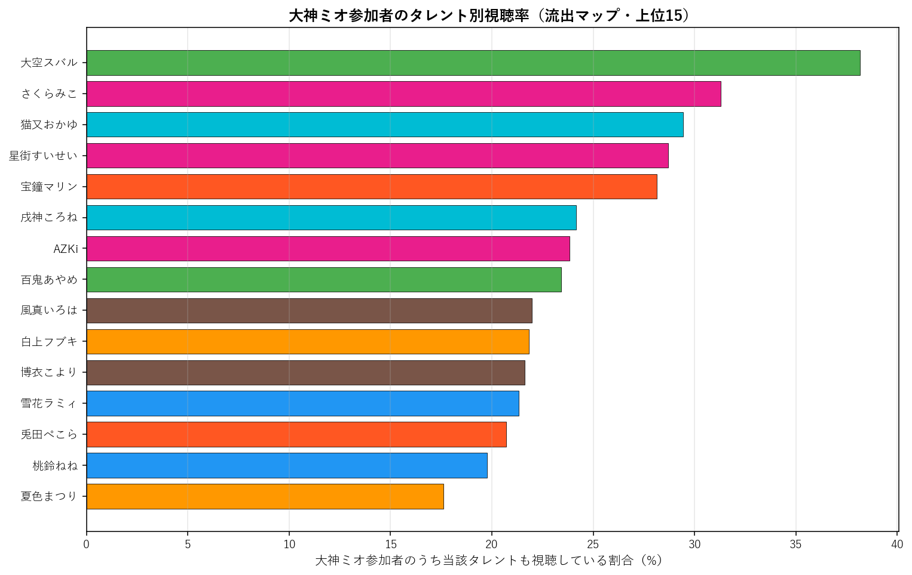

# 大神ミオ（ゲーマーズ）個別深掘り分析

本論文の手法を 大神ミオ 一人に絞って詳細展開する個別レポート。集計時点: 2026年5月、10配信固定サンプル。

## 1. 基本プロファイル

| 項目 | 値 |
|---|---:|
| 所属ユニット | ゲーマーズ |
| 活動年数（2026-05-25時点） | 7.46年 |
| 登録者数 | 1,340,000 |
| チャット参加者数（10配信総ユニーク） | 12,116 |
| 参加率（=ユニーク数/登録者数） | 0.90% |
| 専属ファン（大神ミオのみ参加） | 1,894（15.6%） |
| 平均複推し数（自分含む） | 7.13 |
| 中央値複推し数 | 5.0 |

### 1.1 複推し数分布

大神ミオ参加者を「同時参加した他タレント数」で集計した分布（自分含む、1=単独）。

## 2. 重複ネットワーク

### 2.1 Jaccard 上位10タレント

大神ミオと他タレントとのペアJaccard係数。順位は全595ペア中の順位。

| 順位 | タレント | ユニット | Jaccard | 共視聴者数 | 流出率 |
|---:|---|---|---:|---:|---:|
| 2 | 大空スバル | 2期生 | 16.36% | 4,624 | 38.2% |
| 6 | 猫又おかゆ | ゲーマーズ | 15.46% | 3,565 | 29.4% |
| 8 | 白上フブキ | 1期生 | 14.15% | 2,644 | 21.8% |
| 13 | AZKi | 0期生 | 13.21% | 2,888 | 23.8% |
| 16 | 戌神ころね | ゲーマーズ | 13.09% | 2,925 | 24.1% |
| 20 | 雪花ラミィ | 5期生 | 12.65% | 2,585 | 21.3% |
| 21 | さくらみこ | 0期生 | 12.63% | 3,790 | 31.3% |
| 22 | 博衣こより | 6期生 | 12.56% | 2,620 | 21.6% |
| 23 | 風真いろは | 6期生 | 12.22% | 2,663 | 22.0% |
| 25 | 百鬼あやめ | 2期生 | 12.14% | 2,837 | 23.4% |

### 2.2 流出マップ（参加率上位15）

大神ミオ参加者のうち、他タレントの配信にも参加していた割合の上位。絶対人数が多い人気タレントが上位に来る傾向があり、Jaccard上位とは異なる切り口。

| 順位 | タレント | 流出率 | 共視聴者数 | Jaccard |
|---:|---|---:|---:|---:|
| 1 | 大空スバル | 38.2% | 4,624 | 16.36% |
| 2 | さくらみこ | 31.3% | 3,790 | 12.63% |
| 3 | 猫又おかゆ | 29.4% | 3,565 | 15.46% |
| 4 | 星街すいせい | 28.7% | 3,478 | 10.71% |
| 5 | 宝鐘マリン | 28.1% | 3,408 | 10.37% |
| 6 | 戌神ころね | 24.1% | 2,925 | 13.09% |
| 7 | AZKi | 23.8% | 2,888 | 13.21% |
| 8 | 百鬼あやめ | 23.4% | 2,837 | 12.14% |
| 9 | 風真いろは | 22.0% | 2,663 | 12.22% |
| 10 | 白上フブキ | 21.8% | 2,644 | 14.15% |
| 11 | 博衣こより | 21.6% | 2,620 | 12.56% |
| 12 | 雪花ラミィ | 21.3% | 2,585 | 12.65% |
| 13 | 兎田ぺこら | 20.7% | 2,510 | 9.55% |
| 14 | 桃鈴ねね | 19.8% | 2,395 | 10.62% |
| 15 | 夏色まつり | 17.6% | 2,133 | 10.84% |

### 2.3 3項 lift 上位10（共起の強い3者組）

$\text{lift} = P(大神ミオ \cap X \cap Y) / (P(大神ミオ \cap X) \cdot P(Y))$。1.0=独立、値が大きいほど3者の同時参加が独立予測値より集中している。$|大神ミオ \cap X| \geq 100$ のペアを対象。

| # | X | Y | lift | 3項共視聴 | (target,X) 共視聴 |
|---:|---|---|---:|---:|---:|
| 1 | アキロゼ | 不知火フレア | 11.52 | 341 | 878 |
| 2 | ロボ子さん | 不知火フレア | 11.02 | 406 | 1,093 |
| 3 | ときのそら | ロボ子さん | 10.18 | 470 | 1,847 |
| 4 | ロボ子さん | 尾丸ポルカ | 9.44 | 368 | 1,093 |
| 5 | アキロゼ | 獅白ぼたん | 9.26 | 345 | 878 |
| 6 | ロボ子さん | 白銀ノエル | 9.17 | 485 | 1,093 |
| 7 | 常闇トワ | 獅白ぼたん | 9.11 | 604 | 1,562 |
| 8 | ときのそら | 不知火フレア | 8.98 | 559 | 1,847 |
| 9 | アキロゼ | 常闇トワ | 8.94 | 355 | 878 |
| 10 | アキロゼ | 尾丸ポルカ | 8.88 | 278 | 878 |

**注意**: lift 値が非常に高いペアは小規模かつニッチな同質サブグループを示している。大規模タレント同士のペアでは lift 値は相対的に低くなる（分母が大きいため）。

## 3. ファン構造分解

### 3.1 ユニット別重複

大神ミオ参加者の中で各ユニットのタレントいずれかに参加した人の割合と、当該ユニット内タレントとの平均ペアJaccard。

| ユニット | 人数 | 流出率 | 共視聴者数 | 平均ペアJaccard |
|---|---:|---:|---:|---:|
| 0期生 | 5 | 55.7% | 6,754 | 10.91% |
| 1期生 | 3 | 35.8% | 4,336 | 10.11% |
| 2期生 | 2 | 48.4% | 5,867 | 14.25% |
| ゲーマーズ | 2 | 40.3% | 4,878 | 14.28% |
| 3期生 | 4 | 44.2% | 5,353 | 10.10% |
| 4期生 | 3 | 32.0% | 3,875 | 9.74% |
| 5期生 | 4 | 40.8% | 4,946 | 10.30% |
| 6期生 | 3 | 40.4% | 4,893 | 11.71% |
| ReGLOSS | 4 | 25.9% | 3,139 | 6.46% |
| FLOW GLOW | 4 | 34.9% | 4,231 | 8.89% |

### 3.2 活動年数（世代）別重複

大神ミオ参加者の各世代タレント群への重複度。

| 世代 | 人数 | 流出率 | 平均ペアJaccard |
|---|---:|---:|---:|
| 2018年以前(7年超) | 12 | 76.5% | 11.83% |
| 2019-2020(5-7年) | 11 | 61.2% | 10.08% |
| 2021-2023(2-5年) | 7 | 48.6% | 8.71% |
| 2024-(2年未満) | 4 | 34.9% | 8.89% |

### 3.3 登録者規模別重複

大神ミオ参加者の規模別タレント群への重複度。

| 規模 | 人数 | 流出率 | 平均ペアJaccard |
|---|---:|---:|---:|
| メガ(300万人超) | 1 | 28.1% | 10.37% |
| 大(200-300万) | 8 | 72.2% | 12.91% |
| 中(100-200万) | 19 | 71.2% | 9.79% |
| 小(50-100万) | 5 | 37.3% | 8.27% |
| 極小(50万未満) | 1 | 11.7% | 8.25% |

## 4. 構造的位置

### 4.1 ハブ性指標

- 大神ミオ絡みペアの最高順位: **2/595**
- 上位30以内に入る大神ミオ絡みペアの数: **10/30**
- 上位100以内に入る大神ミオ絡みペアの数: **18/100**

### 4.2 横断接続性

大神ミオのJaccard上位10ペアの所属ユニット数: **6/10ユニット**

Jaccard上位10ペアの内訳:
- 大空スバル（2期生）J=16.36%, 順位2
- 猫又おかゆ（ゲーマーズ）J=15.46%, 順位6
- 白上フブキ（1期生）J=14.15%, 順位8
- AZKi（0期生）J=13.21%, 順位13
- 戌神ころね（ゲーマーズ）J=13.09%, 順位16
- 雪花ラミィ（5期生）J=12.65%, 順位20
- さくらみこ（0期生）J=12.63%, 順位21
- 博衣こより（6期生）J=12.56%, 順位22
- 風真いろは（6期生）J=12.22%, 順位23
- 百鬼あやめ（2期生）J=12.14%, 順位25

### 4.3 外れ値度（平均Jaccard）

- 大神ミオの他34名との平均Jaccard: **10.27%**
- 35名中の順位（小さい順、外れ値ほど上位）: **35/35**

**解釈**: 値が小さいほど他タレントとの重なりが薄く外れ値的位置、大きいほどハブ的位置。35名中で見て中央付近にあれば「平均的な接続度」、上位5位以内なら外れ値、下位5位以内ならハブ。

## 5. 配信間多様性

### 5.1 配信ペア間Jaccard

大神ミオの10配信間で、ペアごとに参加者集合のJaccard係数を計算した分布。

| 統計 | 値 |
|---|---:|
| 最小 | 12.8% |
| 平均 | 18.7% |
| 中央値 | 18.0% |
| 最大 | 30.4% |

**解釈**: 値が高ければ配信間で「常連層」が中心、値が低ければ配信ごとに「一見さん層」が多い。

### 5.2 各配信の独自参加者率

他9配信に参加していない「その配信だけに来た独自参加者」の割合。値が高い配信は特異な層を呼び込んだ可能性を示す。

| 配信日 | 参加者数 | 独自参加者 | 独自率 | タイトル |
|---|---:|---:|---:|---|
| 20260419 | 2,502 | 776 | 31.0% | 【 BIOHAZARD RE:2 】本当に怖いバイオハザード２～クレア編～【 ４ |
| 20260420 | 3,080 | 821 | 26.7% | 【トモコレ】大神ミオの手の平の上でコロコロしたい！【 ホロライブ / 大神ミオ  |
| 20260423 | 2,090 | 404 | 19.3% | 【トモコレ】大神様の手の平の上でコロコロ島、何やら新住人が？【 ホロライブ /  |
| 20260425 | 1,940 | 558 | 28.8% | 【歌枠】アニソン歌って上がる歌枠～～！！！【 ホロライブ / 大神ミオ 】 |
| 20260425 | 2,232 | 492 | 22.0% | 【ぷちホロの村】ホロメンと過ごせる村？！のんびり生活した～い！【ホロライブ/大神 |
| 20260426 | 2,491 | 695 | 27.9% | 【#朝ミオ 】月曜日だよ～！おはみぉーん！ |
| 20260502 | 2,568 | 886 | 34.5% | 【ワンワンバトル】ホロ１でかい声(現状)を出せる狂犬によるワンワン【 ホロライブ |
| 20260503 | 1,326 | 158 | 11.9% | 【Cursed Companions】魔法を唱えてクリアしよう！※NGワード有※ |
| 20260505 | 3,848 | 1,532 | 39.8% | 【雑談】自由にお話しする枠！【ホロライブ/大神ミオ】 |
| 20260510 | 2,942 | 1,021 | 34.7% | 【#朝ミオ 】GW明けのおはみぉーん！月曜日だよ～！ |

### 5.3 累積ユニーク参加者カーブ

古い配信から順に1本ずつ追加していった時の累積ユニーク参加者数。カーブが早く頭打ちになるほど常連が多く、長く伸び続けるほど新規流入が多い。

| 本数 | 配信日 | 配信参加者 | 累積ユニーク |
|---:|---|---:|---:|
| 1本目 | 20260419 | 2,502 | 2,502 |
| 2本目 | 20260420 | 3,080 | 4,576 |
| 3本目 | 20260423 | 2,090 | 5,318 |
| 4本目 | 20260425 | 1,940 | 6,241 |
| 5本目 | 20260425 | 2,232 | 6,966 |
| 6本目 | 20260426 | 2,491 | 8,189 |
| 7本目 | 20260502 | 2,568 | 9,250 |
| 8本目 | 20260503 | 1,326 | 9,454 |
| 9本目 | 20260505 | 3,848 | 11,095 |
| 10本目 | 20260510 | 2,942 | 12,116 |

## 6. まとめ

- 大神ミオは活動 7.5年・登録者 134.0万人。
  チャット参加コア層は 12,116人で参加率 0.90%。
- 専属ファンは 15.6%、平均複推し数は 7.13人。
- Jaccard 最高ペアは 大空スバル（16.36%、全595ペア中2位）。
- 流出絶対数では人気古参（大空スバル 38.2%、さくらみこ 31.3%）が上位だが、Jaccard では同世代・同規模タレント（大空スバル、猫又おかゆ）が上位。
- ハブ性指標は弱め（上位30以内ペアは 10 組）、
  平均Jaccard 10.27% は35名中 35 位（小さい順）。
- 配信間ユーザー重複は平均 18.7%、累積カーブは10本で 12,116人に到達。

---
*分析時点: 2026年5月25日。本論文 `report_audience_paper_jp.pdf` の方法論を流用。個別タレントへの応用例として作成。*