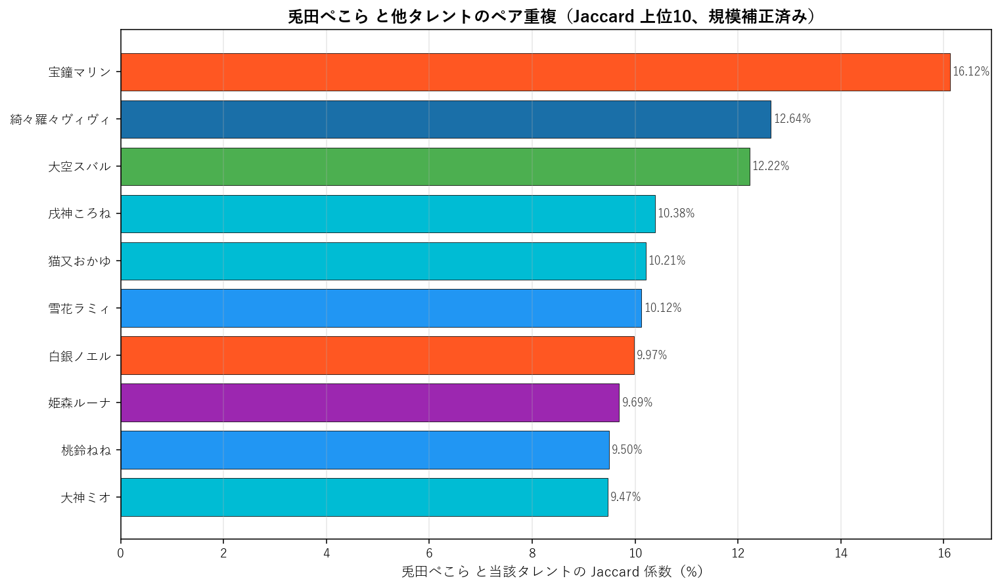
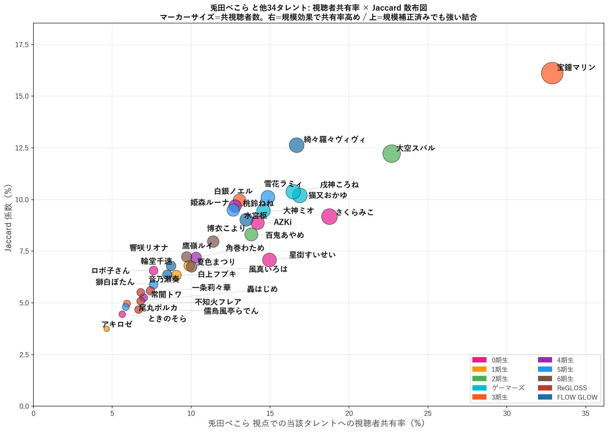

# 兎田ぺこら（3期生）個別深掘り分析

本論文の手法を 兎田ぺこら 一人に絞って詳細展開する個別レポート。集計時点: 2026年5月、10配信固定サンプル。

## 1. 基本プロファイル

| 項目 | 値 |
|---|---:|
| 所属ユニット | 3期生 |
| 活動年数（2026-05-25時点） | 6.86年 |
| 登録者数 | 2,770,000 |
| チャット参加者数（10配信総ユニーク） | 17,674 |
| 参加率（=ユニーク数/登録者数） | 0.64% |
| 専属ファン（兎田ぺこらのみ参加） | 5,254（29.7%） |
| 平均複推し数（自分含む） | 4.98 |
| 中央値複推し数 | 3.0 |

### 1.1 複推し数分布

兎田ぺこら参加者を「同時参加した他タレント数」で集計した分布（自分含む、1=単独）。

## 2. 重複ネットワーク

### 2.1 Jaccard 上位10タレント

兎田ぺこらと他タレントとのペアJaccard係数（規模補正済み）。$|A \cap B|/|A \cup B|$ で計算し、両タレントの規模差に依存しない結合強度を示す。順位は全595ペア中の順位。

| 順位 | タレント | ユニット | Jaccard | 共視聴者数 |
|---:|---|---|---:|---:|
| 2 | 宝鐘マリン | 3期生 | 16.12% | 5,808 |
| 14 | 綺々羅々ヴィヴィ | FLOW GLOW | 12.64% | 2,948 |
| 17 | 大空スバル | 2期生 | 12.22% | 4,009 |
| 51 | 戌神ころね | ゲーマーズ | 10.38% | 2,908 |
| 56 | 猫又おかゆ | ゲーマーズ | 10.21% | 2,981 |
| 62 | 雪花ラミィ | 5期生 | 10.12% | 2,626 |
| 70 | 白銀ノエル | 3期生 | 9.97% | 2,307 |
| 82 | 姫森ルーナ | 4期生 | 9.69% | 2,256 |
| 91 | 桃鈴ねね | 5期生 | 9.50% | 2,236 |
| 94 | 大神ミオ | ゲーマーズ | 9.47% | 2,576 |

### 2.2 視聴者共有率上位と 視聴者共有率 × Jaccard 散布図

**兎田ぺこら視点での他タレントへの視聴者共有率** = $|A \cap B|/|A|$、すなわち「兎田ぺこらの参加者のうち、当該タレント B にも参加した割合」。**視聴者共有率は B の規模に比例するため、絶対値は B が大規模であるほど自然に高くなる**。以下の散布図では、視聴者共有率（X軸）と Jaccard（Y軸）を同時にプロットする。**右方向に位置 = 規模効果で視聴者共有率が押し上げられている**、**上方向に位置 = 規模補正済みでも強い結合** と読める。

**視聴者共有率上位15**: 巨大タレント（マリン・スバル・すいせい等）が上位を占めるのは規模効果。その中に非巨大タレントが食い込む場合は、Jaccard でも上位にあるか確認すると規模補正済みの結合強度が判断できる。

| 順位 | タレント | 視聴者共有率 | 共視聴者数 | Jaccard |
|---:|---|---:|---:|---:|
| 1 | 宝鐘マリン | 32.9% | 5,808 | 16.12% |
| 2 | 大空スバル | 22.7% | 4,009 | 12.22% |
| 3 | さくらみこ | 18.8% | 3,316 | 9.18% |
| 4 | 猫又おかゆ | 16.9% | 2,981 | 10.21% |
| 5 | 綺々羅々ヴィヴィ | 16.7% | 2,948 | 12.64% |
| 6 | 戌神ころね | 16.5% | 2,908 | 10.38% |
| 7 | 星街すいせい | 15.0% | 2,643 | 7.08% |
| 8 | 雪花ラミィ | 14.9% | 2,626 | 10.12% |
| 9 | 大神ミオ | 14.6% | 2,576 | 9.47% |
| 10 | AZKi | 14.2% | 2,509 | 8.88% |
| 11 | 百鬼あやめ | 13.8% | 2,439 | 8.32% |
| 12 | 水宮枢 | 13.5% | 2,382 | 9.04% |
| 13 | 白銀ノエル | 13.1% | 2,307 | 9.97% |
| 14 | 姫森ルーナ | 12.8% | 2,256 | 9.69% |
| 15 | 桃鈴ねね | 12.7% | 2,236 | 9.50% |

## 3. ファン構造分解

### 3.1 ユニット別重複

兎田ぺこら参加者の中で各ユニットのタレントいずれかに参加した人の割合と、当該ユニット内タレントとの平均ペアJaccard。

| ユニット | 人数 | 視聴者共有率 | 共視聴者数 | 平均ペアJaccard |
|---|---:|---:|---:|---:|
| 0期生 | 5 | 35.7% | 6,312 | 7.23% |
| 1期生 | 3 | 18.5% | 3,261 | 5.63% |
| 2期生 | 2 | 29.5% | 5,216 | 10.27% |
| ゲーマーズ | 3 | 31.0% | 5,486 | 10.02% |
| 3期生 | 3 | 38.3% | 6,764 | 10.35% |
| 4期生 | 3 | 22.5% | 3,973 | 7.38% |
| 5期生 | 4 | 27.1% | 4,789 | 7.58% |
| 6期生 | 3 | 22.9% | 4,054 | 7.32% |
| ReGLOSS | 4 | 19.0% | 3,352 | 5.22% |
| FLOW GLOW | 4 | 30.8% | 5,451 | 8.71% |

### 3.2 活動年数（世代）別重複

兎田ぺこら参加者の各世代タレント群への重複度。

| 世代 | 人数 | 視聴者共有率 | 平均ペアJaccard |
|---|---:|---:|---:|
| 2018年以前(7年超) | 13 | 53.7% | 7.97% |
| 2019-2020(5-7年) | 10 | 51.3% | 8.35% |
| 2021-2023(2-5年) | 7 | 32.1% | 6.12% |
| 2024-(2年未満) | 4 | 30.8% | 8.71% |

### 3.3 登録者規模別重複

兎田ぺこら参加者の規模別タレント群への重複度。

| 規模 | 人数 | 視聴者共有率 | 平均ペアJaccard |
|---|---:|---:|---:|
| メガ(300万人超) | 1 | 32.9% | 16.12% |
| 大(200-300万) | 7 | 47.4% | 9.34% |
| 中(100-200万) | 20 | 53.8% | 6.87% |
| 小(50-100万) | 5 | 32.6% | 7.83% |
| 極小(50万未満) | 1 | 8.7% | 6.80% |

## 4. 構造的位置

### 4.1 ハブ性指標

- 兎田ぺこら絡みペアの最高順位: **2/595**
- 上位30以内に入る兎田ぺこら絡みペアの数: **3/30**
- 上位100以内に入る兎田ぺこら絡みペアの数: **10/100**

### 4.2 横断接続性

兎田ぺこらのJaccard上位10ペアの所属ユニット数: **6/10ユニット**

Jaccard上位10ペアの内訳:
- 宝鐘マリン（3期生）J=16.12%, 順位2
- 綺々羅々ヴィヴィ（FLOW GLOW）J=12.64%, 順位14
- 大空スバル（2期生）J=12.22%, 順位17
- 戌神ころね（ゲーマーズ）J=10.38%, 順位51
- 猫又おかゆ（ゲーマーズ）J=10.21%, 順位56
- 雪花ラミィ（5期生）J=10.12%, 順位62
- 白銀ノエル（3期生）J=9.97%, 順位70
- 姫森ルーナ（4期生）J=9.69%, 順位82
- 桃鈴ねね（5期生）J=9.50%, 順位91
- 大神ミオ（ゲーマーズ）J=9.47%, 順位94

### 4.3 外れ値度（平均Jaccard）

- 兎田ぺこらの他34名との平均Jaccard: **7.79%**
- 35名中の順位（小さい順、外れ値ほど上位）: **25/35**

**解釈**: 値が小さいほど他タレントとの重なりが薄く外れ値的位置、大きいほどハブ的位置。35名中で見て中央付近にあれば「平均的な接続度」、上位5位以内なら外れ値、下位5位以内ならハブ。

## 5. 配信間多様性

### 5.1 配信ペア間Jaccard

兎田ぺこらの10配信間で、ペアごとに参加者集合のJaccard係数を計算した分布。

| 統計 | 値 |
|---|---:|
| 最小 | 14.5% |
| 平均 | 22.2% |
| 中央値 | 22.7% |
| 最大 | 31.3% |

**解釈**: 値が高ければ配信間で「常連層」が中心、値が低ければ配信ごとに「一見さん層」が多い。

### 5.2 各配信の独自参加者率

他9配信に参加していない「その配信だけに来た独自参加者」の割合。値が高い配信は特異な層を呼び込んだ可能性を示す。

| 配信日 | 参加者数 | 独自参加者 | 独自率 | タイトル |
|---|---:|---:|---:|---|
| 20260421 | 5,365 | 1,571 | 29.3% | 【カメラ】バズり飯を正直レビュー！！！！！！！！！！！！！！！！！ONICHA、 |
| 20260423 | 1,849 | 455 | 24.6% | 【初見】アークナイツ：エンドフィールドやってみる！ぺこ！【ホロライブ/兎田ぺこら |
| 20260428 | 4,370 | 1,244 | 28.5% | 【ガンプラ】初めての『HG 1/144 シャア専用ザク』作り！！！！！！！！！！ |
| 20260429 | 5,984 | 1,905 | 31.8% | 【ラーメン】家系らーめん兎田家、本日開店です！！！！！！！！！！！！！ぺこ！【ホ |
| 20260501 | 3,050 | 481 | 15.8% | 【凶寓 Dread Flats】ダントツで去年一怖いと言われていたホラーゲームの |
| 20260501 | 3,524 | 694 | 19.7% | 【ワンワンバトル】マイクに向かって吠えろ！そして勝て！！！！！！！！！！！！！ぺ |
| 20260503 | 3,312 | 1,091 | 32.9% | 【天皇賞(春)】2026年春の天皇賞で大勝する！！！！！！！！！！！！！！ぺこ！ |
| 20260506 | 5,362 | 1,413 | 26.4% | 5億年ぶりの激レア雑談【ホロライブ/兎田ぺこら】 |
| 20260507 | 3,518 | 818 | 23.3% | 【初見】友達が少ないウサギが『トモダチコレクション わくわく生活』で最高の島を作 |
| 20260508 | 3,399 | 684 | 20.1% | 【悪意 Dread Neighbor】ガチのマジで今年一怖いホラゲーが決まりそう |

### 5.3 累積ユニーク参加者カーブ

古い配信から順に1本ずつ追加していった時の累積ユニーク参加者数。カーブが早く頭打ちになるほど常連が多く、長く伸び続けるほど新規流入が多い。

| 本数 | 配信日 | 配信参加者 | 累積ユニーク |
|---:|---|---:|---:|
| 1本目 | 20260421 | 5,365 | 5,365 |
| 2本目 | 20260423 | 1,849 | 6,208 |
| 3本目 | 20260428 | 4,370 | 8,551 |
| 4本目 | 20260429 | 5,984 | 11,385 |
| 5本目 | 20260501 | 3,050 | 12,256 |
| 6本目 | 20260501 | 3,524 | 13,252 |
| 7本目 | 20260503 | 3,312 | 14,525 |
| 8本目 | 20260506 | 5,362 | 16,137 |
| 9本目 | 20260507 | 3,518 | 16,990 |
| 10本目 | 20260508 | 3,399 | 17,674 |

## 6. まとめ

- 兎田ぺこらは活動 6.9年・登録者 277.0万人。
  チャット参加コア層は 17,674人で参加率 0.64%。
- 専属ファンは 29.7%、平均複推し数は 4.98人。
- Jaccard 最高ペアは 宝鐘マリン（16.12%、全595ペア中2位）。
- 視聴者共有率絶対数では人気古参（宝鐘マリン 32.9%、大空スバル 22.7%）が上位だが、Jaccard では同世代・同規模タレント（宝鐘マリン、綺々羅々ヴィヴィ）が上位。
- ハブ性指標は弱め（上位30以内ペアは 3 組）、
  平均Jaccard 7.79% は35名中 25 位（小さい順）。
- 配信間ユーザー重複は平均 22.2%、累積カーブは10本で 17,674人に到達。

---
*分析時点: 2026年5月25日。本論文 `report_audience_paper_jp.pdf` の方法論を流用。個別タレントへの応用例として作成。*