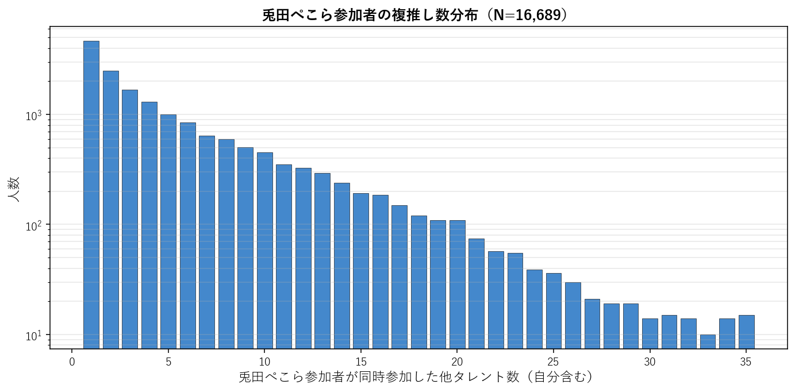
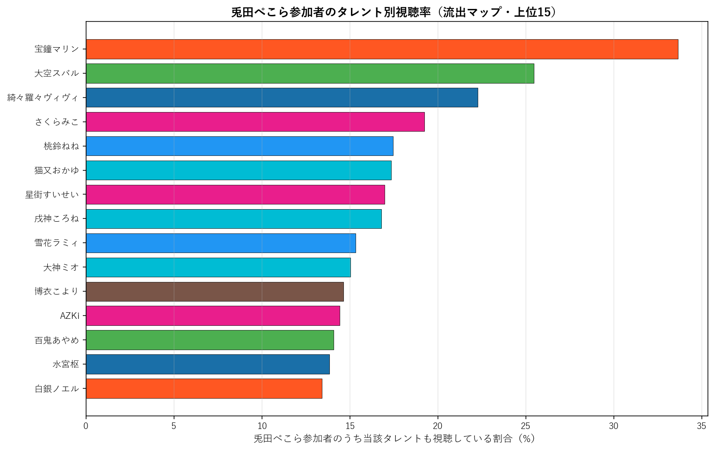
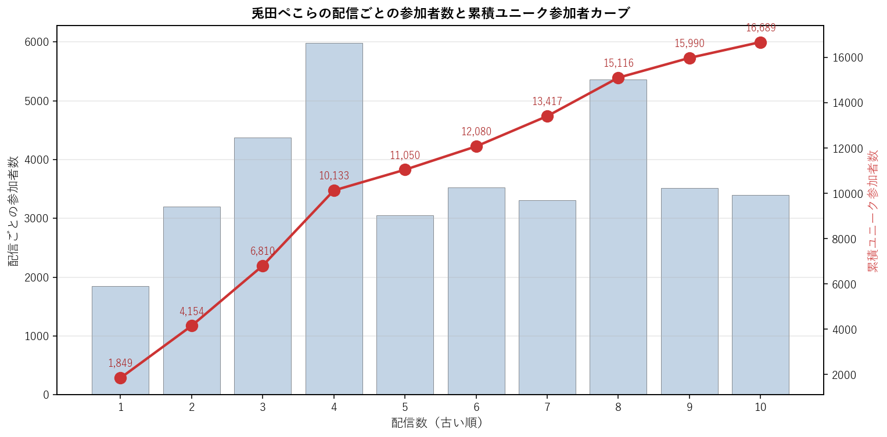

# 兎田ぺこら（3期生）個別深掘り分析

本論文の手法を 兎田ぺこら 一人に絞って詳細展開する個別レポート。集計時点: 2026年5月、10配信固定サンプル。

## 1. 基本プロファイル

| 項目 | 値 |
|---|---:|
| 所属ユニット | 3期生 |
| 活動年数（2026-05-25時点） | 6.86年 |
| 登録者数 | 2,770,000 |
| チャット参加者数（10配信総ユニーク） | 16,689 |
| 参加率（=ユニーク数/登録者数） | 0.60% |
| 専属ファン（兎田ぺこらのみ参加） | 4,665（28.0%） |
| 平均複推し数（自分含む） | 5.34 |
| 中央値複推し数 | 3.0 |

### 1.1 複推し数分布

兎田ぺこら参加者を「同時参加した他タレント数」で集計した分布（自分含む、1=単独）。

## 2. 重複ネットワーク

### 2.1 Jaccard 上位10タレント

兎田ぺこらと他タレントとのペアJaccard係数。順位は全595ペア中の順位。

| 順位 | タレント | ユニット | Jaccard | 共視聴者数 | 流出率 |
|---:|---|---|---:|---:|---:|
| 3 | 宝鐘マリン | 3期生 | 15.94% | 5,618 | 33.7% |
| 4 | 綺々羅々ヴィヴィ | FLOW GLOW | 15.66% | 3,719 | 22.3% |
| 19 | 大空スバル | 2期生 | 12.79% | 4,250 | 25.5% |
| 52 | 桃鈴ねね | 5期生 | 10.95% | 2,913 | 17.5% |
| 78 | 戌神ころね | ゲーマーズ | 10.37% | 2,803 | 16.8% |
| 88 | 猫又おかゆ | ゲーマーズ | 10.23% | 2,896 | 17.4% |
| 89 | 雪花ラミィ | 5期生 | 10.22% | 2,559 | 15.3% |
| 95 | 白銀ノエル | 3期生 | 10.08% | 2,239 | 13.4% |
| 100 | 姫森ルーナ | 4期生 | 9.96% | 2,223 | 13.3% |
| 117 | 大神ミオ | ゲーマーズ | 9.55% | 2,510 | 15.0% |

### 2.2 流出マップ（参加率上位15）

兎田ぺこら参加者のうち、他タレントの配信にも参加していた割合の上位。絶対人数が多い人気タレントが上位に来る傾向があり、Jaccard上位とは異なる切り口。

| 順位 | タレント | 流出率 | 共視聴者数 | Jaccard |
|---:|---|---:|---:|---:|
| 1 | 宝鐘マリン | 33.7% | 5,618 | 15.94% |
| 2 | 大空スバル | 25.5% | 4,250 | 12.79% |
| 3 | 綺々羅々ヴィヴィ | 22.3% | 3,719 | 15.66% |
| 4 | さくらみこ | 19.2% | 3,210 | 9.13% |
| 5 | 桃鈴ねね | 17.5% | 2,913 | 10.95% |
| 6 | 猫又おかゆ | 17.4% | 2,896 | 10.23% |
| 7 | 星街すいせい | 17.0% | 2,834 | 7.52% |
| 8 | 戌神ころね | 16.8% | 2,803 | 10.37% |
| 9 | 雪花ラミィ | 15.3% | 2,559 | 10.22% |
| 10 | 大神ミオ | 15.0% | 2,510 | 9.55% |
| 11 | 博衣こより | 14.6% | 2,442 | 9.54% |
| 12 | AZKi | 14.4% | 2,406 | 8.94% |
| 13 | 百鬼あやめ | 14.1% | 2,348 | 8.26% |
| 14 | 水宮枢 | 13.8% | 2,311 | 9.08% |
| 15 | 白銀ノエル | 13.4% | 2,239 | 10.08% |

### 2.3 3項 lift 上位10（共起の強い3者組）

$\text{lift} = P(兎田ぺこら \cap X \cap Y) / (P(兎田ぺこら \cap X) \cdot P(Y))$。1.0=独立、値が大きいほど3者の同時参加が独立予測値より集中している。$|兎田ぺこら \cap X| \geq 100$ のペアを対象。

| # | X | Y | lift | 3項共視聴 | (target,X) 共視聴 |
|---:|---|---|---:|---:|---:|
| 1 | ときのそら | ロボ子さん | 11.78 | 376 | 1,277 |
| 2 | ときのそら | 不知火フレア | 9.96 | 429 | 1,277 |
| 3 | アキロゼ | 不知火フレア | 9.19 | 266 | 858 |
| 4 | 不知火フレア | 白銀ノエル | 9.04 | 567 | 1,296 |
| 5 | ロボ子さん | 不知火フレア | 8.70 | 376 | 1,282 |
| 6 | 常闇トワ | 獅白ぼたん | 8.67 | 430 | 1,169 |
| 7 | ときのそら | 白銀ノエル | 8.66 | 535 | 1,277 |
| 8 | 尾丸ポルカ | 鷹嶺ルイ | 8.54 | 496 | 1,204 |
| 9 | ときのそら | 姫森ルーナ | 8.49 | 531 | 1,277 |
| 10 | 白上フブキ | 不知火フレア | 8.28 | 443 | 1,586 |

**注意**: lift 値が非常に高いペアは小規模かつニッチな同質サブグループを示している。大規模タレント同士のペアでは lift 値は相対的に低くなる（分母が大きいため）。

## 3. ファン構造分解

### 3.1 ユニット別重複

兎田ぺこら参加者の中で各ユニットのタレントいずれかに参加した人の割合と、当該ユニット内タレントとの平均ペアJaccard。

| ユニット | 人数 | 流出率 | 共視聴者数 | 平均ペアJaccard |
|---|---:|---:|---:|---:|
| 0期生 | 5 | 36.9% | 6,151 | 7.58% |
| 1期生 | 3 | 19.2% | 3,204 | 5.80% |
| 2期生 | 2 | 31.8% | 5,314 | 10.53% |
| ゲーマーズ | 3 | 31.8% | 5,301 | 10.05% |
| 3期生 | 3 | 39.6% | 6,605 | 10.75% |
| 4期生 | 3 | 23.2% | 3,876 | 7.50% |
| 5期生 | 4 | 30.9% | 5,156 | 8.14% |
| 6期生 | 3 | 26.1% | 4,352 | 8.12% |
| ReGLOSS | 4 | 20.5% | 3,420 | 5.51% |
| FLOW GLOW | 4 | 34.9% | 5,821 | 9.54% |

### 3.2 活動年数（世代）別重複

兎田ぺこら参加者の各世代タレント群への重複度。

| 世代 | 人数 | 流出率 | 平均ペアJaccard |
|---|---:|---:|---:|
| 2018年以前(7年超) | 13 | 55.1% | 8.19% |
| 2019-2020(5-7年) | 10 | 53.4% | 8.73% |
| 2021-2023(2-5年) | 7 | 35.0% | 6.63% |
| 2024-(2年未満) | 4 | 34.9% | 9.54% |

### 3.3 登録者規模別重複

兎田ぺこら参加者の規模別タレント群への重複度。

| 規模 | 人数 | 流出率 | 平均ペアJaccard |
|---|---:|---:|---:|
| メガ(300万人超) | 1 | 33.7% | 15.94% |
| 大(200-300万) | 7 | 49.0% | 9.52% |
| 中(100-200万) | 20 | 56.2% | 7.27% |
| 小(50-100万) | 5 | 37.1% | 8.70% |
| 極小(50万未満) | 1 | 9.0% | 6.93% |

## 4. 構造的位置

### 4.1 ハブ性指標

- 兎田ぺこら絡みペアの最高順位: **3/595**
- 上位30以内に入る兎田ぺこら絡みペアの数: **3/30**
- 上位100以内に入る兎田ぺこら絡みペアの数: **9/100**

### 4.2 横断接続性

兎田ぺこらのJaccard上位10ペアの所属ユニット数: **6/10ユニット**

Jaccard上位10ペアの内訳:
- 宝鐘マリン（3期生）J=15.94%, 順位3
- 綺々羅々ヴィヴィ（FLOW GLOW）J=15.66%, 順位4
- 大空スバル（2期生）J=12.79%, 順位19
- 桃鈴ねね（5期生）J=10.95%, 順位52
- 戌神ころね（ゲーマーズ）J=10.37%, 順位78
- 猫又おかゆ（ゲーマーズ）J=10.23%, 順位88
- 雪花ラミィ（5期生）J=10.22%, 順位89
- 白銀ノエル（3期生）J=10.08%, 順位95
- 姫森ルーナ（4期生）J=9.96%, 順位100
- 大神ミオ（ゲーマーズ）J=9.55%, 順位117

### 4.3 外れ値度（平均Jaccard）

- 兎田ぺこらの他34名との平均Jaccard: **8.19%**
- 35名中の順位（小さい順、外れ値ほど上位）: **22/35**

**解釈**: 値が小さいほど他タレントとの重なりが薄く外れ値的位置、大きいほどハブ的位置。35名中で見て中央付近にあれば「平均的な接続度」、上位5位以内なら外れ値、下位5位以内ならハブ。

## 5. 配信間多様性

### 5.1 配信ペア間Jaccard

兎田ぺこらの10配信間で、ペアごとに参加者集合のJaccard係数を計算した分布。

| 統計 | 値 |
|---|---:|
| 最小 | 14.5% |
| 平均 | 22.6% |
| 中央値 | 22.6% |
| 最大 | 31.3% |

**解釈**: 値が高ければ配信間で「常連層」が中心、値が低ければ配信ごとに「一見さん層」が多い。

### 5.2 各配信の独自参加者率

他9配信に参加していない「その配信だけに来た独自参加者」の割合。値が高い配信は特異な層を呼び込んだ可能性を示す。

| 配信日 | 参加者数 | 独自参加者 | 独自率 | タイトル |
|---|---:|---:|---:|---|
| 20260423 | 1,849 | 467 | 25.3% | 【初見】アークナイツ：エンドフィールドやってみる！ぺこ！【ホロライブ/兎田ぺこら |
| 20260425 | 3,201 | 586 | 18.3% | 【ぷちホロの村】ホロメンと過ごすスローライフの始まり！ぺこ！【ホロライブ/兎田ぺ |
| 20260428 | 4,370 | 1,299 | 29.7% | 【ガンプラ】初めての『HG 1/144 シャア専用ザク』作り！！！！！！！！！！ |
| 20260429 | 5,984 | 2,110 | 35.3% | 【ラーメン】家系らーめん兎田家、本日開店です！！！！！！！！！！！！！ぺこ！【ホ |
| 20260501 | 3,050 | 510 | 16.7% | 【凶寓 Dread Flats】ダントツで去年一怖いと言われていたホラーゲームの |
| 20260501 | 3,524 | 710 | 20.1% | 【ワンワンバトル】マイクに向かって吠えろ！そして勝て！！！！！！！！！！！！！ぺ |
| 20260503 | 3,312 | 1,129 | 34.1% | 【天皇賞(春)】2026年春の天皇賞で大勝する！！！！！！！！！！！！！！ぺこ！ |
| 20260506 | 5,362 | 1,479 | 27.6% | 5億年ぶりの激レア雑談【ホロライブ/兎田ぺこら】 |
| 20260507 | 3,518 | 841 | 23.9% | 【初見】友達が少ないウサギが『トモダチコレクション わくわく生活』で最高の島を作 |
| 20260508 | 3,399 | 699 | 20.6% | 【悪意 Dread Neighbor】ガチのマジで今年一怖いホラゲーが決まりそう |

### 5.3 累積ユニーク参加者カーブ

古い配信から順に1本ずつ追加していった時の累積ユニーク参加者数。カーブが早く頭打ちになるほど常連が多く、長く伸び続けるほど新規流入が多い。

| 本数 | 配信日 | 配信参加者 | 累積ユニーク |
|---:|---|---:|---:|
| 1本目 | 20260423 | 1,849 | 1,849 |
| 2本目 | 20260425 | 3,201 | 4,154 |
| 3本目 | 20260428 | 4,370 | 6,810 |
| 4本目 | 20260429 | 5,984 | 10,133 |
| 5本目 | 20260501 | 3,050 | 11,050 |
| 6本目 | 20260501 | 3,524 | 12,080 |
| 7本目 | 20260503 | 3,312 | 13,417 |
| 8本目 | 20260506 | 5,362 | 15,116 |
| 9本目 | 20260507 | 3,518 | 15,990 |
| 10本目 | 20260508 | 3,399 | 16,689 |

## 6. まとめ

- 兎田ぺこらは活動 6.9年・登録者 277.0万人。
  チャット参加コア層は 16,689人で参加率 0.60%。
- 専属ファンは 28.0%、平均複推し数は 5.34人。
- Jaccard 最高ペアは 宝鐘マリン（15.94%、全595ペア中3位）。
- 流出絶対数では人気古参（宝鐘マリン 33.7%、大空スバル 25.5%）が上位だが、Jaccard では同世代・同規模タレント（宝鐘マリン、綺々羅々ヴィヴィ）が上位。
- ハブ性指標は弱め（上位30以内ペアは 3 組）、
  平均Jaccard 8.19% は35名中 22 位（小さい順）。
- 配信間ユーザー重複は平均 22.6%、累積カーブは10本で 16,689人に到達。

---
*分析時点: 2026年5月25日。本論文 `report_audience_paper_jp.pdf` の方法論を流用。個別タレントへの応用例として作成。*