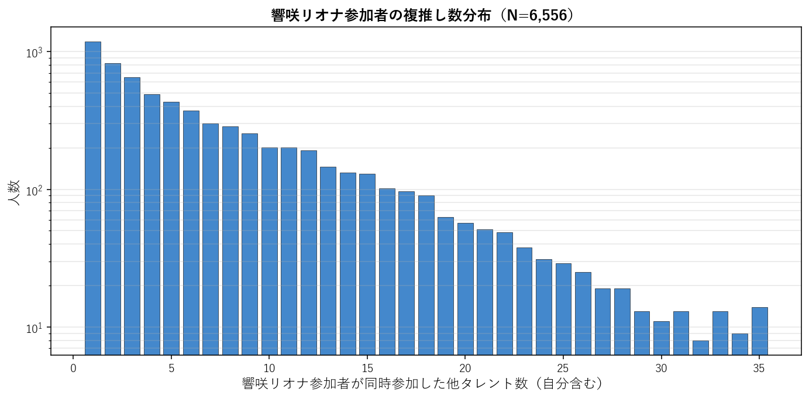
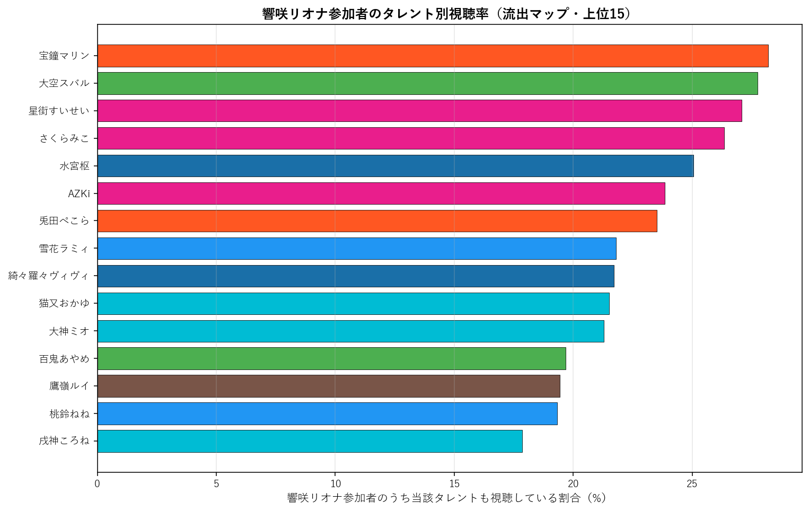
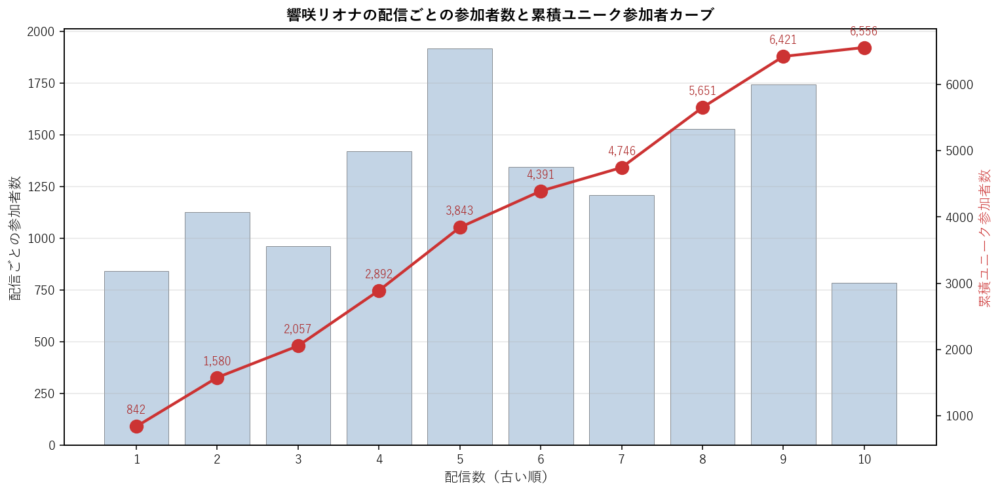

# 響咲リオナ（FLOW GLOW）個別深掘り分析

本論文の手法を 響咲リオナ 一人に絞って詳細展開する個別レポート。集計時点: 2026年5月、10配信固定サンプル。

## 1. 基本プロファイル

| 項目 | 値 |
|---|---:|
| 所属ユニット | FLOW GLOW |
| 活動年数（2026-05-25時点） | 1.54年 |
| 登録者数 | 469,000 |
| チャット参加者数（10配信総ユニーク） | 6,556 |
| 参加率（=ユニーク数/登録者数） | 1.40% |
| 専属ファン（響咲リオナのみ参加） | 1,182（18.0%） |
| 平均複推し数（自分含む） | 7.03 |
| 中央値複推し数 | 5.0 |

### 1.1 複推し数分布

響咲リオナ参加者を「同時参加した他タレント数」で集計した分布（自分含む、1=単独）。

## 2. 重複ネットワーク

### 2.1 Jaccard 上位10タレント

響咲リオナと他タレントとのペアJaccard係数。順位は全595ペア中の順位。

| 順位 | タレント | ユニット | Jaccard | 共視聴者数 | 流出率 |
|---:|---|---|---:|---:|---:|
| 53 | 綺々羅々ヴィヴィ | FLOW GLOW | 10.37% | 1,424 | 21.7% |
| 56 | 水宮枢 | FLOW GLOW | 10.28% | 1,643 | 25.1% |
| 79 | 鷹嶺ルイ | 6期生 | 9.79% | 1,275 | 19.4% |
| 132 | 雪花ラミィ | 5期生 | 8.92% | 1,430 | 21.8% |
| 143 | 一条莉々華 | ReGLOSS | 8.81% | 950 | 14.5% |
| 157 | AZKi | 0期生 | 8.65% | 1,564 | 23.9% |
| 165 | 輪堂千速 | FLOW GLOW | 8.51% | 1,087 | 16.6% |
| 203 | 大神ミオ | ゲーマーズ | 8.08% | 1,395 | 21.3% |
| 205 | 桃鈴ねね | 5期生 | 8.06% | 1,267 | 19.3% |
| 217 | 姫森ルーナ | 4期生 | 7.97% | 1,064 | 16.2% |

### 2.2 流出マップ（参加率上位15）

響咲リオナ参加者のうち、他タレントの配信にも参加していた割合の上位。絶対人数が多い人気タレントが上位に来る傾向があり、Jaccard上位とは異なる切り口。

| 順位 | タレント | 流出率 | 共視聴者数 | Jaccard |
|---:|---|---:|---:|---:|
| 1 | 宝鐘マリン | 28.2% | 1,849 | 6.40% |
| 2 | 大空スバル | 27.7% | 1,819 | 7.62% |
| 3 | 星街すいせい | 27.1% | 1,776 | 6.17% |
| 4 | さくらみこ | 26.4% | 1,728 | 6.49% |
| 5 | 水宮枢 | 25.1% | 1,643 | 10.28% |
| 6 | AZKi | 23.9% | 1,564 | 8.65% |
| 7 | 兎田ぺこら | 23.5% | 1,542 | 6.80% |
| 8 | 雪花ラミィ | 21.8% | 1,430 | 8.92% |
| 9 | 綺々羅々ヴィヴィ | 21.7% | 1,424 | 10.37% |
| 10 | 猫又おかゆ | 21.5% | 1,410 | 7.17% |
| 11 | 大神ミオ | 21.3% | 1,395 | 8.08% |
| 12 | 百鬼あやめ | 19.7% | 1,290 | 6.67% |
| 13 | 鷹嶺ルイ | 19.4% | 1,275 | 9.79% |
| 14 | 桃鈴ねね | 19.3% | 1,267 | 8.06% |
| 15 | 戌神ころね | 17.8% | 1,170 | 6.52% |

### 2.3 3項 lift 上位10（共起の強い3者組）

$\text{lift} = P(響咲リオナ \cap X \cap Y) / (P(響咲リオナ \cap X) \cdot P(Y))$。1.0=独立、値が大きいほど3者の同時参加が独立予測値より集中している。$|響咲リオナ \cap X| \geq 100$ のペアを対象。

| # | X | Y | lift | 3項共視聴 | (target,X) 共視聴 |
|---:|---|---|---:|---:|---:|
| 1 | ときのそら | ロボ子さん | 14.20 | 287 | 778 |
| 2 | 音乃瀬奏 | 一条莉々華 | 11.98 | 398 | 1,026 |
| 3 | ロボ子さん | 一条莉々華 | 11.86 | 273 | 711 |
| 4 | ロボ子さん | 不知火フレア | 11.67 | 231 | 711 |
| 5 | ときのそら | 一条莉々華 | 11.47 | 289 | 778 |
| 6 | 白上フブキ | 不知火フレア | 10.94 | 266 | 874 |
| 7 | アキロゼ | 不知火フレア | 10.82 | 193 | 641 |
| 8 | 不知火フレア | 一条莉々華 | 10.81 | 209 | 597 |
| 9 | ときのそら | 不知火フレア | 10.76 | 233 | 778 |
| 10 | 博衣こより | 一条莉々華 | 10.75 | 377 | 1,083 |

**注意**: lift 値が非常に高いペアは小規模かつニッチな同質サブグループを示している。大規模タレント同士のペアでは lift 値は相対的に低くなる（分母が大きいため）。

## 3. ファン構造分解

### 3.1 ユニット別重複

響咲リオナ参加者の中で各ユニットのタレントいずれかに参加した人の割合と、当該ユニット内タレントとの平均ペアJaccard。

| ユニット | 人数 | 流出率 | 共視聴者数 | 平均ペアJaccard |
|---|---:|---:|---:|---:|
| 0期生 | 5 | 51.1% | 3,353 | 7.05% |
| 1期生 | 3 | 30.2% | 1,978 | 6.46% |
| 2期生 | 2 | 37.0% | 2,424 | 7.14% |
| ゲーマーズ | 3 | 37.7% | 2,470 | 7.26% |
| 3期生 | 4 | 42.9% | 2,812 | 6.55% |
| 4期生 | 3 | 31.7% | 2,080 | 7.25% |
| 5期生 | 4 | 38.5% | 2,522 | 7.25% |
| 6期生 | 3 | 37.1% | 2,429 | 8.05% |
| ReGLOSS | 4 | 33.3% | 2,181 | 6.89% |
| FLOW GLOW | 3 | 41.7% | 2,735 | 9.72% |

### 3.2 活動年数（世代）別重複

響咲リオナ参加者の各世代タレント群への重複度。

| 世代 | 人数 | 流出率 | 平均ペアJaccard |
|---|---:|---:|---:|
| 2018年以前(7年超) | 13 | 66.3% | 6.98% |
| 2019-2020(5-7年) | 11 | 59.8% | 6.99% |
| 2021-2023(2-5年) | 7 | 50.7% | 7.39% |
| 2024-(2年未満) | 3 | 41.7% | 9.72% |

### 3.3 登録者規模別重複

響咲リオナ参加者の規模別タレント群への重複度。

| 規模 | 人数 | 流出率 | 平均ペアJaccard |
|---|---:|---:|---:|
| メガ(300万人超) | 1 | 28.2% | 6.40% |
| 大(200-300万) | 8 | 61.5% | 6.74% |
| 中(100-200万) | 20 | 69.6% | 7.14% |
| 小(50-100万) | 5 | 49.4% | 9.10% |

## 4. 構造的位置

### 4.1 ハブ性指標

- 響咲リオナ絡みペアの最高順位: **53/595**
- 上位30以内に入る響咲リオナ絡みペアの数: **0/30**
- 上位100以内に入る響咲リオナ絡みペアの数: **3/100**

### 4.2 横断接続性

響咲リオナのJaccard上位10ペアの所属ユニット数: **7/10ユニット**

Jaccard上位10ペアの内訳:
- 綺々羅々ヴィヴィ（FLOW GLOW）J=10.37%, 順位53
- 水宮枢（FLOW GLOW）J=10.28%, 順位56
- 鷹嶺ルイ（6期生）J=9.79%, 順位79
- 雪花ラミィ（5期生）J=8.92%, 順位132
- 一条莉々華（ReGLOSS）J=8.81%, 順位143
- AZKi（0期生）J=8.65%, 順位157
- 輪堂千速（FLOW GLOW）J=8.51%, 順位165
- 大神ミオ（ゲーマーズ）J=8.08%, 順位203
- 桃鈴ねね（5期生）J=8.06%, 順位205
- 姫森ルーナ（4期生）J=7.97%, 順位217

### 4.3 外れ値度（平均Jaccard）

- 響咲リオナの他34名との平均Jaccard: **7.31%**
- 35名中の順位（小さい順、外れ値ほど上位）: **13/35**

**解釈**: 値が小さいほど他タレントとの重なりが薄く外れ値的位置、大きいほどハブ的位置。35名中で見て中央付近にあれば「平均的な接続度」、上位5位以内なら外れ値、下位5位以内ならハブ。

## 5. 配信間多様性

### 5.1 配信ペア間Jaccard

響咲リオナの10配信間で、ペアごとに参加者集合のJaccard係数を計算した分布。

| 統計 | 値 |
|---|---:|
| 最小 | 12.1% |
| 平均 | 19.0% |
| 中央値 | 18.4% |
| 最大 | 31.8% |

**解釈**: 値が高ければ配信間で「常連層」が中心、値が低ければ配信ごとに「一見さん層」が多い。

### 5.2 各配信の独自参加者率

他9配信に参加していない「その配信だけに来た独自参加者」の割合。値が高い配信は特異な層を呼び込んだ可能性を示す。

| 配信日 | 参加者数 | 独自参加者 | 独自率 | タイトル |
|---|---:|---:|---:|---|
| 20260408 | 842 | 195 | 23.2% | 【#NELLマットレス】響咲リオナのNELLコイルフトンと過ごしてみた！？【ホロ |
| 20260408 | 1,125 | 290 | 25.8% | 【歌枠】とにかく歌が歌いたいんじゃああああああ💛【ホロライブ DEV_IS 響咲 |
| 20260411 | 963 | 240 | 24.9% | 【Phasmophobia】幽霊調査っ♡先輩たち助けてええええ(´;ω;｀)【ホ |
| 20260412 | 1,420 | 353 | 24.9% | 【ドラゴンボールZ KAKAROT】完全初見！配信予定【ホロライブ DEV_IS |
| 20260415 | 1,917 | 772 | 40.3% | 【ドラゴンボールZ KAKAROT】完全初見！ついに開幕！せるげーーーーーむ！！ |
| 20260422 | 1,346 | 421 | 31.3% | 深夜歌枠♡【ホロライブ DEV_IS 響咲リオナ】 |
| 20260428 | 1,207 | 275 | 22.8% | 【ぷちホロの村】のんびりスローライフ❤【ホロライブ DEV_IS 響咲リオナ】 |
| 20260502 | 1,529 | 846 | 55.3% | 【777TOWN.net | バジリスク～甲賀忍法帖～絆】終わりじゃ天膳！！【ホ |
| 20260504 | 1,742 | 746 | 42.8% | 【ARK: Survival Ascended】初見ARK！恐竜さん見てみたい✨ |
| 20260506 | 786 | 135 | 17.2% | 【Cursed Companions】NGワードで即死！？自滅だけはさけるんだっ |

### 5.3 累積ユニーク参加者カーブ

古い配信から順に1本ずつ追加していった時の累積ユニーク参加者数。カーブが早く頭打ちになるほど常連が多く、長く伸び続けるほど新規流入が多い。

| 本数 | 配信日 | 配信参加者 | 累積ユニーク |
|---:|---|---:|---:|
| 1本目 | 20260408 | 842 | 842 |
| 2本目 | 20260408 | 1,125 | 1,580 |
| 3本目 | 20260411 | 963 | 2,057 |
| 4本目 | 20260412 | 1,420 | 2,892 |
| 5本目 | 20260415 | 1,917 | 3,843 |
| 6本目 | 20260422 | 1,346 | 4,391 |
| 7本目 | 20260428 | 1,207 | 4,746 |
| 8本目 | 20260502 | 1,529 | 5,651 |
| 9本目 | 20260504 | 1,742 | 6,421 |
| 10本目 | 20260506 | 786 | 6,556 |

## 6. まとめ

- 響咲リオナは活動 1.5年・登録者 46.9万人。
  チャット参加コア層は 6,556人で参加率 1.40%。
- 専属ファンは 18.0%、平均複推し数は 7.03人。
- Jaccard 最高ペアは 綺々羅々ヴィヴィ（10.37%、全595ペア中53位）。
- 流出絶対数では人気古参（宝鐘マリン 28.2%、大空スバル 27.7%）が上位だが、Jaccard では同世代・同規模タレント（綺々羅々ヴィヴィ、水宮枢）が上位。
- ハブ性指標は弱め（上位30以内ペアは 0 組）、
  平均Jaccard 7.31% は35名中 13 位（小さい順）。
- 配信間ユーザー重複は平均 19.0%、累積カーブは10本で 6,556人に到達。

---
*分析時点: 2026年5月25日。本論文 `report_audience_paper_jp.pdf` の方法論を流用。個別タレントへの応用例として作成。*