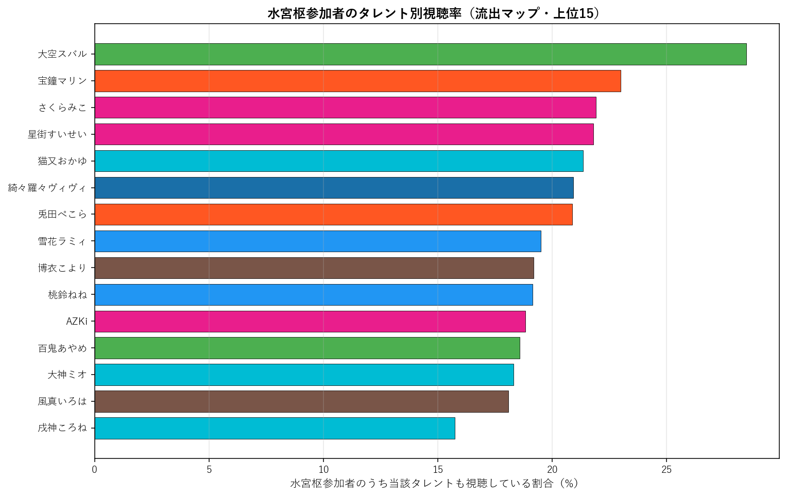

# 水宮枢（FLOW GLOW）個別深掘り分析

本論文の手法を 水宮枢 一人に絞って詳細展開する個別レポート。集計時点: 2026年5月、10配信固定サンプル。

## 1. 基本プロファイル

| 項目 | 値 |
|---|---:|
| 所属ユニット | FLOW GLOW |
| 活動年数（2026-05-25時点） | 1.54年 |
| 登録者数 | 675,000 |
| チャット参加者数（10配信総ユニーク） | 11,072 |
| 参加率（=ユニーク数/登録者数） | 1.64% |
| 専属ファン（水宮枢のみ参加） | 2,873（25.9%） |
| 平均複推し数（自分含む） | 6.23 |
| 中央値複推し数 | 4.0 |

### 1.1 複推し数分布

水宮枢参加者を「同時参加した他タレント数」で集計した分布（自分含む、1=単独）。

## 2. 重複ネットワーク

### 2.1 Jaccard 上位10タレント

水宮枢と他タレントとのペアJaccard係数。順位は全595ペア中の順位。

| 順位 | タレント | ユニット | Jaccard | 共視聴者数 | 流出率 |
|---:|---|---|---:|---:|---:|
| 31 | 綺々羅々ヴィヴィ | FLOW GLOW | 11.86% | 2,316 | 20.9% |
| 49 | 大空スバル | 2期生 | 10.99% | 3,154 | 28.5% |
| 54 | 雪花ラミィ | 5期生 | 10.90% | 2,159 | 19.5% |
| 74 | 博衣こより | 6期生 | 10.46% | 2,123 | 19.2% |
| 83 | 響咲リオナ | FLOW GLOW | 10.28% | 1,643 | 14.8% |
| 92 | 猫又おかゆ | ゲーマーズ | 10.18% | 2,364 | 21.4% |
| 109 | 桃鈴ねね | 5期生 | 9.72% | 2,118 | 19.1% |
| 113 | AZKi | 0期生 | 9.64% | 2,085 | 18.8% |
| 115 | 大神ミオ | ゲーマーズ | 9.58% | 2,027 | 18.3% |
| 116 | 音乃瀬奏 | ReGLOSS | 9.55% | 1,694 | 15.3% |

### 2.2 流出マップ（参加率上位15）

水宮枢参加者のうち、他タレントの配信にも参加していた割合の上位。絶対人数が多い人気タレントが上位に来る傾向があり、Jaccard上位とは異なる切り口。

| 順位 | タレント | 流出率 | 共視聴者数 | Jaccard |
|---:|---|---:|---:|---:|
| 1 | 大空スバル | 28.5% | 3,154 | 10.99% |
| 2 | 宝鐘マリン | 23.0% | 2,546 | 7.79% |
| 3 | さくらみこ | 21.9% | 2,425 | 8.00% |
| 4 | 星街すいせい | 21.8% | 2,413 | 7.42% |
| 5 | 猫又おかゆ | 21.4% | 2,364 | 10.18% |
| 6 | 綺々羅々ヴィヴィ | 20.9% | 2,316 | 11.86% |
| 7 | 兎田ぺこら | 20.9% | 2,311 | 9.08% |
| 8 | 雪花ラミィ | 19.5% | 2,159 | 10.90% |
| 9 | 博衣こより | 19.2% | 2,123 | 10.46% |
| 10 | 桃鈴ねね | 19.1% | 2,118 | 9.72% |
| 11 | AZKi | 18.8% | 2,085 | 9.64% |
| 12 | 百鬼あやめ | 18.6% | 2,058 | 8.91% |
| 13 | 大神ミオ | 18.3% | 2,027 | 9.58% |
| 14 | 風真いろは | 18.1% | 2,001 | 9.35% |
| 15 | 戌神ころね | 15.7% | 1,743 | 7.75% |

### 2.3 3項 lift 上位10（共起の強い3者組）

$\text{lift} = P(水宮枢 \cap X \cap Y) / (P(水宮枢 \cap X) \cdot P(Y))$。1.0=独立、値が大きいほど3者の同時参加が独立予測値より集中している。$|水宮枢 \cap X| \geq 100$ のペアを対象。

| # | X | Y | lift | 3項共視聴 | (target,X) 共視聴 |
|---:|---|---|---:|---:|---:|
| 1 | ときのそら | ロボ子さん | 13.20 | 414 | 1,254 |
| 2 | アキロゼ | 響咲リオナ | 10.50 | 311 | 725 |
| 3 | 不知火フレア | 響咲リオナ | 10.22 | 357 | 855 |
| 4 | アキロゼ | 不知火フレア | 9.98 | 244 | 725 |
| 5 | 一条莉々華 | 響咲リオナ | 9.85 | 459 | 1,141 |
| 6 | 常闇トワ | 一条莉々華 | 9.75 | 338 | 1,102 |
| 7 | ロボ子さん | 一条莉々華 | 9.71 | 324 | 1,061 |
| 8 | 不知火フレア | 一条莉々華 | 9.67 | 260 | 855 |
| 9 | 鷹嶺ルイ | 響咲リオナ | 9.64 | 587 | 1,491 |
| 10 | 尾丸ポルカ | 鷹嶺ルイ | 9.38 | 448 | 990 |

**注意**: lift 値が非常に高いペアは小規模かつニッチな同質サブグループを示している。大規模タレント同士のペアでは lift 値は相対的に低くなる（分母が大きいため）。

## 3. ファン構造分解

### 3.1 ユニット別重複

水宮枢参加者の中で各ユニットのタレントいずれかに参加した人の割合と、当該ユニット内タレントとの平均ペアJaccard。

| ユニット | 人数 | 流出率 | 共視聴者数 | 平均ペアJaccard |
|---|---:|---:|---:|---:|
| 0期生 | 5 | 42.8% | 4,739 | 8.02% |
| 1期生 | 3 | 25.5% | 2,821 | 6.85% |
| 2期生 | 2 | 37.0% | 4,102 | 9.95% |
| ゲーマーズ | 3 | 34.8% | 3,854 | 9.17% |
| 3期生 | 4 | 37.0% | 4,101 | 7.66% |
| 4期生 | 3 | 26.3% | 2,911 | 7.56% |
| 5期生 | 4 | 34.7% | 3,838 | 8.12% |
| 6期生 | 3 | 35.0% | 3,878 | 9.47% |
| ReGLOSS | 4 | 30.2% | 3,344 | 7.52% |
| FLOW GLOW | 3 | 33.6% | 3,718 | 10.15% |

### 3.2 活動年数（世代）別重複

水宮枢参加者の各世代タレント群への重複度。

| 世代 | 人数 | 流出率 | 平均ペアJaccard |
|---|---:|---:|---:|
| 2018年以前(7年超) | 13 | 60.3% | 8.31% |
| 2019-2020(5-7年) | 11 | 52.4% | 7.80% |
| 2021-2023(2-5年) | 7 | 46.9% | 8.35% |
| 2024-(2年未満) | 3 | 33.6% | 10.15% |

### 3.3 登録者規模別重複

水宮枢参加者の規模別タレント群への重複度。

| 規模 | 人数 | 流出率 | 平均ペアJaccard |
|---|---:|---:|---:|
| メガ(300万人超) | 1 | 23.0% | 7.79% |
| 大(200-300万) | 8 | 56.2% | 8.65% |
| 中(100-200万) | 20 | 62.9% | 7.91% |
| 小(50-100万) | 4 | 37.3% | 9.33% |
| 極小(50万未満) | 1 | 14.8% | 10.28% |

## 4. 構造的位置

### 4.1 ハブ性指標

- 水宮枢絡みペアの最高順位: **31/595**
- 上位30以内に入る水宮枢絡みペアの数: **0/30**
- 上位100以内に入る水宮枢絡みペアの数: **6/100**

### 4.2 横断接続性

水宮枢のJaccard上位10ペアの所属ユニット数: **7/10ユニット**

Jaccard上位10ペアの内訳:
- 綺々羅々ヴィヴィ（FLOW GLOW）J=11.86%, 順位31
- 大空スバル（2期生）J=10.99%, 順位49
- 雪花ラミィ（5期生）J=10.90%, 順位54
- 博衣こより（6期生）J=10.46%, 順位74
- 響咲リオナ（FLOW GLOW）J=10.28%, 順位83
- 猫又おかゆ（ゲーマーズ）J=10.18%, 順位92
- 桃鈴ねね（5期生）J=9.72%, 順位109
- AZKi（0期生）J=9.64%, 順位113
- 大神ミオ（ゲーマーズ）J=9.58%, 順位115
- 音乃瀬奏（ReGLOSS）J=9.55%, 順位116

### 4.3 外れ値度（平均Jaccard）

- 水宮枢の他34名との平均Jaccard: **8.32%**
- 35名中の順位（小さい順、外れ値ほど上位）: **24/35**

**解釈**: 値が小さいほど他タレントとの重なりが薄く外れ値的位置、大きいほどハブ的位置。35名中で見て中央付近にあれば「平均的な接続度」、上位5位以内なら外れ値、下位5位以内ならハブ。

## 5. 配信間多様性

### 5.1 配信ペア間Jaccard

水宮枢の10配信間で、ペアごとに参加者集合のJaccard係数を計算した分布。

| 統計 | 値 |
|---|---:|
| 最小 | 7.5% |
| 平均 | 12.2% |
| 中央値 | 12.0% |
| 最大 | 18.7% |

**解釈**: 値が高ければ配信間で「常連層」が中心、値が低ければ配信ごとに「一見さん層」が多い。

### 5.2 各配信の独自参加者率

他9配信に参加していない「その配信だけに来た独自参加者」の割合。値が高い配信は特異な層を呼び込んだ可能性を示す。

| 配信日 | 参加者数 | 独自参加者 | 独自率 | タイトル |
|---|---:|---:|---:|---|
| 20260326 | 1,932 | 746 | 38.6% | 【パラソーシャル】ホラー苦手が行く【水宮枢／ホロライブDEV_IS】 |
| 20260328 | 2,015 | 1,006 | 49.9% | 【FF10】初めてのファイナルファンタジー💙完全初見 :ネタバレあり【水宮枢／ホ |
| 20260401 | 1,751 | 660 | 37.7% | 【BLEACH Rebirth of Souls】完全初見 どんな話なんだ…！# |
| 20260403 | 3,254 | 1,853 | 56.9% | 【わかる！学べる！小学校教科書テスト】さすがに任せて✋【水宮枢／ホロライブDEV |
| 20260411 | 2,397 | 1,166 | 48.6% | 【雑談／Free talk】最近の話とか一緒にはなそ〜❕💙【水宮枢／ホロライブD |
| 20260418 | 1,172 | 506 | 43.2% | 【アークナイツエンドフィールド】初めてのアークナイツ！物語が始まる…✨️【水宮枢 |
| 20260421 | 537 | 90 | 16.8% | 【モンギル：STAR DIVE】モンギルの世界に遊びに行く…✨️【水宮枢／ホロラ |
| 20260426 | 1,158 | 400 | 34.5% | 【ASMR】メン限お試し15分・微糖…？バイノーラルでお話☁️【水宮枢／ホロライ |
| 20260503 | 1,669 | 750 | 44.9% | 【歌枠 KARAOKE】縦型歌雑談〜❕【水宮枢／ホロライブDEV_IS】 |
| 20260506 | 2,036 | 960 | 47.2% | 【雑談／freetalk】縦型雑談〜❕【水宮枢／ホロライブDEV_IS】 |

### 5.3 累積ユニーク参加者カーブ

古い配信から順に1本ずつ追加していった時の累積ユニーク参加者数。カーブが早く頭打ちになるほど常連が多く、長く伸び続けるほど新規流入が多い。

| 本数 | 配信日 | 配信参加者 | 累積ユニーク |
|---:|---|---:|---:|
| 1本目 | 20260326 | 1,932 | 1,932 |
| 2本目 | 20260328 | 2,015 | 3,436 |
| 3本目 | 20260401 | 1,751 | 4,411 |
| 4本目 | 20260403 | 3,254 | 6,723 |
| 5本目 | 20260411 | 2,397 | 8,149 |
| 6本目 | 20260418 | 1,172 | 8,705 |
| 7本目 | 20260421 | 537 | 8,813 |
| 8本目 | 20260426 | 1,158 | 9,280 |
| 9本目 | 20260503 | 1,669 | 10,112 |
| 10本目 | 20260506 | 2,036 | 11,072 |

## 6. まとめ

- 水宮枢は活動 1.5年・登録者 67.5万人。
  チャット参加コア層は 11,072人で参加率 1.64%。
- 専属ファンは 25.9%、平均複推し数は 6.23人。
- Jaccard 最高ペアは 綺々羅々ヴィヴィ（11.86%、全595ペア中31位）。
- 流出絶対数では人気古参（大空スバル 28.5%、宝鐘マリン 23.0%）が上位だが、Jaccard では同世代・同規模タレント（綺々羅々ヴィヴィ、大空スバル）が上位。
- ハブ性指標は弱め（上位30以内ペアは 0 組）、
  平均Jaccard 8.32% は35名中 24 位（小さい順）。
- 配信間ユーザー重複は平均 12.2%、累積カーブは10本で 11,072人に到達。

---
*分析時点: 2026年5月25日。本論文 `report_audience_paper_jp.pdf` の方法論を流用。個別タレントへの応用例として作成。*