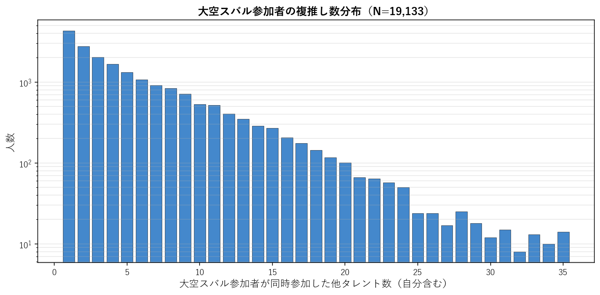
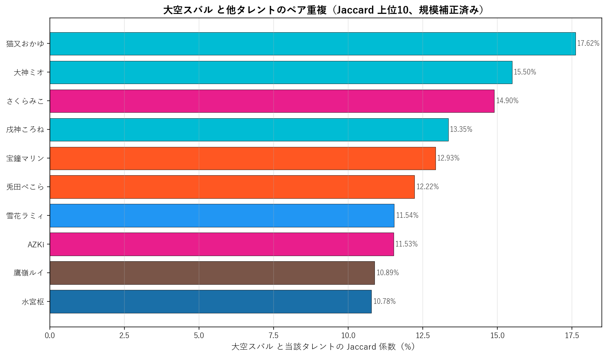
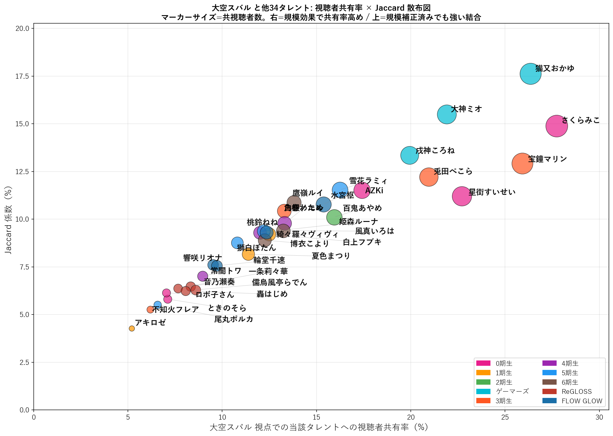
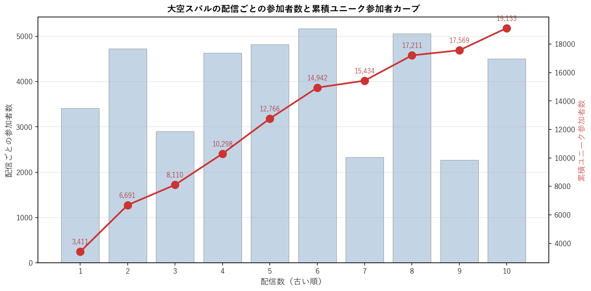

# 大空スバル（2期生）個別深掘り分析

本論文の手法を 大空スバル 一人に絞って詳細展開する個別レポート。集計時点: 2026年5月、10配信固定サンプル。

## 1. 基本プロファイル

| 項目 | 値 |
|---|---:|
| 所属ユニット | 2期生 |
| 活動年数（2026-05-25時点） | 7.69年 |
| 登録者数 | 2,000,000 |
| チャット参加者数（10配信総ユニーク） | 19,133 |
| 参加率（=ユニーク数/登録者数） | 0.96% |
| 専属ファン（大空スバルのみ参加） | 4,298（22.5%） |
| 平均複推し数（自分含む） | 5.60 |
| 中央値複推し数 | 4.0 |

### 1.1 複推し数分布

大空スバル参加者を「同時参加した他タレント数」で集計した分布（自分含む、1=単独）。

## 2. 重複ネットワーク

### 2.1 Jaccard 上位10タレント

大空スバルと他タレントとのペアJaccard係数（規模補正済み）。$|A \cap B|/|A \cup B|$ で計算し、両タレントの規模差に依存しない結合強度を示す。順位は全595ペア中の順位。

| 順位 | タレント | ユニット | Jaccard | 共視聴者数 |
|---:|---|---|---:|---:|
| 1 | 猫又おかゆ | ゲーマーズ | 17.62% | 5,041 |
| 3 | 大神ミオ | ゲーマーズ | 15.50% | 4,192 |
| 5 | さくらみこ | 0期生 | 14.90% | 5,305 |
| 10 | 戌神ころね | ゲーマーズ | 13.35% | 3,814 |
| 12 | 宝鐘マリン | 3期生 | 12.93% | 4,957 |
| 17 | 兎田ぺこら | 3期生 | 12.22% | 4,009 |
| 24 | 雪花ラミィ | 5期生 | 11.54% | 3,108 |
| 25 | AZKi | 0期生 | 11.53% | 3,331 |
| 29 | 星街すいせい | 0期生 | 11.21% | 4,345 |
| 37 | 鷹嶺ルイ | 6期生 | 10.89% | 2,639 |

### 2.2 視聴者共有率上位と 視聴者共有率 × Jaccard 散布図

**大空スバル視点での他タレントへの視聴者共有率** = $|A \cap B|/|A|$、すなわち「大空スバルの参加者のうち、当該タレント B にも参加した割合」。**視聴者共有率は B の規模に比例するため、絶対値は B が大規模であるほど自然に高くなる**。以下の散布図では、視聴者共有率（X軸）と Jaccard（Y軸）を同時にプロットする。**右方向に位置 = 規模効果で視聴者共有率が押し上げられている**、**上方向に位置 = 規模補正済みでも強い結合** と読める。

**視聴者共有率上位15**: 巨大タレント（マリン・スバル・すいせい等）が上位を占めるのは規模効果。その中に非巨大タレントが食い込む場合は、Jaccard でも上位にあるか確認すると規模補正済みの結合強度が判断できる。

| 順位 | タレント | 視聴者共有率 | 共視聴者数 | Jaccard |
|---:|---|---:|---:|---:|
| 1 | さくらみこ | 27.7% | 5,305 | 14.90% |
| 2 | 猫又おかゆ | 26.3% | 5,041 | 17.62% |
| 3 | 宝鐘マリン | 25.9% | 4,957 | 12.93% |
| 4 | 星街すいせい | 22.7% | 4,345 | 11.21% |
| 5 | 大神ミオ | 21.9% | 4,192 | 15.50% |
| 6 | 兎田ぺこら | 21.0% | 4,009 | 12.22% |
| 7 | 戌神ころね | 19.9% | 3,814 | 13.35% |
| 8 | AZKi | 17.4% | 3,331 | 11.53% |
| 9 | 雪花ラミィ | 16.2% | 3,108 | 11.54% |
| 10 | 百鬼あやめ | 15.9% | 3,050 | 10.11% |
| 11 | 水宮枢 | 15.4% | 2,940 | 10.78% |
| 12 | 鷹嶺ルイ | 13.8% | 2,639 | 10.89% |
| 13 | 角巻わため | 13.3% | 2,546 | 9.79% |
| 14 | 白銀ノエル | 13.3% | 2,542 | 10.44% |
| 15 | 風真いろは | 13.2% | 2,532 | 9.40% |

## 3. ファン構造分解

### 3.1 ユニット別重複

大空スバル参加者の中で各ユニットのタレントいずれかに参加した人の割合と、当該ユニット内タレントとの平均ペアJaccard。

| ユニット | 人数 | 視聴者共有率 | 共視聴者数 | 平均ペアJaccard |
|---|---:|---:|---:|---:|
| 0期生 | 5 | 47.4% | 9,069 | 9.92% |
| 1期生 | 3 | 23.0% | 4,403 | 7.22% |
| 2期生 | 1 | 15.9% | 3,050 | 10.11% |
| ゲーマーズ | 3 | 43.7% | 8,362 | 15.49% |
| 3期生 | 4 | 40.1% | 7,670 | 10.22% |
| 4期生 | 3 | 25.7% | 4,914 | 8.70% |
| 5期生 | 4 | 30.5% | 5,828 | 8.80% |
| 6期生 | 3 | 29.1% | 5,567 | 9.73% |
| ReGLOSS | 4 | 22.8% | 4,360 | 6.35% |
| FLOW GLOW | 4 | 30.7% | 5,865 | 8.82% |

### 3.2 活動年数（世代）別重複

大空スバル参加者の各世代タレント群への重複度。

| 世代 | 人数 | 視聴者共有率 | 平均ペアJaccard |
|---|---:|---:|---:|
| 2018年以前(7年超) | 12 | 64.7% | 10.65% |
| 2019-2020(5-7年) | 11 | 54.7% | 9.29% |
| 2021-2023(2-5年) | 7 | 39.5% | 7.80% |
| 2024-(2年未満) | 4 | 30.7% | 8.82% |

### 3.3 登録者規模別重複

大空スバル参加者の規模別タレント群への重複度。

| 規模 | 人数 | 視聴者共有率 | 平均ペアJaccard |
|---|---:|---:|---:|
| メガ(300万人超) | 1 | 25.9% | 12.93% |
| 大(200-300万) | 7 | 61.5% | 12.71% |
| 中(100-200万) | 20 | 62.0% | 8.49% |
| 小(50-100万) | 5 | 33.0% | 8.10% |
| 極小(50万未満) | 1 | 9.5% | 7.62% |

## 4. 構造的位置

### 4.1 ハブ性指標

- 大空スバル絡みペアの最高順位: **1/595**
- 上位30以内に入る大空スバル絡みペアの数: **9/30**
- 上位100以内に入る大空スバル絡みペアの数: **15/100**

### 4.2 横断接続性

大空スバルのJaccard上位10ペアの所属ユニット数: **5/10ユニット**

Jaccard上位10ペアの内訳:
- 猫又おかゆ（ゲーマーズ）J=17.62%, 順位1
- 大神ミオ（ゲーマーズ）J=15.50%, 順位3
- さくらみこ（0期生）J=14.90%, 順位5
- 戌神ころね（ゲーマーズ）J=13.35%, 順位10
- 宝鐘マリン（3期生）J=12.93%, 順位12
- 兎田ぺこら（3期生）J=12.22%, 順位17
- 雪花ラミィ（5期生）J=11.54%, 順位24
- AZKi（0期生）J=11.53%, 順位25
- 星街すいせい（0期生）J=11.21%, 順位29
- 鷹嶺ルイ（6期生）J=10.89%, 順位37

### 4.3 外れ値度（平均Jaccard）

- 大空スバルの他34名との平均Jaccard: **9.41%**
- 35名中の順位（小さい順、外れ値ほど上位）: **34/35**

**解釈**: 値が小さいほど他タレントとの重なりが薄く外れ値的位置、大きいほどハブ的位置。35名中で見て中央付近にあれば「平均的な接続度」、上位5位以内なら外れ値、下位5位以内ならハブ。

## 5. 配信間多様性

### 5.1 配信ペア間Jaccard

大空スバルの10配信間で、ペアごとに参加者集合のJaccard係数を計算した分布。

| 統計 | 値 |
|---|---:|
| 最小 | 14.3% |
| 平均 | 19.1% |
| 中央値 | 19.2% |
| 最大 | 26.6% |

**解釈**: 値が高ければ配信間で「常連層」が中心、値が低ければ配信ごとに「一見さん層」が多い。

### 5.2 各配信の独自参加者率

他9配信に参加していない「その配信だけに来た独自参加者」の割合。値が高い配信は特異な層を呼び込んだ可能性を示す。

| 配信日 | 参加者数 | 独自参加者 | 独自率 | タイトル |
|---|---:|---:|---:|---|
| 20260310 | 3,411 | 1,012 | 29.7% | 【#生スバル】マリオテニスフィーバー！！！！！熱血！！！！！猫又塾しゅばああああ |
| 20260311 | 4,722 | 1,315 | 27.8% | 【#生スバル】JSP2やるしゅばああああああああああああああああああああああああ |
| 20260312 | 2,902 | 826 | 28.5% | 【#生スバル】スバルの小屋：KIARA【ホロライブ/大空スバル】 |
| 20260317 | 4,631 | 1,260 | 27.2% | 【#生スバル】ご褒美ぽこあやるしゅばああああああああああああああああああああああ |
| 20260322 | 4,821 | 1,669 | 34.6% | 【#生スバル】LOST JUDGMENT：裁かれざる記憶【※ネタバレあり】 |
| 20260408 | 5,170 | 1,765 | 34.1% | 【#生スバル】バイオハザードRe3やるしゅばああああああああああああああああああ |
| 20260422 | 2,333 | 342 | 14.7% | 【#生スバル】みんなでホラゲーやるしゅばああああああああああああああああああああ |
| 20260430 | 5,059 | 1,536 | 30.4% | 【#生スバル】トモダチコレクションわくわく生活やるしゅばああああああああああああ |
| 20260506 | 2,272 | 321 | 14.1% | 【Cursed Companions】NGワードを言うと仲間にダメージが入るホラ |
| 20260509 | 4,505 | 1,564 | 34.7% | 【#生スバル】おはすば！：FREE TALK【ホロライブ/大空スバル】 |

### 5.3 累積ユニーク参加者カーブ

古い配信から順に1本ずつ追加していった時の累積ユニーク参加者数。カーブが早く頭打ちになるほど常連が多く、長く伸び続けるほど新規流入が多い。

| 本数 | 配信日 | 配信参加者 | 累積ユニーク |
|---:|---|---:|---:|
| 1本目 | 20260310 | 3,411 | 3,411 |
| 2本目 | 20260311 | 4,722 | 6,691 |
| 3本目 | 20260312 | 2,902 | 8,110 |
| 4本目 | 20260317 | 4,631 | 10,298 |
| 5本目 | 20260322 | 4,821 | 12,766 |
| 6本目 | 20260408 | 5,170 | 14,942 |
| 7本目 | 20260422 | 2,333 | 15,434 |
| 8本目 | 20260430 | 5,059 | 17,211 |
| 9本目 | 20260506 | 2,272 | 17,569 |
| 10本目 | 20260509 | 4,505 | 19,133 |

## 6. まとめ

- 大空スバルは活動 7.7年・登録者 200.0万人。
  チャット参加コア層は 19,133人で参加率 0.96%。
- 専属ファンは 22.5%、平均複推し数は 5.60人。
- Jaccard 最高ペアは 猫又おかゆ（17.62%、全595ペア中1位）。
- 視聴者共有率絶対数では人気古参（さくらみこ 27.7%、猫又おかゆ 26.3%）が上位だが、Jaccard では同世代・同規模タレント（猫又おかゆ、大神ミオ）が上位。
- ハブ性指標は弱め（上位30以内ペアは 9 組）、
  平均Jaccard 9.41% は35名中 34 位（小さい順）。
- 配信間ユーザー重複は平均 19.1%、累積カーブは10本で 19,133人に到達。

---
*分析時点: 2026年5月25日。本論文 `report_audience_paper_jp.pdf` の方法論を流用。個別タレントへの応用例として作成。*