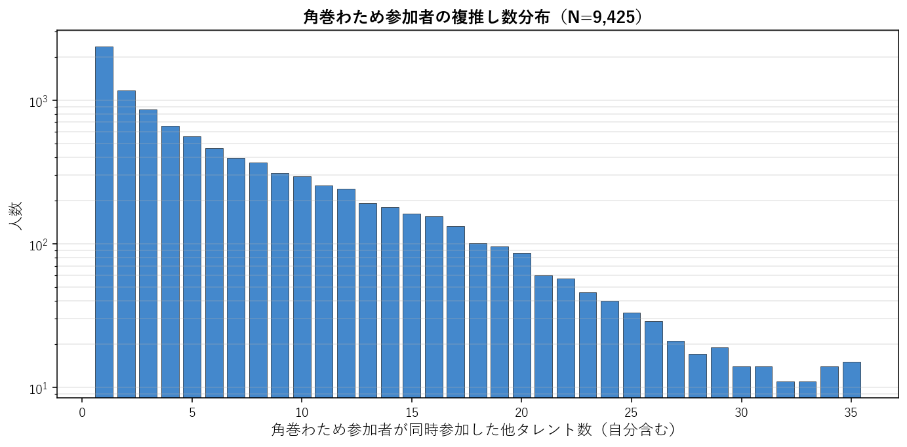
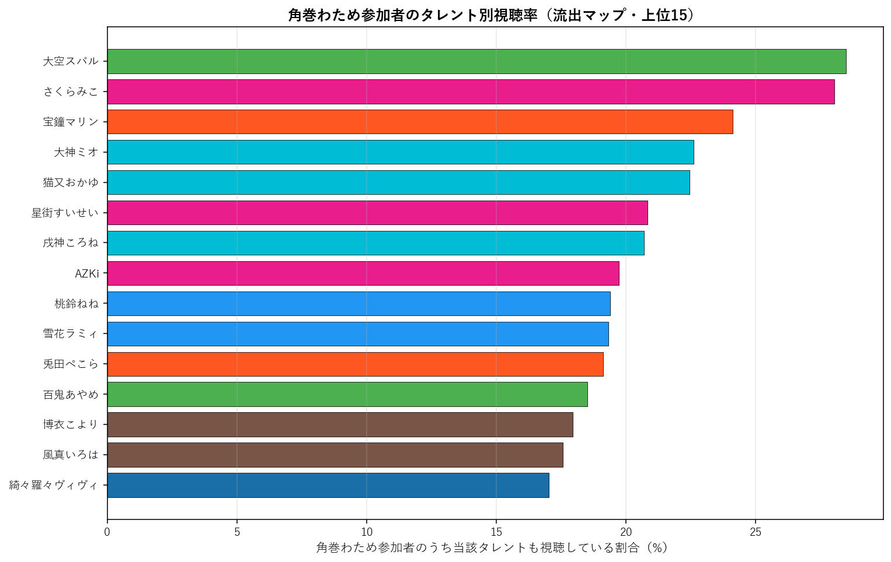
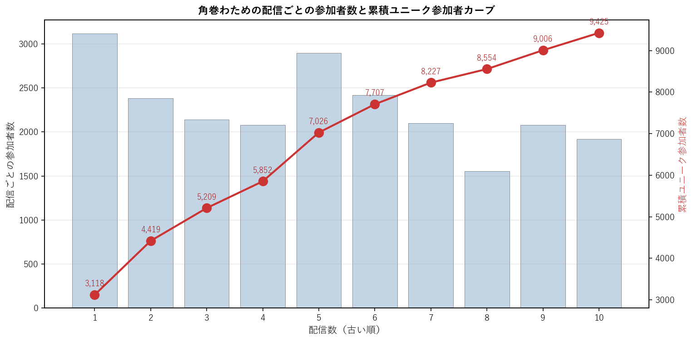

# 角巻わため（4期生）個別深掘り分析

本論文の手法を 角巻わため 一人に絞って詳細展開する個別レポート。集計時点: 2026年5月、10配信固定サンプル。

## 1. 基本プロファイル

| 項目 | 値 |
|---|---:|
| 所属ユニット | 4期生 |
| 活動年数（2026-05-25時点） | 6.40年 |
| 登録者数 | 1,700,000 |
| チャット参加者数（10配信総ユニーク） | 9,425 |
| 参加率（=ユニーク数/登録者数） | 0.55% |
| 専属ファン（角巻わためのみ参加） | 2,353（25.0%） |
| 平均複推し数（自分含む） | 6.41 |
| 中央値複推し数 | 4.0 |

### 1.1 複推し数分布

角巻わため参加者を「同時参加した他タレント数」で集計した分布（自分含む、1=単独）。

## 2. 重複ネットワーク

### 2.1 Jaccard 上位10タレント

角巻わためと他タレントとのペアJaccard係数。順位は全595ペア中の順位。

| 順位 | タレント | ユニット | Jaccard | 共視聴者数 | 流出率 |
|---:|---|---|---:|---:|---:|
| 51 | 大神ミオ | ゲーマーズ | 10.97% | 2,130 | 22.6% |
| 104 | 雪花ラミィ | 5期生 | 9.83% | 1,820 | 19.3% |
| 108 | 大空スバル | 2期生 | 9.76% | 2,685 | 28.5% |
| 111 | 猫又おかゆ | ゲーマーズ | 9.69% | 2,115 | 22.4% |
| 126 | 戌神ころね | ゲーマーズ | 9.46% | 1,951 | 20.7% |
| 144 | さくらみこ | 0期生 | 9.28% | 2,642 | 28.0% |
| 146 | 白銀ノエル | 3期生 | 9.27% | 1,458 | 15.5% |
| 152 | AZKi | 0期生 | 9.20% | 1,859 | 19.7% |
| 158 | 姫森ルーナ | 4期生 | 9.08% | 1,439 | 15.3% |
| 167 | 桃鈴ねね | 5期生 | 8.95% | 1,827 | 19.4% |

### 2.2 流出マップ（参加率上位15）

角巻わため参加者のうち、他タレントの配信にも参加していた割合の上位。絶対人数が多い人気タレントが上位に来る傾向があり、Jaccard上位とは異なる切り口。

| 順位 | タレント | 流出率 | 共視聴者数 | Jaccard |
|---:|---|---:|---:|---:|
| 1 | 大空スバル | 28.5% | 2,685 | 9.76% |
| 2 | さくらみこ | 28.0% | 2,642 | 9.28% |
| 3 | 宝鐘マリン | 24.1% | 2,273 | 7.26% |
| 4 | 大神ミオ | 22.6% | 2,130 | 10.97% |
| 5 | 猫又おかゆ | 22.4% | 2,115 | 9.69% |
| 6 | 星街すいせい | 20.8% | 1,964 | 6.27% |
| 7 | 戌神ころね | 20.7% | 1,951 | 9.46% |
| 8 | AZKi | 19.7% | 1,859 | 9.20% |
| 9 | 桃鈴ねね | 19.4% | 1,827 | 8.95% |
| 10 | 雪花ラミィ | 19.3% | 1,820 | 9.83% |
| 11 | 兎田ぺこら | 19.1% | 1,801 | 7.41% |
| 12 | 百鬼あやめ | 18.5% | 1,744 | 8.01% |
| 13 | 博衣こより | 18.0% | 1,692 | 8.86% |
| 14 | 風真いろは | 17.6% | 1,656 | 8.24% |
| 15 | 綺々羅々ヴィヴィ | 17.0% | 1,605 | 8.63% |

### 2.3 3項 lift 上位10（共起の強い3者組）

$\text{lift} = P(角巻わため \cap X \cap Y) / (P(角巻わため \cap X) \cdot P(Y))$。1.0=独立、値が大きいほど3者の同時参加が独立予測値より集中している。$|角巻わため \cap X| \geq 100$ のペアを対象。

| # | X | Y | lift | 3項共視聴 | (target,X) 共視聴 |
|---:|---|---|---:|---:|---:|
| 1 | ときのそら | ロボ子さん | 12.12 | 368 | 1,214 |
| 2 | アキロゼ | 不知火フレア | 11.96 | 273 | 677 |
| 3 | ロボ子さん | 不知火フレア | 11.22 | 308 | 814 |
| 4 | ときのそら | 不知火フレア | 10.41 | 426 | 1,214 |
| 5 | 一条莉々華 | 響咲リオナ | 10.00 | 302 | 739 |
| 6 | 常闇トワ | 獅白ぼたん | 9.49 | 415 | 1,031 |
| 7 | 白上フブキ | 不知火フレア | 9.26 | 465 | 1,490 |
| 8 | ロボ子さん | 姫森ルーナ | 9.23 | 368 | 814 |
| 9 | アキロゼ | 響咲リオナ | 9.18 | 254 | 677 |
| 10 | ロボ子さん | 尾丸ポルカ | 9.16 | 266 | 814 |

**注意**: lift 値が非常に高いペアは小規模かつニッチな同質サブグループを示している。大規模タレント同士のペアでは lift 値は相対的に低くなる（分母が大きいため）。

## 3. ファン構造分解

### 3.1 ユニット別重複

角巻わため参加者の中で各ユニットのタレントいずれかに参加した人の割合と、当該ユニット内タレントとの平均ペアJaccard。

| ユニット | 人数 | 流出率 | 共視聴者数 | 平均ペアJaccard |
|---|---:|---:|---:|---:|
| 0期生 | 5 | 46.9% | 4,420 | 7.84% |
| 1期生 | 3 | 28.7% | 2,707 | 7.28% |
| 2期生 | 2 | 36.8% | 3,465 | 8.89% |
| ゲーマーズ | 3 | 40.1% | 3,784 | 10.04% |
| 3期生 | 4 | 39.1% | 3,688 | 7.92% |
| 4期生 | 2 | 21.8% | 2,058 | 7.84% |
| 5期生 | 4 | 37.6% | 3,541 | 8.15% |
| 6期生 | 3 | 33.4% | 3,151 | 8.39% |
| ReGLOSS | 4 | 25.6% | 2,417 | 5.79% |
| FLOW GLOW | 4 | 33.3% | 3,137 | 7.52% |

### 3.2 活動年数（世代）別重複

角巻わため参加者の各世代タレント群への重複度。

| 世代 | 人数 | 流出率 | 平均ペアJaccard |
|---|---:|---:|---:|
| 2018年以前(7年超) | 13 | 64.5% | 8.38% |
| 2019-2020(5-7年) | 10 | 54.5% | 7.99% |
| 2021-2023(2-5年) | 7 | 42.8% | 6.90% |
| 2024-(2年未満) | 4 | 33.3% | 7.52% |

### 3.3 登録者規模別重複

角巻わため参加者の規模別タレント群への重複度。

| 規模 | 人数 | 流出率 | 平均ペアJaccard |
|---|---:|---:|---:|
| メガ(300万人超) | 1 | 24.1% | 7.26% |
| 大(200-300万) | 8 | 59.4% | 8.73% |
| 中(100-200万) | 19 | 64.0% | 7.79% |
| 小(50-100万) | 5 | 35.7% | 7.00% |
| 極小(50万未満) | 1 | 11.5% | 7.25% |

## 4. 構造的位置

### 4.1 ハブ性指標

- 角巻わため絡みペアの最高順位: **51/595**
- 上位30以内に入る角巻わため絡みペアの数: **0/30**
- 上位100以内に入る角巻わため絡みペアの数: **1/100**

### 4.2 横断接続性

角巻わためのJaccard上位10ペアの所属ユニット数: **6/10ユニット**

Jaccard上位10ペアの内訳:
- 大神ミオ（ゲーマーズ）J=10.97%, 順位51
- 雪花ラミィ（5期生）J=9.83%, 順位104
- 大空スバル（2期生）J=9.76%, 順位108
- 猫又おかゆ（ゲーマーズ）J=9.69%, 順位111
- 戌神ころね（ゲーマーズ）J=9.46%, 順位126
- さくらみこ（0期生）J=9.28%, 順位144
- 白銀ノエル（3期生）J=9.27%, 順位146
- AZKi（0期生）J=9.20%, 順位152
- 姫森ルーナ（4期生）J=9.08%, 順位158
- 桃鈴ねね（5期生）J=8.95%, 順位167

### 4.3 外れ値度（平均Jaccard）

- 角巻わための他34名との平均Jaccard: **7.86%**
- 35名中の順位（小さい順、外れ値ほど上位）: **18/35**

**解釈**: 値が小さいほど他タレントとの重なりが薄く外れ値的位置、大きいほどハブ的位置。35名中で見て中央付近にあれば「平均的な接続度」、上位5位以内なら外れ値、下位5位以内ならハブ。

## 5. 配信間多様性

### 5.1 配信ペア間Jaccard

角巻わための10配信間で、ペアごとに参加者集合のJaccard係数を計算した分布。

| 統計 | 値 |
|---|---:|
| 最小 | 20.8% |
| 平均 | 26.7% |
| 中央値 | 26.3% |
| 最大 | 35.1% |

**解釈**: 値が高ければ配信間で「常連層」が中心、値が低ければ配信ごとに「一見さん層」が多い。

### 5.2 各配信の独自参加者率

他9配信に参加していない「その配信だけに来た独自参加者」の割合。値が高い配信は特異な層を呼び込んだ可能性を示す。

| 配信日 | 参加者数 | 独自参加者 | 独自率 | タイトル |
|---|---:|---:|---:|---|
| 20260403 | 3,118 | 1,050 | 33.7% | 【 クロノ・トリガー 】完全初見！ついに名作に触れるひつじ... #1【角巻わた |
| 20260404 | 2,381 | 598 | 25.1% | 【雑談＆お礼】今週もお疲れ様でした！喉の調子が悪い日は町田商店に限る🍜【角巻わた |
| 20260413 | 2,140 | 398 | 18.6% | 【雑談＆お礼】お話しよ～～～～～～～～～～～～～～！！！【角巻わため/ホロライブ |
| 20260419 | 2,081 | 424 | 20.4% | 【雑談＆お礼】お茶を飲んでる羊の性格は、なーんだ！！【角巻わため/ホロライブ４期 |
| 20260423 | 2,895 | 852 | 29.4% | 【 トモダチコレクション わくわく生活 】初めてのトモコレ生活！！！【角巻わため |
| 20260426 | 2,419 | 516 | 21.3% | 【 ぷちホロの村 - 剣とお店と田舎暮らし 】このゲームをプレイする夢を見たんだ |
| 20260428 | 2,098 | 475 | 22.6% | 【 クロノ・トリガー 】完全初見！マルチエンド回収行くか...？！（ED3～ED |
| 20260506 | 1,555 | 251 | 16.1% | 【 Cursed Companions 】NGワードを言ってはいけないよ、絶対だ |
| 20260507 | 2,078 | 430 | 20.7% | 【雑談＆お礼】金ビキニの次は何ビキニが来るんだろう？？【角巻わため/ホロライブ４ |
| 20260510 | 1,917 | 419 | 21.9% | 【 R.E.P.O. 】アプデが来た！コスメティックというものがあるらしい！【角 |

### 5.3 累積ユニーク参加者カーブ

古い配信から順に1本ずつ追加していった時の累積ユニーク参加者数。カーブが早く頭打ちになるほど常連が多く、長く伸び続けるほど新規流入が多い。

| 本数 | 配信日 | 配信参加者 | 累積ユニーク |
|---:|---|---:|---:|
| 1本目 | 20260403 | 3,118 | 3,118 |
| 2本目 | 20260404 | 2,381 | 4,419 |
| 3本目 | 20260413 | 2,140 | 5,209 |
| 4本目 | 20260419 | 2,081 | 5,852 |
| 5本目 | 20260423 | 2,895 | 7,026 |
| 6本目 | 20260426 | 2,419 | 7,707 |
| 7本目 | 20260428 | 2,098 | 8,227 |
| 8本目 | 20260506 | 1,555 | 8,554 |
| 9本目 | 20260507 | 2,078 | 9,006 |
| 10本目 | 20260510 | 1,917 | 9,425 |

## 6. まとめ

- 角巻わためは活動 6.4年・登録者 170.0万人。
  チャット参加コア層は 9,425人で参加率 0.55%。
- 専属ファンは 25.0%、平均複推し数は 6.41人。
- Jaccard 最高ペアは 大神ミオ（10.97%、全595ペア中51位）。
- 流出絶対数では人気古参（大空スバル 28.5%、さくらみこ 28.0%）が上位だが、Jaccard では同世代・同規模タレント（大神ミオ、雪花ラミィ）が上位。
- ハブ性指標は弱め（上位30以内ペアは 0 組）、
  平均Jaccard 7.86% は35名中 18 位（小さい順）。
- 配信間ユーザー重複は平均 26.7%、累積カーブは10本で 9,425人に到達。

---
*分析時点: 2026年5月25日。本論文 `report_audience_paper_jp.pdf` の方法論を流用。個別タレントへの応用例として作成。*